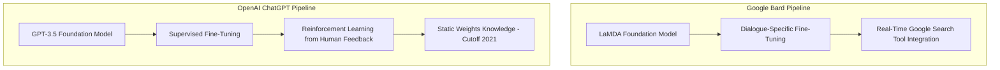

Well, Google finally clicked "deploy." 

After months of watching OpenAI soak up every ounce of spotlight in the tech industry, Google has officially unveiled **Bard**, its conversational AI assistant designed to take on ChatGPT. 

But as the marketing decks flood the internet and PR machines on both sides spin up to supersonic speeds, we need to cut through the noise. What is actually happening under the hood? How does Bard stack up against ChatGPT when you strip away the branding and look at the raw computer science?

This isn't just a comparison of two chat interfaces. This is a head-to-head clash of two entirely different engineering philosophies, training pipelines, and infrastructure strategies. Let's tear them down.

---

## 1. The Heritage: LaMDA vs. GPT-3.5

At their cores, both Bard and ChatGPT are built on the Transformer architecture—the legendary 2017 Google-invented neural network design that completely revolutionized Natural Language Processing (NLP). But that’s where the architectural similarities end.

### Google Bard: Built on LaMDA
Bard is powered by a lightweight version of **LaMDA** (Language Model for Dialogue Applications), which Google first introduced at I/O in 2021. 

Unlike OpenAI's models, which were initially trained as general-purpose text predictors, LaMDA was built from day one specifically for **dialogue**. Google's engineers trained LaMDA on a massive dataset of conversational transcripts, focusing on multi-turn dialogue patterns. 

But the most interesting technical detail is LaMDA’s internal tool-use capability. LaMDA is trained to query external resources, including Google’s real-time search index, calculators, and translation databases, and merge those outputs back into its generated text.

### OpenAI ChatGPT: Built on GPT-3.5
ChatGPT is a fine-tuned variant of the **GPT-3.5** family (specifically, `text-davinci-003`). GPT-3.5's primary training objective was predicting the next token in a sequence across an astronomically large corpus of web text, books, and code. 

To turn this raw text predictor into the helpful, non-toxic chat assistant we know, OpenAI used **Reinforcement Learning from Human Feedback (RLHF)**. This process involved human labelers ranking different model outputs, training a reward model, and using Proximal Policy Optimization (PPO) to adjust the model's weights to mimic human preferences.

---

## 2. Real-Time Information vs. Frozen Weights

The most glaring functional difference between Bard and ChatGPT right now is how they access knowledge.

### ChatGPT's Static Brain
As of today, ChatGPT's knowledge is entirely frozen. It operates on a static set of weights finalized in late 2021. If you ask ChatGPT who won the Super Bowl last week, or what happened in the markets yesterday, it will confidently hallucinate or polite-lock you with: *"I am an AI with a knowledge cutoff of September 2021..."*

This is because ChatGPT relies purely on the **implicit parameters** stored inside its neural network weights. It is incredibly fast and highly cohesive, but it is fundamentally blind to the present.

### Bard's Real-Time Loop
Bard, on the other hand, is built on a dynamic loop. When a query is entered, Bard’s lightweight LaMDA backend can make a call to Google’s search engine, retrieve live data from the web, and feed those context-rich snippets into its generation engine.

This is a massive advantage for current event queries, technical documentation updates, and live research. But it introduces a serious latency penalty and a higher risk of propagating web-based misinformation if the search results themselves are low quality.

---

## 3. The Inference Cost & Scale Equation

Why did Google release a "lightweight model version" of LaMDA for Bard's initial launch? This is a fascinating engineering trade-off.

The full-sized LaMDA model is estimated to have around 137 billion parameters. Running inference on a model of that size for millions of concurrent users is an absolute nightmare for GPU/TPU utilization. 

By deploying a significantly smaller, optimized version of the model, Google dramatically reduces:
- **Inference Latency**: Faster response times for users.
- **Compute Overhead**: Lower cost per query, enabling them to scale to hundreds of millions of users without melting their TPU clusters.
- **VRAM Requirements**: Allowing them to fit more concurrent inference sessions onto a single cluster of their custom Tensor Processing Units (TPUs).

OpenAI is facing similar scaling pains. ChatGPT's sudden viral explosion has forced them to introduce "ChatGPT Plus" subscriptions to offset the massive cloud bill of running their dense GPT-3.5 models. 

---

## 4. The Coding Battle: Bard’s Blind Spot?

If you are a developer, ChatGPT has likely already integrated into your daily workflow. It is incredibly good at writing, refactoring, and debugging code. 

Why? Because GPT-3.5 was heavily pre-trained on massive amounts of public code from GitHub, StackOverflow, and technical docs. It understands abstract syntax trees and can simulate code execution surprisingly well.

At launch, Bard is notably hesitant with code. Google has explicitly stated that coding capabilities are not yet fully supported or optimized in Bard's initial rollout, despite LaMDA's underlying power. This is a strategic choice: Google is prioritizing conversation, safety, and search synthesis over developer utilities for now. If you want a coding companion, ChatGPT is still the undisputed king of the IDE.

---

## 5. Technical Comparison At a Glance

Let’s break down the core metrics of these two powerhouses side-by-side:

| Feature | ChatGPT (GPT-3.5) | Google Bard (LaMDA) |
|:---|:---|:---|
| **Architecture** | Transformer (Decoder-only) | Transformer (Decoder-only) |
| **Primary Training Method** | Pre-training + RLHF (PPO) | Dialogue Pre-training + Fine-tuning |
| **Knowledge Cutoff** | September 2021 | None (Dynamic Search Queries) |
| **Infrastructure** | Microsoft Azure (Nvidia A100 GPUs) | Google Cloud (Custom TPU v4 Clusters) |
| **Strengths** | Deep reasoning, coding, structural formatting | Real-time events, natural dialogue flow |
| **Weaknesses** | Hallucinations, zero real-time awareness | Unpredictable search synthesis, weak coding |

---

## The Engineer's Perspective

From an engineering standpoint, ChatGPT represents the absolute pinnacle of **parametric memory alignment**. It is a demonstration of how far you can push a frozen neural network by using high-quality human alignment datasets.

Bard, on the other hand, is a glimpse into the future of **retrieval-augmented systems**. It is a hybrid creature—part classical indexing engine, part generative language model. 

OpenAI showed us how an LLM can think. Google is trying to show us how an LLM can browse. 

The real winner of this war won't be the model with the most parameters, but the team that builds the tightest, most cost-effective feedback loop between real-time data retrieval and parameter updates. Let the games begin.