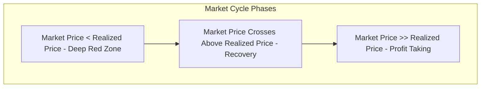

If you've been reading the mainstream financial press over the last three months, you probably think crypto is completely, irreversibly dead. 

Following the spectacular, fraud-fueled collapse of FTX in November 2022, the narrative was set: the industry is a smoking crater of contagion. The SEC is going after staking services, the Department of Justice is knocking on doors, and the mainstream media is busy writing elaborate, highly satisfied obituaries for Web3.

And yet, if you look at the price chart, a very weird thing is happening. 

Bitcoin didn't go to zero. It didn't even stay at the $15.5k FTX post-panic bottom. In fact, since January 1st, Bitcoin has quietly climbed over 45%, climbing back to around $23,500. 

How do we reconcile this massive divergence? How can an asset class facing the worst regulatory crackdown in its history be up 45% in eight weeks?

The answer lies inside the blockchain. 

While the media is busy trading opinions, the blockchain is recording absolute, immutable truths. If you ignore the talking heads on television and analyze the **on-chain metrics**—the raw ledger data of where, when, and how Bitcoin is moving—you see a completely different story. You see the classic, structural transition from a brutal bear market capitulation into a quiet, highly resilient accumulation phase.

Let’s dive into the three core on-chain metrics that actually matter right now, and what the data is trying to tell us about the state of the market.

---

## 1. Crossing the Rubicon: Realized Price Reclamation

The single most important technical metric in all of on-chain analysis is the **Realized Price**.

Unlike the traditional *Market Price* (which is just the cost of the last coin traded on an exchange), the **Realized Price** represents the average cost basis of all Bitcoins in circulation. It is calculated by taking the value of every single UTXO (Unspent Transaction Output) at the time it was last moved on-chain, and dividing it by the total circulating supply. 

Historically, the Realized Price acts as an absolute floor for the market. 
- In a healthy bull market, the Market Price sits comfortably above the Realized Price (everyone is in profit on average).
- During the depths of a bear market, the Market Price dips below the Realized Price. This is the "capitulation phase," where the average investor is underwater, and panic-sellers bleed coins to long-term HODLers.



In mid-January 2023, Bitcoin quietly crossed back **above its Realized Price** (which was sitting around $19,700). 

Historically, reclaiming this line isn’t just a minor technical breakout; it is a structural "crossing of the Rubicon." In 2015 and 2019, once the market price reclaimed and sustained its position above the Realized Price, it signaled the absolute end of the cyclical macro-bottom. It tells us that the desperate sellers who were forced to dump coins during the FTX contagion are officially gone, replaced by buyers whose cost basis is firmly in the green.

---

## 2. The Illiquid Supply Shock: Long-Term HODLers Stand Firm

The second metric to watch is **Illiquid Supply**. 

On-chain analytics platforms (like Glassnode) categorize wallets based on their historical selling behavior. Wallets that rarely sell their coins are classified as *Illiquid entities* (long-term HODLers), while wallets that frequently move and trade their coins are classified as *Liquid or Highly Liquid entities* (speculators, exchanges, and day traders).

During the FTX panic, when billions of dollars of paper assets evaporated in a weekend, you would expect long-term holders to panic and dump their coins.

The data shows the exact opposite. 

Throughout the entire crash, the amount of Bitcoin held by "Illiquid" wallets continued to climb, hitting an all-time high of over 15 million BTC. This represents roughly **78% of the total circulating supply** of Bitcoin. 


This is an absolute supply bottle-neck. Nearly four out of every five Bitcoins are sitting in wallets with zero intention of selling at these price levels. 

At the same time, **Exchange Balances** are dropping to levels not seen since 2018. Following the collapse of centralized entities like Celsius, BlockFi, and FTX, the motto "Not your keys, not your coins" became a physical reality. Investors are pulling their assets off exchanges at a historic rate, locking them in hardware cold storage wallets.

When 78% of the supply is locked in cold storage, it creates an intense **supply shock**. The moment any fresh demand enters the market—whether via macro liquidity injections or institutional interest—there are simply no coins available on exchanges to meet that demand. The price has no choice but to adjust violently upward.

---

## 3. The MVRV Z-Score: Escaping the Undervaluation Zone

If you want to know how cheap Bitcoin actually is relative to its historical cycles, you look at the **MVRV Z-Score**.

The MVRV Z-Score is a ratio defined by: 

$$\text{Z-Score} = \frac{\text{Market Cap} - \text{Realized Cap}}{\text{Standard Deviation of Market Cap}}$$

This ratio measures how far the current market valuation is stretching away from its "fair value" (realized cap). 
- A Z-Score above 7 signals the market is dangerously overheated (the cycle top).
- A Z-Score below 0 signals the market is deeply undervalued, presenting a generational buying opportunity.

During the post-FTX capitulation in late 2022, the MVRV Z-Score plunged deep into the negative zone, hitting levels only seen at the absolute bottoms of the 2015 and 2018 bear markets. 

In February 2023, the MVRV Z-Score has officially **crawled back out of the negative zone**. 

```
MVRV Z-Score Cycle Signal (Feb 2023):
+--------------------------------------------------+
|  7.0+   [ Red Zone - Cycle Top / Bubble ]        |
|                                                  |
|  2.0    [ Mid-Range Bull / Distribution ]        |
|                                                  |
|  0.0-0.5 [ We Are Here - Accumulation/Recovery ] | <--- Escaped the floor
|                                                  |
| < 0.0   [ Green Zone - Generational Bottom ]     |
+--------------------------------------------------+
```

This transition represents an escape velocity from the macro-depression floor. It indicates that the extreme, irrational undervaluation caused by systemic liquidation is officially behind us. The market is resetting to its natural accumulation baseline.

---

## The Takeaway

Price is a lagging indicator. It is driven by short-term derivatives leverage, whale manipulation on exchanges, and the emotional mood swings of retail traders reacting to the morning news.

But on-chain metrics do not lie. They are the structural radiography of the financial network. 

The radiography of February 2023 is telling us that despite the regulatory storms, the legal crackdowns, and the negative media coverage, the foundation of the Bitcoin network has never been stronger. The weak hands have been completely washed out, exchange supplies are depleted, and long-term HODLers are quietly accumulating the float.

The bear market isn't fully over—we will undoubtedly face more volatility and macroeconomic speedbumps in the months ahead. But the raw data is telling you to stop looking at the obituary columns. The recovery has already begun.

*HODL accordingly.*