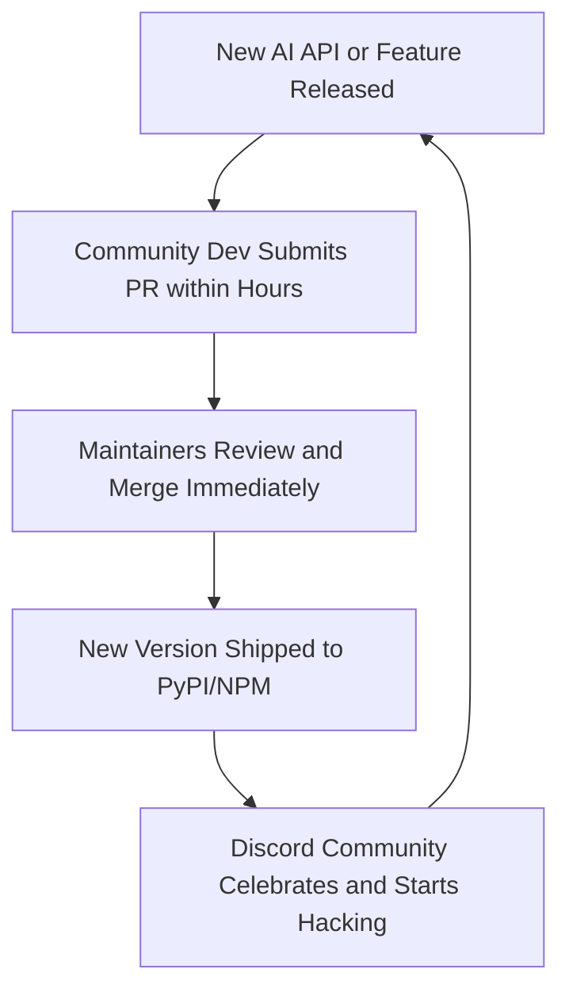

If you want to witness the epicenter of the AI gold rush, you don't go to SF startup networking mixers or scroll through flashy tech-VC Twitter. 

You open up Discord and join the **LangChain** server.

Launched in late October 2022 by Harrison Chase, LangChain has gone from a simple Python library for "chaining" together LLM prompts to an absolute open-source juggernaut. It has racked up over 15,000 stars on GitHub, raised a massive seed round, and its Discord server has exploded into a hyper-active community of thousands of engineers hacking together agents, RAG applications, and autonomous pipelines at all hours of the night.

What is fascinating here isn't just the code itself—which, if we are being completely honest, is often a chaotic, rapidly shifting maze of nested abstractions. 

What is fascinating is the **community-building masterclass** Chase and his team have pulled off. They have constructed one of the most vibrant, collaborative, and fast-moving technical developer ecosystems on earth almost overnight. 

How did they do it? And what can other developers, founders, and open-source advocates learn from the LangChain Discord explosion? Let’s dissect the playbook.

---

## 1. Shipping Velocity as a Marketing Strategy

In the software world, we often preach about the virtues of "clean code," "robust architecture," and "intentional design." 

But in a space as volatile as Generative AI—where OpenAI or Google launches a paradigm-shifting API update every other Tuesday—the absolute highest-value asset a project can possess is **velocity**.

LangChain's development velocity is nothing short of legendary. The team ships multiple releases *a day*. 
- If a new vector database launches at 9:00 AM, there is a LangChain wrapper for it by 11:30 AM.
- If OpenAI changes an endpoint structure at 3:00 PM, a patch is merged into the LangChain main branch by 4:15 PM.

This breakneck pace does something magical to a developer community: it creates a feeling of intense, electric **recency**. 

Developers know that the LangChain repository is the absolute frontier of what is technically possible with LLMs. When you hang out in the LangChain Discord, you don’t feel like you are using a tool. You feel like you are actively co-authoring the future of the technology stack.

---

## 2. Low-Friction Contribution: The "Inclusive Open Source" Model

Many classic open-source projects behave like exclusive country clubs. If you submit a pull request, you might wait weeks for a core maintainer to review it, only to be hit with a pedantic laundry list of formatting critiques, architectural nitpicks, and demands for 100% test coverage.

LangChain flipped this script entirely. They made the barrier to contribution incredibly low.

If a developer writes a quick integration for a niche document loader or a custom embedding service, Harrison Chase reviews and merges it almost instantly. 

Does this lead to code bloat? Yes. Does it result in a library that occasionally breaks backwards compatibility? Absolutely. Ask any developer who has upgraded their LangChain package from `0.0.120` to `0.0.121` and watched their code collapse into a heap of import errors.

But the psychological payoff for the contributor is immense. 

When a developer submits a PR, sees it merged within an hour, and gets a shoutout on Twitter, they are hooked. They aren't just an anonymous user anymore; they are a co-creator of the fastest-growing AI library in the world. They will spend their next weekend answering questions in the Discord support channels, writing tutorials, and advocating for the library to their engineering team at work. Inclusive, low-friction contribution is the ultimate developer acquisition loop.

---

## 3. The Power of the "Builder Showcase" Feedback Loop

Developers are inherently vain creatures. We don't just want to build cool things; we want our peers to *see* that we built cool things.

The LangChain team leaned into this human desire beautifully by establishing a tight, highly visible feedback loop inside their Discord. They set up dedicated `#share-your-project` and `#showcase` channels, which are constantly monitored by the core maintainers.

When someone posts a unique hack—like a Discord bot that reads Git diffs and auto-generates pull request descriptions using LangChain—it doesn’t get lost in the noise. The LangChain team retweets it to their massive audience, pins it in the Discord, and occasionally integrates the idea directly as an official template in the repository.

This creates a powerful status-seeking game:
1. Developer builds a clever hack using LangChain.
2. Developer shares it in the Discord showcase.
3. Developer receives instant validation, social capital, and traffic from the maintainers and the community.
4. Other developers see this recognition and are inspired to build and share their own hacks.

This loop turns the Discord into a living, breathing gallery of inspiration. It keeps engagement levels sky-high because developers aren't just logging in to ask for debug help; they are logging in to see what their peers have built in the last 24 hours.

---

## 4. Embracing the "Spaghetti Chain" Trade-Off

Let's address the elephant in the room: LangChain has plenty of critics in the software engineering community. Many argue that the library is over-engineered, that its abstractions hide simple API calls behind three layers of undocumented classes, and that you are often better off writing raw Python scripts.

But here is the counter-intuitive truth: **the "spaghetti" nature of LangChain is exactly why its community is so strong.**

When a tool is too perfect, too polished, and too simple, it doesn't require a community. If a library works flawlessly out of the box with zero configuration, developers write their code and move on with their lives.

But when a library is powerful, highly ambitious, yet incredibly raw and fast-moving, **a community becomes a structural necessity.** 

Developers *need* the Discord to figure out why their custom `BufferMemory` isn't persisting across agents. They *need* to talk to other engineers to share workarounds for undocumented API changes. The friction of the software acts as a social glue, binding developers together into a collective problem-solving squad.

---

## The Takeaway

LangChain has shown us that in the AI era, community building isn't a secondary marketing activity. It is the core engine of product distribution and development.

By prioritizing release velocity over perfect design, welcoming every single contributor with open arms, and aggressively celebrating community creations, they have built a moat that no proprietary software company can easily clone.

If you are building a tool in the developer space, close your design spec. Stop worrying about making your codebase a work of perfect, pristine art. Open your gates, invite the builders inside, and let them help you write the playbook. Velocity wins wars. Community keeps you on the throne.

*See you in the Discord.*