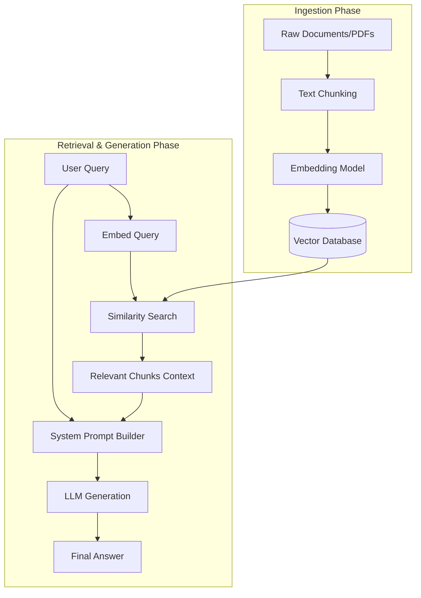

The biggest trap developers fall into when they first start building with Large Language Models is thinking they need to "fine-tune" a model on their custom dataset.

You want ChatGPT to understand your company's internal HR wiki or your software's documentation, so your brain immediately jumps to: *"I need to gather all my PDFs, format them as JSONL, rent an expensive cluster of GPUs, and fine-tune a custom GPT-3 model!"*

Let me save you thousands of dollars, dozens of hours, and an infinite amount of hair-pulling. **Do not do this.** 

Fine-tuning is fantastic for teaching a model a specific *style*, *tone*, or *formatting constraint*. It is absolutely terrible for teaching a model new *facts*. If you fine-tune a model on your documentation, it will still hallucinate, it will still invent API parameters that don't exist, and it will be completely incapable of telling you what was updated in your docs yesterday without a complete re-train.

So how do the pros do it? They build a **RAG (Retrieval-Augmented Generation)** pipeline. 

RAG is a simple, incredibly elegant design pattern. Instead of trying to bake facts *directly into the model's brain* (the weights), you keep the model's brain completely frozen. When a user asks a question, you look up the relevant facts from an external database, stuff those facts into the prompt context window, and tell the LLM: *"Read this textbook, and answer the user's question based ONLY on the text provided."*

Let’s build a production-grade RAG pipeline from scratch.

---

## The RAG Architecture: A Three-Step Dance

Building a RAG application is essentially a pipeline with three major stages:



Let's write some clean, dependency-free Python code to demonstrate exactly how this works under the hood.

---

## Step 1: Chunking the Documents

An LLM has a limited context window (typically 4k tokens for GPT-3.5-turbo). If you try to feed your entire 300-page company manual into the prompt, the model will either throw an out-of-memory error or charge you a fortune in API costs.

We must break our documents down into small, digestible "chunks." A good default strategy is to split text into chunks of roughly 500 characters, with an overlap of 100 characters so we don't lose context at the boundaries.

Here is how you write a simple chunker in Python:

```python
def chunk_text(text: str, chunk_size: int = 500, overlap: int = 100) -> list[str]:
    chunks = []
    start = 0
    while start < len(text):
        end = start + chunk_size
        chunks.append(text[start:end])
        # Move the cursor forward by chunk_size minus overlap
        start += (chunk_size - overlap)
    return chunks

# Example document
doc = "Our company, Zenflow, uses a hybrid work model. Engineers are expected in the office on Tuesdays and Thursdays. Reimbursements for travel on these days are covered up to $50. All other days are fully remote."
chunks = chunk_text(doc, chunk_size=100, overlap=20)
print(f"Split document into {len(chunks)} chunks.")
```

---

## Step 2: Embedding Chunks into Vector Space

Now that we have our text chunks, how do we find the ones relevant to a user's question? We can't just use simple keyword matching (like `ctrl+f`). If a user asks, *"When do I have to commute to the office?"*, a keyword search for "commute" might fail because our document uses the word "office" and "hybrid."

We need **semantic search**. To do this, we pass our chunks through an **Embedding Model** (like OpenAI’s `text-embedding-ada-002`). 

An embedding model takes a string of text and converts it into a large array of floating-point numbers (a vector) representing the *semantic meaning* of that text. If two pieces of text are conceptually similar, their vectors will point in almost the identical direction in high-dimensional space.

Let’s write a helper to generate embeddings and calculate their similarity using `numpy`:

```python
import numpy as np
import openai

# Note: Make sure to set your OPENAI_API_KEY environment variable
def get_embedding(text: str, model: str = "text-embedding-ada-002") -> list[float]:
    response = openai.Embedding.create(
        input=[text],
        model=model
    )
    return response['data'][0]['embedding']

def cosine_similarity(v1: list[float], v2: list[float]) -> float:
    # Cosine similarity is the dot product of normalized vectors
    dot_product = np.dot(v1, v2)
    norm_v1 = np.linalg.norm(v1)
    norm_v2 = np.linalg.norm(v2)
    return dot_product / (norm_v1 * norm_v2)
```

In a real application, you would save these vectors into a specialized **Vector Database** (like Pinecone, Weaviate, or Chroma). For our beginner setup, we can store them in an in-memory dictionary.

Let’s embed our chunks:

```python
# In-memory database of text chunks and their embeddings
vector_db = []

raw_wiki = [
    "Zenflow's travel reimbursement policy covers up to $50 per day for office commutes on Tuesdays and Thursdays.",
    "The official remote work policy at Zenflow allows engineers to work from any country within +/- 3 hours of EST.",
    "For database changes, engineers must submit an approved pull request and have a Senior DBA run the migrations.",
    "Health insurance benefits at Zenflow are managed via Zenefits, with open enrollment beginning every November."
]

for item in raw_wiki:
    embedding = get_embedding(item)
    vector_db.append({
        "text": item,
        "embedding": embedding
    })
print("Successfully populated our vector database!")
```

---

## Step 3: Querying and Retrieval

When a user asks a question, we:
1. Generate the embedding vector for the user's question.
2. Calculate the cosine similarity between the question vector and all our stored chunk vectors.
3. Sort the database by similarity and grab the top `K` most relevant chunks.

```python
def retrieve_relevant_context(query: str, db: list[dict], top_k: int = 1) -> list[str]:
    query_vector = get_embedding(query)
    results = []
    
    for item in db:
        similarity = cosine_similarity(query_vector, item["embedding"])
        results.append((similarity, item["text"]))
        
    # Sort by similarity score descending
    results.sort(key=lambda x: x[0], reverse=True)
    return [text for score, text in results[:top_k]]

# Test retrieval
user_query = "What is the policy for working from another country?"
retrieved_context = retrieve_relevant_context(user_query, vector_db, top_k=1)
print(f"Retrieved: {retrieved_context}")
```

---

## Step 4: Generating the Response with Context

Now comes the magic. We take the user's raw query and the retrieved context chunks, and compile them into a highly structured system prompt. We then send this prompt to an LLM like GPT-3.5-turbo to construct the final, grounded answer.

```python
def generate_grounded_answer(query: str, context_chunks: list[str]) -> str:
    # Build the context block
    context_str = "\n".join([f"- {chunk}" for chunk in context_chunks])
    
    system_prompt = f"""You are a helpful company wiki assistant. 
Answer the user's question using ONLY the provided facts below. 
If the answer cannot be found in the facts, say 'I do not have access to that information.'

Facts:
{context_str}
"""

    response = openai.ChatCompletion.create(
        model="gpt-3.5-turbo",
        messages=[
            {"role": "system", "content": system_prompt},
            {"role": "user", "content": query}
        ],
        temperature=0.0 # Keep temperature at 0 to minimize hallucinations
    )
    
    return response.choices[0].message['content']

# Run the complete RAG loop!
final_answer = generate_grounded_answer(user_query, retrieved_context)
print(f"\nAnswer: {final_answer}")
```

---

## Common RAG Gotchas to Avoid

While RAG is incredibly powerful, it isn't magic. As you scale beyond this simple script, you will run into several architectural challenges:

1. **Chunking Strategies Matter**: If you chunk your files blindly in the middle of a sentence, you break the semantic meaning of the words. Consider using structured splitters (like splitting by markdown headers or code boundaries) rather than just character counts.
2. **The "Lost in the Middle" Phenomenon**: LLMs tend to pay heavy attention to the very beginning and very end of your context window, often ignoring information in the middle. If you retrieve 20 context chunks, make sure your most highly relevant scores are sorted to the absolute top of the prompt.
3. **Embeddings are Language Agnostic (mostly)**: You can embed a Spanish document and query it in English, and cosine similarity will still match them! Embeddings map conceptual meaning, not just words.

---

## The Verdict

RAG is the ultimate cheat code of modern AI development. It bridges the gap between massive, static general knowledge and private, dynamic custom data without costing you an arm and a leg in model training. 

If you are building a tool for your team, your community, or your startup, stop looking at training notebooks. Fire up a simple vector database, write a clean ingestion pipeline, and give your LLM the context it needs to win. 

Happy coding. Let's build something beautiful.