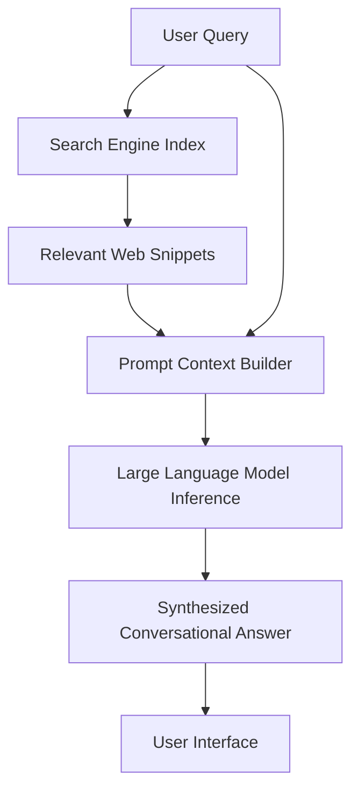

For nearly two decades, the internet had a single, undisputed front door. It was a blank white page, a colorful multi-font logo, and a simple search box. You typed in a query, pressed enter, and got back "10 blue links." It was an absolute cash cow, minting hundreds of billions of dollars for Google and funding their endless side-quests, from self-driving cars to internet-beaming balloons.

Then, on November 30, 2022, OpenAI dropped ChatGPT, and the collective ground beneath Mountain View began to liquefy. 

Fast forward to early February 2023, and we are witnessing the most high-stakes, fast-moving corporate warfare in the history of consumer technology. Microsoft, having quietly poured billions into OpenAI over the last four years, is about to integrate a customized version of GPT-4 into Bing. Google, meanwhile, has reportedly declared a corporate "Code Red," dragooning founders Larry Page and Sergey Brin back into active service to review AI product roadmaps. 

This isn't just a minor feature update. This is a fundamental paradigm shift. The simple search box is dead, the conversational web has arrived, and Microsoft has just fired a shot across Google's bow that could dismantle their entire business model.

---

## The Panic in Mountain View

To understand why Google is panicking, you have to understand the sheer, terrifying asymmetry of this war.

For Microsoft, search is a side hustle. Bing commands roughly 3% of the global search market. If Bing gains even a fraction of a percent of market share, it is pure gravy for Redmond. Satya Nadella is playing with house money. He can afford to take massive risks, break things, and absorb astronomical compute costs because he has nothing to lose and everything to gain.

For Google, search is their entire existence. It accounts for over 70% of parent company Alphabet’s revenue. If search gets disrupted, Google's ability to fund everything else vanishes. This puts Google in an impossible dilemma, famously known as the **Innovator's Dilemma**. 

If Google deploys a conversational AI search assistant too slowly, they risk losing their audience to Microsoft's shiny new toys. But if they deploy it too quickly, they risk destroying their own business model in two ways:
1. **The UX Problem**: If an AI gives you the perfect, synthesized answer to your question directly, why would you ever click on an ad? The lucrative ecosystem of Google Ads relies on users clicking through to external websites. Direct, conversational answers bypass the middleman entirely.
2. **The Compute Problem**: Serving a traditional search query is incredibly cheap. It involves looking up pre-computed index values. Running a forward-pass through a 100-billion-parameter language model for *every single search* is orders of magnitude more expensive.

---

## Technical Realities: Semantic Indexing vs. LLM Inference

Let’s talk engineering, because beneath all the marketing hype, this is a battle of raw architectures.

Traditional search is essentially a massive, highly optimized dictionary lookup. Google crawler bots map the web, build a reverse index, and use algorithms like PageRank—heavily augmented today by semantic embeddings—to deliver relevant pages to your browser in milliseconds. The heavy lifting is done upfront (during indexing). At query time, the system is incredibly cheap to run.

AI-driven conversational search, like the upcoming Bing Chat, works on a completely different model. It combines traditional search with on-the-fly generative AI, a technique we're starting to call **Retrieval-Augmented Generation (RAG)**. 

When you ask Bing Chat a question, the backend doesn't just pass your query to GPT-4. Instead, it:
1. Translates your query into traditional search terms.
2. Runs a fast index search to retrieve the most recent, authoritative web snippets.
3. Feeds those raw snippets into the LLM’s context window as "ground truth."
4. Tasks the LLM with synthesizing those inputs into a conversational response, complete with inline citations.

This architecture solves the core hallucination problem of LLMs by grounding them in real-time search data. But the performance overhead is absolutely brutal. 

Traditional search takes under 100 milliseconds. LLM generation requires streaming tokens, which can take several seconds. More importantly, the cost structure is terrifying. Analysts estimate that while a standard Google search costs a fraction of a cent ($0.003), a conversational LLM query costs at least $0.03 to $0.05. If you multiply that difference by Google's 8.5 billion daily searches, you are talking about an extra $10 to $20 billion in annual server costs.

---

## Satya Nadella's Masterstroke

Microsoft's strategy here is incredibly elegant. By leveraging their cloud dominance with Azure, they are the only company on earth that can realistically scale the infrastructure required to challenge Google's search monopoly. 

Azure gives OpenAI the massive, subsidized GPU clusters they need to train and serve their models. In return, Microsoft gets exclusive commercial licenses and first-crack integration of cutting-edge models into their enterprise suite: Office 365, Teams, Windows, and now, Bing.

Satya Nadella is essentially forcing Google to fight on a battlefield where Google has no natural advantages. If Google matches Microsoft’s AI features, they cannibalize their search profit margins. If they don’t, they watch their user base slowly erode as Bing becomes the cooler, smarter cousin. It is a classic pincer movement.

As Nadella noted in a recent interview, *"I want people to know that we made them dance. And I want them to dance."*

---

## The Death of the Web Ecosystem?

But let’s look past the corporate drama for a second. What does the AI search war mean for the rest of the web?

The entire economy of the modern internet is built on an implicit contract: creators write articles, build tutorials, and publish content for free, and in exchange, search engines send them traffic, which they monetize through ads or subscriptions.

Conversational AI search breaks this contract completely. If Bing or Google scraped an engineer's detailed guide on "How to configure Nginx with SSL," uses that guide to generate a neat 4-step answer directly in the search interface, and the user never visits the original blog post, the creator gets exactly zero pageviews, zero ad revenue, and zero incentive to write the next guide.

We are staring down a future where the sources of training data for these very AIs begin to dry up because we've killed the economic engine of content creation. It's a tragedy of the commons in the making.

---

## The Verdict

We are in week one of a war that will play out over the next ten years. 

Google is preparing to launch its own competitor, rumored to be called **Bard**, built on top of their massive LaMDA (Language Model for Dialogue Applications) architecture. Google has some of the best AI researchers on the planet, and their custom-designed Tensor Processing Units (TPUs) could give them a massive cost advantage in serving these heavy models.

But technology alone won't win this. Momentum, distribution, and business model alignment will. Microsoft is hungry, nimble, and has nothing to lose. Google is defensive, slow-moving, and terrified of breaking their golden goose.

Grab your popcorn, folks. The search box is turning into an agent, and the web's front door is about to look completely unrecognizable. Let's see who dances best.