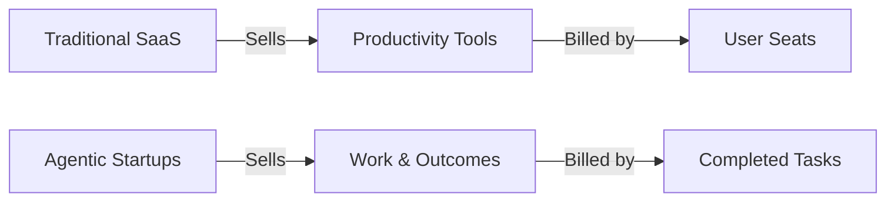

The venture capital world is currently in the middle of a massive, breathless love affair with AI Agents. Turn on Twitter or open Hacker News on any given morning, and you will see a dozen new startups announcing seed rounds to build the "AI software engineer," the "AI SDR," or the "AI accountant." 

But as the initial hype of GPT-4 wrapper demos starts to settle into the cold, hard reality of the enterprise software market, founders are hitting a major wall. 

They are realizing that building an AI agent that works is only half the battle. The harder question is: **How do you build a business model around software that doesn't have human users?**

If your software is doing the work instead of just helping a human do the work, the old playbook of enterprise software is dead. Let us look at why traditional SaaS metrics are breaking, and what business models will actually survive the transition into the agentic era.

---

## The Fatal Flaw of Per-Seat Pricing

For the last twenty years, software business models have been incredibly simple. You built a tool, calculated how much productivity it added to an employee, and charged the company a flat monthly fee per employee—known as **SaaS per-seat pricing**. Whether it is Slack, Salesforce, or Microsoft 365, the formula worked perfectly: more employees = more seats = more revenue.

But AI agents represent a fundamental shift. They are not tools that make a human more productive; they are **digital workers** designed to replace workflows entirely.

Consider a startup building an AI Agent that automates outbound sales development (an AI SDR). A medium-sized enterprise might currently employ five human SDRs, paying $100/month per seat for an email outreach tool. 

If your AI SDR agent is so effective that the company can replace those five SDRs with a single manager supervising your AI, how do you price your software?
*   If you charge per seat, the customer only buys **one seat** for the human supervisor. You are making $100/month while destroying $300,000 in annual human labor costs.
*   You have transferred immense value to the customer, but your startup is going broke because you priced based on users, not utility.

Per-seat pricing for AI agents is economic suicide. If your software is successful, it naturally reduces the user count of your customers. Your pricing model must align with this new reality.

---

## The Outcome-Based Model: Selling Labor, Not Software

To survive, agent startups are shifting from selling software to selling **outcomes**. Instead of selling a subscription to an email editor, you sell a successfully booked meeting. Instead of selling a customer support helpdesk, you sell a successfully resolved customer ticket.

This is known as **Outcome-as-a-Service (OaaS)**. It is a highly compelling proposition for enterprises:
1.  **Zero Risk**: The customer only pays when the software delivers measurable business value.
2.  **Massive TAM Expansion**: Instead of capturing a tiny sliver of a company's software budget, you are competing directly for their **labor budget**—which is historically 10x to 50x larger.

If a human customer support agent costs $30 per hour and resolves 4 tickets an hour, the customer is paying roughly $7.50 per resolution. If your AI Agent can resolve a ticket with the same quality for $1.50, and you charge $3.00 per resolution, the customer cuts their cost by 60%, and your startup captures massive high-margin revenue.

---

## The Strategic Blueprints for Agentic Success

As the market matures, we are seeing three business models emerge that actually make sense for AI agent startups.

| Model | Value Proposition | Pricing Mechanism | Best For |
| :--- | :--- | :--- | :--- |
| **Headless Service Provider** | Fully replaces an entire human department | Per Completed Outcome / Task | Customer Support, Bookkeeping, QA |
| **Agentic Orchestrator** | Infrastructure to build and run custom agents | Compute Run-time + Token Markups | Developer Platforms, B2B Integration |
| **Copilot Trojan Horse** | Starts as an autocomplete tool, evolves to agent | Land on SaaS seats, expand on automation | CRM, Legal Document Review, Coding |

### 1. The Headless Service Provider
These startups act as complete B2B services. The customer doesn't even care how the software works or what LLM is running under the hood. They interact with it via a simple dashboard or an email inbox. 

The startup manages the messy backend logic, prompt engineering, and database integrations, charging a fee per task completed (e.g., $10 per processed tax return).

### 2. The Agentic Orchestrator
If you are building the platform where other people construct agents (think LangChain, AutoGPT, or custom workflow builders), you cannot price on outcomes because you don't control the outcome. 

Instead, the model is **metered utility**. You charge based on agent-hours run, active data connections maintained, or a small markup on the underlying API tokens processed.

### 3. The Copilot Trojan Horse
Enterprise trust is extremely hard to win. Companies are terrified of letting autonomous agents loose on their databases or customer channels. 

The smartest startups are launching as "Copilots" (human-in-the-loop assistants) using standard SaaS pricing. Once the tool is inside the workflow, it silently trains on the human user's corrections. When the accuracy reaches 99.9%, the startup flips a switch, turns on autonomous agent mode, and transitions the client to outcome-based pricing.

---

## The Gross Margin Challenge: Managing Your Token Budget

Software companies have historically enjoyed gorgeous gross margins of 80% to 90%. But for AI agent startups, margins are a brutal battleground. 

An agent that implements a complex ReAct loop might make 30 sequential calls to GPT-4 to solve a single ticket. It fetches vector embeddings, queries a database, runs a web search, and summarizes files. 
*   If your underlying API cost for a single agent execution is $4.00, and you priced the outcome at $3.00, you are losing money on every transaction.
*   If your agent gets stuck in an infinite loop, a single buggy user query can drain hundreds of dollars from your billing account in minutes.

To protect their margins, successful agent startups are focusing heavily on **token economics**:
1.  **Semantic Caching**: Storing past successful agent thoughts and execution paths so identical or highly similar user intents don't require calling the LLM from scratch.
2.  **Model Cascading**: Using cheap, fast open-source models (like LLaMA or fine-tuned smaller models) for basic routing and classification, and only spinning up expensive frontier models (like GPT-4) when a reasoning step is highly complex.
3.  **Local Execution**: Running open-source models locally on specialized instances rather than paying commercial APIs per token.

---

## The Labor Arbitrage of the Future

The startups that win the next decade will not be the ones with the flashiest demo videos or the highest-rated GitHub repositories. The winners will be the pragmatic founders who understand that AI agents are not just cool software—they are a form of scalable, digital labor. 

Align your pricing with the work your software actually finishes, keep a tight grip on your compute expenses, and watch your addressable market expand into the trillions.
