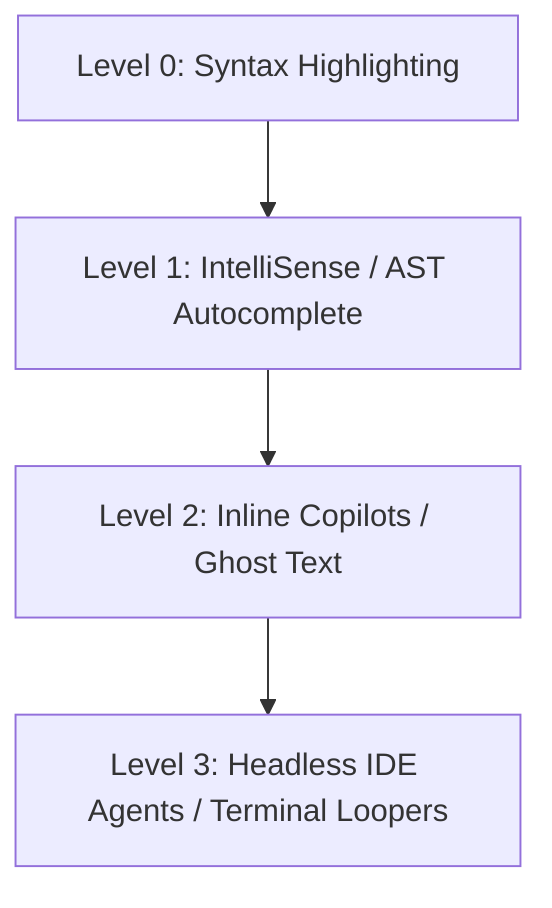

If you have spent any time writing code over the past decade, your workflow has likely been incredibly stable. Your "developer stack" was composed of a dependable code editor (like VS Code), a compiler or runtime environment, a standard linter (like ESLint or Ruff) to keep your syntax neat, and a reliable web browser constantly pinned to StackOverflow, MDN Web Docs, or Github Issues.

You wrote code, hit a wall, googled the error, copied a snippet, adjusted the variables, and repeated the process until the tests passed.

But in May 2023, that workflow is melting away. 

We are living through a massive, silent software engineering revolution. A new breed of developer tools is emerging, and they are completely replacing the traditional coding stack. We are moving from simple autocomplete tools to complex, autonomous programmatic LLM-driven generation layers. 

Let us map out the architecture of this new developer stack and examine how it is changing what it means to be a software engineer.

---

## The Shift: Autocomplete vs. Generation Layers

To understand the difference, let us look at the evolution of developer assistance:

Traditional autocomplete (like IntelliSense) relies on **Abstract Syntax Trees (ASTs)**. It parses your local files, understands your class definitions and imports, and recommends method names as you type. It is incredibly helpful, but it has no understanding of context, intent, or design patterns.

The new AI-driven stack operates as a **Contextual Generation Layer**. It doesn’t just predict your next word; it generates complete functions, designs system architectures, writes test cases, executes commands, reads compiler logs, and patches its own bugs.

---

## Anatomy of the New Developer Stack

The modern AI developer stack is organized into three distinct layers. Let us break down how they interact to automate software construction.

### 1. The Context Layer: Code Graphs and Vector Indices
An AI model is only as smart as the context you feed it. If you ask a generic LLM to write a database query for your application, it will hallucinate tables and columns. 

To solve this, tools like **Cursor** or custom enterprise indexers build a real-time semantic index of your codebase. They run your repository through structural code parsers, split files into logical code chunks, generate high-dimensional vector embeddings of those chunks, and store them in a local or cloud-based vector index.

When you type a query, the system automatically performs a semantic vector search across your entire codebase, pulls in the 5 most relevant helper files or database schemas, and appends them to your prompt context. The LLM suddenly knows *exactly* how your specific database is structured.

### 2. The Autocomplete Layer: Real-time Ghost Text
This is the most familiar layer, dominated by **GitHub Copilot**. Operating as a fast, low-latency client inside your IDE, it constantly monitors your keystrokes and comments. 

It uses specialized, smaller language models trained specifically on code (such as Codex) to predict the next 5 to 50 lines of code in real-time, displaying them as grey "ghost text." It handles the boring boilerplate, leaving you to focus on high-level logic.

### 3. The Execution Layer: Terminal-Based Agents
This is the cutting-edge of the developer stack. These are autonomous agents (like AutoGPT, or custom CLI scripts) that don’t just write code—they **execute** it. 

Imagine you have a compilation error in a complex TypeScript project. Instead of copying the error to a browser, you hand it to an execution agent. The agent:
1.  Reads the compiler error log.
2.  Locates the offending file.
3.  Asks an LLM to identify the bug and generate a code patch.
4.  Applies the edit using precise AST replacements.
5.  Runs the compiler command again in the terminal.
6.  If the compiler fails with a new error, it reads the new log and loops back to step 1.

This represents a true self-correcting feedback loop. The AI is playing the role of both the developer *and* the debugger.

---

## The Pivot in Developer Relations (DevRel)

This tectonic shift is causing an existential crisis in **Developer Relations (DevRel)** and developer marketing. 

For the last decade, DevRel was simple: you wrote tutorials, spoke at conferences, and created clean, interactive documentation hubs so human developers would choose your API over a competitor's.

But what happens when human developers aren't reading your documentation anymore? What happens when an **AI Agent** is the one reading your docs and writing the integration code?

If your documentation is sloppy, or if your OpenAPI specification is missing key schemas, the AI agent will fail to write the integration code correctly. As a result, the developer will assume your product is buggy or difficult to use, and they will ask the agent to swap it for a competitor with better AI-readable docs.

To survive in this new world, API providers must optimize their content for LLM ingestion:
*   **Comprehensive OpenAPI specs**: Your specs are now your primary product catalog. They must be perfectly descriptive, featuring detailed descriptions and clear data schemas.
*   **Structured markdown syntax**: Docs should have clean, predictable layouts with high semantic density.
*   **LLM-dedicated documentation pages**: Exposing a single, giant, token-optimized text file (like `llms.txt`) at the root of your domain that lists all available endpoints, common integration patterns, and configurations.

---

## The Human as the Architect

As these layers fuse together into cohesive, automated workflows, the role of the software developer is being rewritten. 

We are moving away from being syntactical typists who spend hours wrestling with brace placements, missing imports, and minor compiler bugs. We are becoming **system architects and code reviewers**.

We specify the business logic, direct the agent to the correct files, review the proposed diffs for security and performance vulnerabilities, and orchestrate the overall systems flow. The modern stack is incredibly fast, wildly productive, and slightly terrifying. It has never been a better—or more dynamic—time to build.
