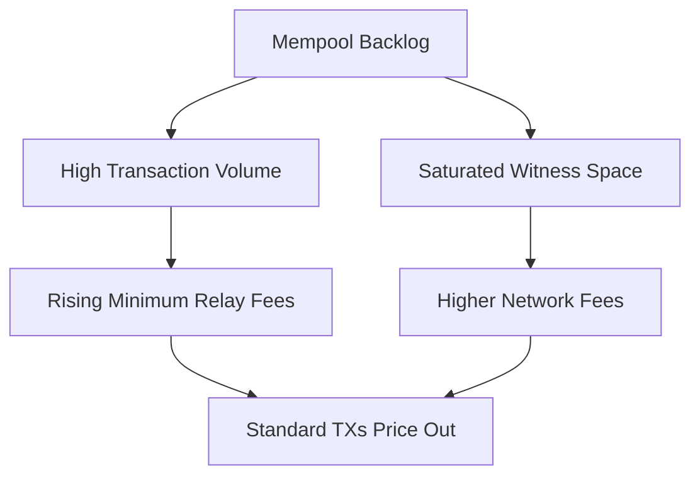

Just when we thought the crypto bear market was going to be a long, quiet winter of staring at flatlining charts and building developer tooling in silence, someone went and turned Bitcoin into an expensive, chaotic playground. If you have tried to send a standard on-chain Bitcoin transaction recently, you have probably noticed something shocking: fees have spiked to levels not seen since the height of the 2021 bull run. 

The culprit? A bizarre, brilliant, and deeply controversial technical shift called **Ordinals** and its wild child offspring, the **BRC-20** token standard. 

Suddenly, the world’s oldest, most conservative blockchain is hosting digital art galleries, meme coin minting frenzies, and a civil war between purists and builders. Let us open up the engine bay and examine how engineers pulled off this paradigm shift without a hard fork.

---

## The Core Magic: What is Ordinal Theory?

To understand how we got here, we have to talk about Casey Rodarmor’s **Ordinal Theory**. In Bitcoin, the smallest unit of currency is a satoshi (or "sat"), representing $10^{-8}$ BTC. There are 2.1 quadrillion satoshis in total. 

Historically, satoshis have been completely fungible—one sat is identical to another. Ordinal Theory changes this by proposing a logical tracking scheme. It assigns a unique serial number to every single satoshi in existence, ordered by the sequence in which they are mined. 

But Ordinal Theory is entirely an *off-chain* consensus. The Bitcoin network itself does not recognize these serial numbers; it only processes UTXOs (Unspent Transaction Outputs). However, by following a strict set of rules—first-in, first-out (FIFO) transfer from transaction inputs to outputs—anyone running an Ordinal-aware indexer can track a specific satoshi as it moves from wallet to wallet.

Once you can track an individual satoshi, you can do something fascinating: you can "inscribe" it.

---

## How Inscriptions Actually Work

Inscribing is the act of attaching arbitrary content—like HTML, JPEG, SVG, or plain text—directly to an individual satoshi. How is this achieved without altering the Bitcoin protocol? By utilizing two major upgrades in Bitcoin history: **Segregated Witness (SegWit)** in 2017 and **Taproot** in 2021.

SegWit introduced the "witness" portion of a transaction, which separates cryptographic signatures from transactional data and discounts its cost. Taproot then removed the size limits on witness data, allowing developers to write complex scripts.

When you create an inscription, you write your file directly inside a Taproot script path spending condition. Specifically, the data is wrapped inside an "envelope" of non-executed opcodes. To the Bitcoin network, this script looks like standard verification logic that will never be executed. To an Ordinals indexer, it is a payload of data.

Here is what the basic envelope looks like inside the assembly code:

```text
OP_FALSE
OP_IF
  OP_PUSH "ord"
  OP_1
  OP_PUSH "image/png"
  OP_0
  OP_PUSH <hex_encoded_image_data>
OP_ENDIF
```

Because `OP_FALSE` prevents the execution of this block, this data has absolutely zero impact on Bitcoin's state execution. It is dead weight to the nodes validating transactions, but it is immortalized in the immutable ledger. Because witness data receives a 75% fee discount (known as "witness discount"), this became a highly cost-effective way to store data on-chain.

---

## BRC-20: Turning Inscriptions into Fungible Tokens

If you thought JPEGs on Bitcoin were wild, wait until you meet BRC-20. Created by an anonymous developer known only as `@domodata` in March 2023, BRC-20 is an experimental standard for deploying, minting, and transferring fungible tokens directly on Bitcoin using text inscriptions.

Wait, how do you build fungible tokens on a chain that doesn't support smart contracts? 

By using JSON. Yes, you read that correctly. BRC-20 tokens are powered by small, inscribed text files containing JSON structures. The protocol defines three core operations: `deploy`, `mint`, and `transfer`.

### 1. Deploying a Token
To create a new BRC-20 token, you inscribe a JSON packet specifying the token ticker, maximum supply, and mint limits. Here is how the famous `$ordi` token was deployed:

```json
{
  "p": "brc-20",
  "op": "deploy",
  "tick": "ordi",
  "max": "21000000",
  "lim": "1000"
}
```

### 2. Minting Tokens
Once deployed, anyone can mint tokens by inscribing a mint transaction. It is a first-come, first-served race:

```json
{
  "p": "brc-20",
  "op": "mint",
  "tick": "ordi",
  "amt": "1000"
}
```

### 3. Transferring Tokens
To transfer these tokens, the sender must first inscribe a "transfer" JSON state to a new satoshi, and then send that satoshi to the recipient:

```json
{
  "p": "brc-20",
  "op": "transfer",
  "tick": "ordi",
  "amt": "500"
}
```

Because Bitcoin does not enforce double-spend rules on BRC-20 balances, off-chain indexers have to do all the heavy lifting. The indexer parses every single block chronologically, validating that a mint did not exceed the maximum supply, or that a sender actually had the balance they tried to transfer. If you try to transfer tokens you do not own, the indexer ignores the transaction.

---

## The Great Mempool Crisis: Why Nodes are Screaming

This combination of JSON files and minting races has had a dramatic, real-world impact. Thousands of users are spamming the network with thousands of micro-transactions to mint new tokens, resulting in a historic mempool backlog. 



For miners, this is a golden era. Transaction fees have occasionally exceeded the 6.25 BTC block subsidy, providing a massive revenue boost. But for daily users who rely on Bitcoin for low-cost, sovereign value transfer, the network has become painfully slow and expensive.

This has sparked a furious ideological rift:
*   **The Purists (Maximalists)**: Argue that Bitcoin's blockspace should be reserved exclusively for financial transactions. They view inscriptions as "exploit-driven spam" and are calling for code updates to filter out these transactions.
*   **The Builders**: Argue that Bitcoin is a permissionless ledger. If you pay the market-rate transaction fee, you have the right to write whatever data you want into your transactions.

---

## The Technical Outlook

As engineers, we must marvel at the ingenuity. BRC-20 is a hack—it is inefficient, relies heavily on centralized or federated off-chain indexers, and places a heavy burden on Bitcoin’s UTXO set. Yet, it proves that the desire for utility on the world’s most secure ledger is immense.

Whether BRC-20 survives or burns out, the genies of Ordinals and Taproot are out of the bottle. Bitcoin is no longer just digital gold. It is a database, and the developers are here to play.
