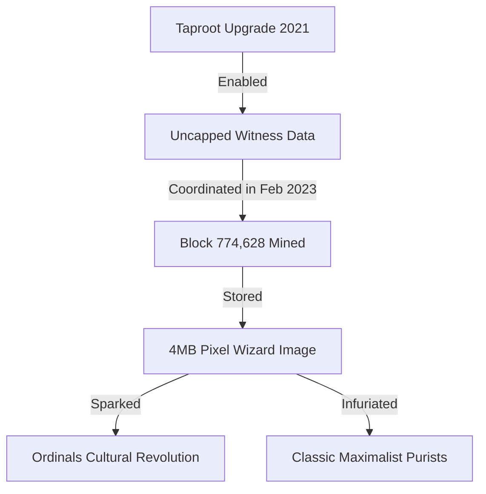

For years, the Bitcoin community had a very specific, carefully manicured reputation. If you spent any time on Crypto Twitter, you knew the archetype well: the Bitcoin Maximalist. They had laser eyes in their profile pictures, wrote extensive threads about the historical failures of fiat currency, adhered to a strictly carnivore diet, and viewed any blockspace usage that wasn't a standard Peer-to-Peer financial transaction as an existential threat to the network. 

The prevailing culture was solemn, highly political, deeply defensive, and occasionally incredibly toxic. Bitcoin was digital gold—a serious monetary network for a serious world. There was zero room for play.

Then, in early 2023, Casey Rodarmor launched the **Ordinals** protocol.

Almost overnight, a wild, irreverent wave of pixelated wizards, generative art collections, and experimental meme coins crashed through the gates of the Bitcoin mempool. The resulting cultural explosion has created the most fascinating, polarized, and chaotic rift in the history of the cryptocurrency space. 

Let us take an anthropological look inside the new Bitcoin culture.

---

## The Inciting Incident: The 4MB Wizard

To understand the culture clash, we have to talk about Block 774,628. On February 1, 2023, a developer named Udi Wertheimer, along with independent mining pool Luxor, coordinated the mining of the largest transaction and block in Bitcoin’s history. 

The block was almost exactly 4 megabytes—the absolute physical limit allowed by the Taproot protocol. 

And what was stored inside this historic, network-straining transaction? A giant, low-resolution drawing of a MS-Paint-style wizard celebrating "Magic Internet Money."

This was not a mistake; it was an incredibly deliberate, provocative act of cultural performance art. It was designed to send a clear message: **Bitcoin is a permissionless database. If you pay the transaction fee, you can store whatever you want.**

For the old-guard maximalists, this was a desecration of the sacred ledger. They viewed the wizard as "spam" designed to bloat the blockchain, drive up transaction fees, and make it harder for poor people in developing nations to run full validating nodes. 

For the new wave of builders, the wizard was a symbol of liberation—proof that Bitcoin could once again be fun, creative, and technically dynamic.

---

## True Digital Permanence vs. Ethereum NFTs

The culture of the Ordinals community is built on a foundation of intense technical elitism, but with a twist. They look down on traditional Ethereum-based NFTs, mockingly calling them "pointers."

In the Ethereum ecosystem, when you buy an NFT, the actual image file is rarely stored on the blockchain itself (because doing so is prohibitively expensive). Instead, the smart contract contains a metadata URL pointing to a decentralized storage service like IPFS, or worse, a standard centralized Amazon Web Services (AWS) bucket. If the hosting server goes down or the gateway breaks, your million-dollar JPEG becomes a broken link.

Ordinals, however, are called **Inscriptions** because the entire payload—whether it is a PNG, an SVG, or a JSON file—is written *directly* into the witness data of a Bitcoin transaction. 

This means that as long as the Bitcoin network exists, the artwork exists. It cannot be censored, deleted, or altered. The image is as permanent as the transactions recording your transactions. This technical distinction has birthed a highly obsessive collector culture that values "pure on-chain provenance" above all else.

---

## Inside the Ordinals Social Circles

If you wander into an Ordinals Discord server or join a Twitter Space, the energy is dramatically different from traditional Bitcoin communities. It feels much closer to the early days of Ethereum DeFi or the Solana NFT summer—yet it is wrapped in Bitcoin's rugged, security-first ethos.

### 1. The Language has Changed
The vocabulary of classic Bitcoin—UTXOs, halving cycles, hash rates, and lightning channels—is being combined with the slang of Web3: mints, mint storms, floor prices, rarities, and "degens." 

### 2. The Wizard Ethos
The "Taproot Wizards" have become a dominant cultural force, actively encouraging developers to experiment on Bitcoin. They wear wizard hats to conferences, organize massive online flashmobs, and treat the solemnity of old-school maximalism as a joke.

### 3. The BRC-20 Speculators
The creation of BRC-20 tokens has brought a wave of intense financial speculation. Small-cap traders are coordinating "mint storms," flooding the mempool with millions of transactions to mint newly deployed meme tokens. The speed, high stakes, and high fees have created a hyper-collaborative environment where developers and retail traders coordinate in real-time to track mempool clearing rates and optimize fee rates.

---

## Why the Rift is Good for Bitcoin

While node operators are frustrated by the massive backlog in the mempool and purists are screaming about block space pollution, this cultural shift is arguably the healthiest thing to happen to Bitcoin in half a decade.

For years, Bitcoin was suffering from a massive **brain drain**. The most talented young smart-contract engineers, cryptographers, and product designers were migrating to Ethereum, Cosmos, or Solana because Bitcoin’s development roadmap was perceived as dead and stale. 

Ordinals have shattered that perception. 

Once again, the world's most secure blockchain is attracting creative, ambitious hackers. Developers are writing custom indexing scripts, building headless market marketplaces, optimizing wallet architectures to handle individual satoshi tracking, and designing light-weight scaling protocols.

---

## The Canvas is Open

Culture is not something that can be controlled by a committee or defined by an ideology. In a permissionless system, culture is an emergent property of the protocol’s capabilities.

By upgrading Bitcoin to support SegWit and Taproot, the community gave developers a robust, cryptographically secure canvas. The pixelated wizards, JSON text packets, and community fights are simply what happens when that canvas is finally painted on. The cyber-hornets might be buzzing in anger, but the wizards are already casting their spells.
