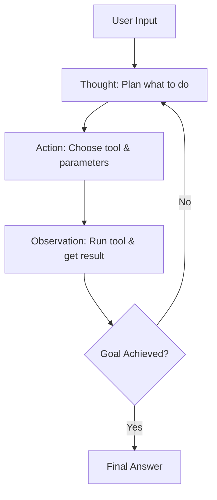

Large Language Models (LLMs) are incredibly impressive text predictors, but on their own, they are like brilliant minds locked in dark rooms. They can reason beautifully about the information they were trained on, but they have no eyes to see real-time data, no hands to operate tools, and no memory to handle multi-step workflows.

That is where **AI Agents** come in.

Unlike a simple linear chain (where you pass an input through an LLM and get a static output), an agent uses an LLM as its central reasoning engine. It observes user input, decides which tools to invoke, executes those tools, parses the results, and loops until it determines it has successfully resolved the user’s request.

In this tutorial, we are going to build a fully functional, autonomous AI Agent using Python and **LangChain**. Our agent will have access to a custom mathematical tool and a search tool, and it will be capable of reasoning, storing conversation memory, and executing complex multi-step queries.

---

## The ReAct Framework: Reason and Act

Under the hood, most LangChain agents implement the **ReAct** (Reasoning + Acting) design pattern. The loop is incredibly simple yet surprisingly powerful:



This cycle continues until the LLM decides that it has the information necessary to construct the final answer. Let us build one from scratch.

---

## Step 0: Prerequisites and Installation

First, let us set up our environment. You will need Python 3.8+ and API keys for OpenAI and SerpAPI (for Google Search).

Run the following command in your terminal:

```bash
pip install langchain langchain-openai google-search-results python-dotenv
```

Create a `.env` file in your root folder and populate it with your credentials:

```env
OPENAI_API_KEY=your_openai_api_key_here
SERPAPI_API_KEY=your_serpapi_api_key_here
```

---

## Step 1: Initialize the LLM and Load Built-in Tools

Let us write the baseline Python script to load our environment variables and initialize our OpenAI model. We will use `gpt-3.5-turbo` because of its speed and cost-effectiveness.

```python
import os
from dotenv import load_dotenv
from langchain_openai import ChatOpenAI
from langchain.agents import load_tools

# Load environment variables
load_dotenv()

# Initialize ChatOpenAI as our core reasoning engine
llm = ChatOpenAI(
    model="gpt-3.5-turbo",
    temperature=0.0
)

# Load standard search and math tools
# 'serpapi' handles Google Web search, 'llm-math' handles basic calculator operations
tools = load_tools(["serpapi", "llm-math"], llm=llm)
```

---

## Step 2: Write a Custom Python Tool

While built-in tools are great, the true power of LangChain lies in writing custom tools that can interface with your own internal databases, APIs, or custom scripts. 

Let us build a custom tool that calculates the length of a string. While simple, it demonstrates how you can wrap any Python function in a tool using the `@tool` decorator.

```python
from langchain.tools import tool

@tool
def calculate_string_length(text: str) -> str:
    """Calculates the exact number of characters in a string. 
    Use this tool when you need to count characters, measure text length, 
    or check if text meets length constraints."""
    length = len(text)
    return f"The text is exactly {length} characters long."

# Append our custom tool to the list of tools
tools.append(calculate_string_length)
```

**CRITICAL DETAIL**: The docstring inside the tool is not just comments. It is the **instructions the LLM reads** to understand when and how to call your tool. If your docstring is vague, the LLM will struggle to invoke it correctly.

---

## Step 3: Configure Agent Memory

An agent is useless in a chat context if it forgets what the user said in the previous message. Let us initialize memory to track conversation state.

```python
from langchain.memory import ConversationBufferMemory

memory = ConversationBufferMemory(
    memory_key="chat_history",
    return_messages=True
)
```

---

## Step 4: Initialize the Agent Executor

Now, let us bring it all together. We will construct a `StructuredChatAgent`, which allows our tools to handle multiple input parameters comfortably.

```python
from langchain.agents import AgentType, initialize_agent

# Create the agent executor
agent_executor = initialize_agent(
    tools=tools,
    llm=llm,
    agent=AgentType.STRUCTURED_CHAT_ZERO_SHOT_REACT_DESCRIPTION,
    verbose=True,
    memory=memory,
    handle_parsing_errors=True
)
```

Setting `verbose=True` is vital. It outputs the model's intermediate thoughts, actions, and observations to the console, allowing you to see the ReAct loop in action.

---

## Step 5: Test-Driving Our Autonomous Agent

Let us feed our agent a prompt that requires it to perform a search, do a calculation, and count the characters of its output. This forces the agent to orchestrate multiple tools in sequence.

```python
if __name__ == "__main__":
    prompt = (
        "Find the current CEO of Microsoft. "
        "Find their age, divide that age by 2, "
        "and tell me how many characters are in their full name."
    )
    
    print("Initiating Agent Executor...")
    response = agent_executor.run(input=prompt)
    print("\n--- FINAL ANSWER ---")
    print(response)
```

---

## Reading the Console Trace: The Reasoning Path

When you run this script, your console will output the internal execution log. It looks like a software engineer thinking out loud:

```text
> Entering new AgentExecutor chain...
Thought: I need to find the current CEO of Microsoft and their age first. I will use the search tool.

Action:
{
  "action": "Search",
  "action_input": "current CEO of Microsoft age"
}

Observation: Satya Nadella is the CEO of Microsoft, and he is 55 years old (born August 19, 1967).

Thought: The CEO is Satya Nadella, and he is 55 years old. 
Now I need to divide 55 by 2. I will use the calculator tool.

Action:
{
  "action": "Calculator",
  "action_input": "55 / 2"
}

Observation: Answer: 27.5

Thought: The calculated division is 27.5. 
Now I need to find the character count of his full name, 'Satya Nadella'. 
I will use the calculate_string_length tool.

Action:
{
  "action": "calculate_string_length",
  "action_input": "Satya Nadella"
}

Observation: The text is exactly 13 characters long.

Thought: I have successfully fetched the CEO (Satya Nadella), calculated their age divided by 2 (27.5), and found the character count of their full name (13). I can now construct the final response.

Final Answer: The current CEO of Microsoft is Satya Nadella. He is 55 years old. Half of his age is 27.5, and his full name, 'Satya Nadella', is exactly 13 characters long.
```

---

## Pitfalls in Production AI Agents

While this looks incredibly seamless, deploying agents to production requires managing some unique engineering challenges:

### 1. Infinite Loops (Runaway Agents)
If the LLM makes an error when parsing tool outputs or gets confused, it can enter an infinite loop of executing the same tool over and over. Always configure a safety budget like `max_iterations=5` in your agent configuration.

### 2. Output Parsing Failures
LLMs are probabilistic. They may generate an action format like `Action: Use tool "Calculator"` instead of the exact JSON structure your agent executor expects. Setting `handle_parsing_errors=True` ensures the parser catches this error and gracefully asks the LLM to re-evaluate its format.

### 3. API Latency and Cost
Every step of the ReAct loop requires a complete API round trip to OpenAI. If your agent executes a 5-step loop, you will incur five times the token cost and waiting times. Keep your tools lightweight and optimize your prompts to minimize reasoning steps.

---

## The Next Horizon

By abstracting tool invocation and logic flow into natural language, LangChain has created a revolutionary development pattern. You are no longer writing deterministic algorithms; you are engineering autonomous actors capable of making rational decisions in real-time. Start building!
