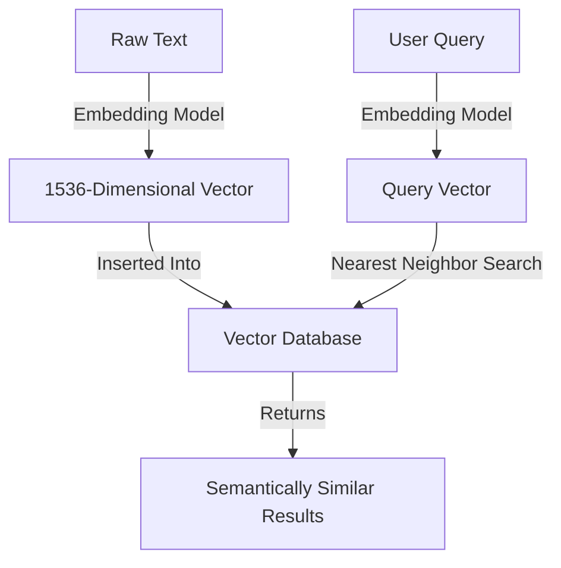

The sudden rise of Large Language Models (LLMs) has forced software engineers to learn a brand-new vocabulary. We are no longer just worrying about SQL normalization, database indexing, and Redis caching. Now, we are talking about high-dimensional spaces, token budgets, and **Vector Databases**.

If LLMs are the brains of modern artificial intelligence applications, vector databases are the **long-term memory**. 

When you build a Retrieval-Augmented Generation (RAG) system to chat with your PDF documents, or when you build an agent that remembers past conversations, you cannot rely on Postgres or MongoDB. Standard databases are designed to match exact terms; they are blind to semantic meaning.

To handle semantic relationships at scale, you need a vector database. But with dozens of platforms competing for your attention, which one should you choose? Let us peel back the layers on how vector indexing works, and compare the three biggest players in the game: **Pinecone**, **Weaviate**, and **Chroma**.

---

## What is a Vector Database, Anyway?

Before we look at the databases, let us quickly demystify the core technology. 

When you pass text (like a sentence or a code block) into an embedding model (like OpenAI’s `text-embedding-ada-002`), it translates that text into a **vector embedding**—an array of high-dimensional floating-point numbers (usually 1,536 dimensions for OpenAI).

This vector represents the *semantic meaning* of the text. Phrases like "the cat sat on the rug" and "a feline rested on the carpet" will produce vectors that are mathematically very close to each other in N-dimensional space, even though they share almost no identical words.



A vector database is optimized to store millions of these arrays and perform **Approximate Nearest Neighbor (ANN)** search. Instead of searching linearly (which would take forever at scale), it uses advanced graph and index structures like **HNSW (Hierarchical Navigable Small World)** or **IVF (Inverted File)** to locate the closest vectors in milliseconds.

---

## The Three Contenders

Let us look at our three major databases. Each targets a very different developer profile and operational environment.

---

## 1. Pinecone: The Fully Managed Cloud Giant

Pinecone is the undisputed leader in fully managed, cloud-native vector storage. It is closed-source and operates strictly as a SaaS (Software-as-a-Service) platform.

```python
# Pinecone API Example (Python)
import pinecone

# Initialize the client
pinecone.init(api_key="YOUR_API_KEY", environment="us-west1-gcp")

# Create a serverless index
pinecone.create_index("my-index", dimension=1536, metric="cosine")

# Insert vectors
index = pinecone.Index("my-index")
index.upsert(vectors=[
    ("doc-1", [0.01, 0.02, 0.03, ...], {"metadata_key": "value"})
])

# Semantic Query
results = index.query(vector=[0.015, 0.018, 0.032, ...], top_k=2, include_metadata=True)
```

### The Pros:
*   **Zero Operational Overhead**: Pinecone is serverless. You do not worry about hosting, Kubernetes clusters, memory pooling, or scaling disk storage. You just create an index via an API call and start writing.
*   **Sub-linear Scaling**: It handles scaling up to billions of vectors seamlessly, optimizing indexes behind the scenes.

### The Cons:
*   **Closed Source**: You are entirely locked into their platform. If Pinecone raises prices or has an outage, you have no recourse.
*   **No Local Mode**: You cannot run Pinecone offline inside your Docker container or on your local machine, which makes local testing and CI/CD pipelines frustrating to configure.

---

## 2. Weaviate: The Open-Source Swiss Army Knife

Weaviate is an open-source, developer-first vector database. It supports self-hosting via Docker/Kubernetes, but also offers a managed cloud service.

```python
# Weaviate API Example (Python)
import weaviate

client = weaviate.Client("http://localhost:8080")

# Define schema
class_obj = {
    "class": "Document",
    "vectorizer": "text2vec-openai",  # Automatically generates vectors using OpenAI
    "properties": [
        {"name": "content", "dataType": ["text"]}
    ]
}
client.schema.create_class(class_obj)

# Insert data (Weaviate will vectorise 'content' automatically under the hood)
client.data_object.create(
    {"content": "The cat sat on the rug"},
    "Document"
)

# Search
results = (
    client.query.get("Document", ["content"])
    .with_near_text({"concepts": ["feline on carpet"]})
    .with_limit(1)
    .do()
)
```

### The Pros:
*   **Hybrid Search**: Weaviate natively supports combining semantic search with keyword search (BM25) out of the box. This is incredibly useful for enterprise RAG where exact keyword matches (like part numbers or brand names) are vital.
*   **Automatic Vectorization**: It can integrate directly with models from OpenAI, Hugging Face, or Cohere. You write raw text, and Weaviate calls the API to create and store the vectors on its own.
*   **Self-Hostable**: Complete control over your infrastructure and data privacy.

### The Cons:
*   **Complexity**: Configuring Weaviate's schema and managing its self-hosted infrastructure has a steeper learning curve compared to Pinecone's simple key-value layout.

---

## 3. Chroma: The In-Memory Prototyper

Chroma is a lightweight, open-source embedded database. It is designed to be runs inside your application process, similar to SQLite.

```python
# Chroma API Example (Python)
import chromadb

# Initialize local database
client = chromadb.Client()

# Create a collection (defaults to SentenceTransformers vectorization)
collection = client.create_collection("my-docs")

# Add documents
collection.add(
    documents=["The cat sat on the rug", "A dog barked at the mailman"],
    ids=["doc1", "doc2"]
)

# Search
results = collection.query(
    query_texts=["feline resting"],
    n_results=1
)
```

### The Pros:
*   **Dead Simple**: You can set it up in two lines of Python code. There are no servers to configure, no network connections to manage, and no API keys required.
*   **Embedded**: Runs completely in-memory or saves directly to a local directory, making it perfect for scripts, notebooks, and local desktop applications.

### The Cons:
*   **Scale Limits**: Because it runs inside your application process, its performance is constrained by your local RAM and CPU. It is not designed to serve high-throughput, multi-tenant enterprise traffic with billions of items out of the box.

---

## Direct Architectural Comparison

| Feature | Pinecone | Weaviate | Chroma |
| :--- | :--- | :--- | :--- |
| **Hosting Model** | Closed-Source SaaS Only | Open-Source & Managed Cloud | Open-Source Embedded (SQLite style) |
| **API Interface** | REST, gRPC | GraphQL, REST | Python, JavaScript SDK |
| **Underlying Index** | Proprietary Graph | Custom HNSW | HNSW (via hnswlib) |
| **Hybrid Search** | Limited metadata filtering | Advanced BM25 + Vector | Limited metadata filtering |
| **Setup Time** | 2 minutes (Cloud API) | 10 minutes (Docker) | 10 seconds (Pip Install) |

---

## The Verdict: Which One Should You Choose?

As engineers, we should always choose our tools based on the constraints of our projects:

1.  **Choose Chroma** if you are prototyping, building a local script, writing a tutorial, or building an application that runs entirely on a user's local machine. It is the absolute king of rapid developer setup.
2.  **Choose Weaviate** if you want an open-source solution, require hybrid keyword-plus-vector search, need to self-host to keep your data strictly private inside your own cloud, or love GraphQL.
3.  **Choose Pinecone** if you are building an enterprise production SaaS, have a tiny engineering team with zero interest in managing database clusters, and want a highly scalable, "just works" serverless solution.

The vector database layer is the anchor of your intelligent software stack. Choose wisely, optimize your vectors, and enjoy building the future!
