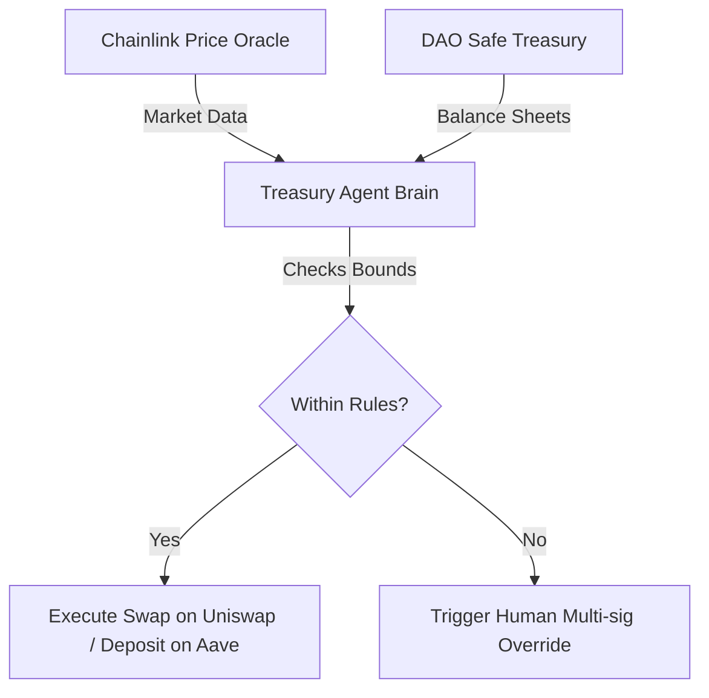
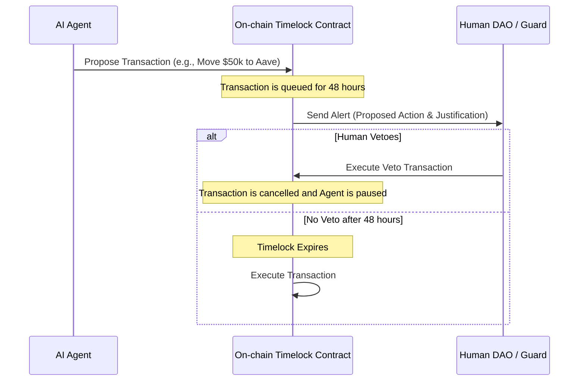

Welcome back, dev heroes. Let’s talk about Decentralized Autonomous Organizations (DAOs). 

In theory, DAOs are the ultimate evolution of human coordination. They are flat, global, permissionless, and can pool millions of dollars of capital in a single smart contract. They promise a world where anyone, anywhere, can contribute to a global mission and get paid automatically based on their on-chain contributions.

In practice, DAOs in 2023 are kind of a disaster. 

They suffer from severe voter apathy—usually less than 2% of token holders actually participate in active votes. They are paralyzed by endless Discord drama, plagued by governance capture by a few wealthy whales, and slowed down by extreme execution friction. If a DAO wants to pay an open-source contributor $1,000 for fixing a bug, it shouldn't require a 14-day governance proposal and $200 in gas fees.

We have reached the limits of human-only decentralized coordination. But what happens if we introduce a new class of community members?

What happens when we give DAOs their own **autonomous AI agents** with spending power?

Today, we are going to explore the concept of **Agent-Based Communities**: how wrapping LLMs in on-chain wallets can solve the core structural bottlenecks of DAOs, and how a hybrid human-AI governance model actually works.

---

## The Core Friction: The High Cognitive Cost of Governance

To understand why we need AI in DAOs, we have to look at cognitive load. 

To be an active, responsible DAO member today, you have to:
1.  Read 40-page, jargon-heavy governance proposals on Snapshot.
2.  Audit complex smart contract code attached to proposals to ensure there are no backdoor exploits.
3.  Monitor active discussions across Discord, Discourse, and Twitter 24/7 to gauge community sentiment.
4.  Execute manual transaction calls to claim rewards, delegate votes, or bridge assets.

Nobody has time for this. It is a full-time job, but it pays in speculative governance tokens of volatile value. Naturally, humans burn out, leading to centralized committee structures that look exactly like the old corporate hierarchies DAOs were meant to replace.

This is where AI agents step in. AI doesn't sleep. It doesn't get voter fatigue. It doesn't write passive-aggressive comments in Discord channels. It can ingest and analyze millions of data points in milliseconds and execute precise, deterministic operations based on that intelligence.

---

## Three AI Agent Archetypes for the Modern DAO

We can augment DAOs today by deploying specialized AI agents that operate directly within our communication channels and on-chain registries. Here are the three most critical agent archetypes:

### 1. The Autonomous Treasury Manager
Managing a DAO treasury is highly inefficient. If the market dips and the treasury needs to rebalance its stablecoin reserves to prevent liquidation, waiting for a multi-day voting process is a recipe for bankruptcy.

An **Autonomous Treasury Agent** is a smart contract wallet (like a Safe) connected to an LLM brain with access to DeFi protocols. Guided by a set of strict, programmatically enforced risk bounds (e.g., *"never allow stablecoin exposure to drop below 30%"*), the agent can execute real-time portfolio rebalancing, yield farming, or hedging strategies without waiting for human intervention.

### 2. The Sentiment & Context Summarizer
If you’ve spent five minutes in a crypto Discord, you know it’s a firehose of noise. 

A **Context Agent** can run continuously in your Discord and discourse forums. It parses every comment, filters out spam and bot activity, tracks overall community sentiment, and generates a clean, daily executive summary for human members:

*   *"General community sentiment is down 12% due to delays in the v2 roadmap."*
*   *"A major technical discussion has emerged in channel #dev-chat regarding gas optimization. Here are the top 3 proposed solutions."*
*   *"We detected a coordinated Sybil attack attempting to influence the voting on Proposal #42."*

### 3. The Proposal Auditor & Explainer
Before a human votes on an on-chain proposal, they need to understand it. 

An **Auditor Agent** can automatically intercept new Snapshot proposals. It reads the markdown text, identifies the corresponding smart contract payload, and generates two critical summaries:
1.  **The Layman's Summary**: A translation of the proposal's objectives and financial impact into plain, simple English.
2.  **The Technical Code Audit**: An automated security scan of the bytecode or Solidity code to be executed, highlighting any potential security vulnerabilities, unexpected admin privileges, or rug-pull risks.

---

## The System Architecture: Enforcing Bounds with Optimistic Governance

You might be thinking: *"This sounds great, but giving an LLM access to a multi-million dollar treasury is a terrifying idea. What if it hallucinates a bad trade or gets tricked by a prompt injection?"*

You are absolutely right. You must **never** give an AI agent absolute, unrestricted write-access to your smart contracts.

Instead, we use a design pattern called **Optimistic Governance**.

In this model, the AI agent has the authority to queue transactions in an on-chain timelock contract. Once a transaction is queued, a 48-hour countdown begins. 

The community has a window of 48 hours to review the agent's proposed action and its written justification. If any DAO member spots an anomaly, they can raise an alert, and a human multi-sig or a majority vote can trigger a veto. If no veto is registered before the timelock expires, the transaction executes automatically.

This ensures that the agent handles the heavy lifting of execution, while humans maintain ultimate veto power.

---

## Conclusion: The Rise of Hybrid Organizations

We are standing on the precipice of a massive shift in corporate design. The most successful organizations of the future will not be traditional hierarchical corporations, nor will they be chaotic, human-only DAOs.

They will be **hybrid, agent-based communities**.

By delegating the low-leverage, high-cognitive tasks of data tracking, proposal parsing, treasury rebalancing, and community moderation to specialized AI agents, human DAO members can focus entirely on high-level strategy, creative direction, and core product design.

It is time to stop arguing in Discord channels and start writing code. Let's build the smart contracts, register the agent profiles, and watch our communities scale autonomously.

Stay sovereign, and keep building.
