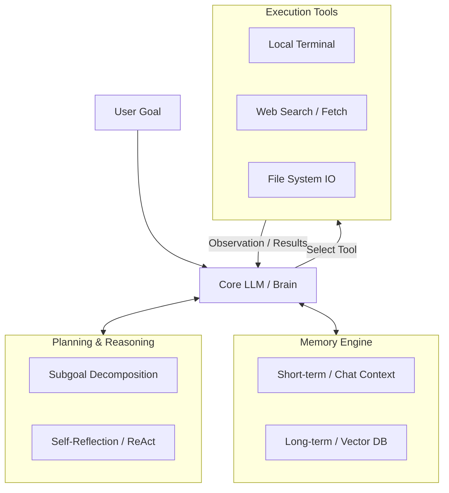

Welcome back, dev heroes. We’ve all seen the viral Twitter videos: a developer types a single sentence, press enter, and an "autonomous AI agent" proceeds to build an entire web app, launch a marketing campaign, and order a pizza. 

But if you’ve actually tried to clone those flashy GitHub repos and run them locally, you probably faced a very different reality. The agent gets stuck in infinite loops, hallucinate APIs that don’t exist, forgets what it was doing three steps ago, and burns through your OpenAI API credits faster than a junior developer in an AWS Sandbox.

The truth is, agents aren't magic. They are software. And just like any other software system, they require structured, disciplined architecture to actually work in the real world. 

Today, we are going to strip away the hype and analyze the core blocks of **AI Agent Architecture**. We will examine memory, planning pipelines, tool execution, and the state-machine loops that bind them together.

---

## The Big Picture: The Agentic Stack

At a system level, an AI agent is a design pattern that wraps a Large Language Model (LLM) in a loop of observation, decision-making, and action. Instead of a single static request/response cycle, an agent manages its own state, reflects on its performance, and uses external tools to achieve a target goal.

Here is the high-level system architecture of a functional AI agent:



Let's dissect each of these blocks.

---

## Block 1: The Brain (The Foundation LLM)

The LLM is the engine, but it is not the entire car. It handles language understanding, semantic extraction, and next-step reasoning. 

When designing an agentic system, you have to choose your core model carefully. For agents, **reasoning capacity** is infinitely more important than raw speed. The model must be highly capable of:
1.  **Strict Instruction Following**: If your model outputs markdown when you requested raw JSON, your tool execution parsers will break.
2.  **Function Calling**: The model must natively support structured outputs (like JSON schemas or tool-calling parameters) to safely interface with external code.

Models like GPT-4 or Claude 2 are the current industry standards for agentic brains. Trying to run a complex agentic loop with a small, unquantized local model will usually end in a loop of semantic gibberish.

---

## Block 2: Planning and Reasoning Pipelines

How does an agent approach a complex, multi-step problem without panicking? It uses a structured planning pipeline. There are two primary techniques we use to achieve this:

### 1. Subgoal Decomposition
When a user inputs a massive goal like *"Write a web scraper for CoinMarketCap and email me the CSV daily,"* the agent cannot execute this in a single prompt. The system must decompose the main goal into a sequential list of discrete, trackable sub-tasks. 
In software terms, this is similar to creating a dynamic todo list. The agent tracks which sub-tasks are `pending`, `in_progress`, and `completed`, updating its execution queue dynamically based on the results of previous steps.

### 2. The Reflection Loop (ReAct)
The most successful reasoning framework for agents is **ReAct (Reason + Act)**. Traditional LLM calls are "feed-forward"—they output a guess and hope it's correct. ReAct forces the model into a multi-step loop:

$$\text{Thought} \rightarrow \text{Action} \rightarrow \text{Observation} \rightarrow \text{Reflection}$$

*   **Thought**: The agent reasons about its current state and plans the next logical action.
*   **Action**: The agent selects a tool and executes it with specific parameters.
*   **Observation**: The agent reads the raw results returned by the tool (e.g., a terminal output or an HTTP status code).
*   **Reflection**: The agent compares the observation against its expected outcome and adjusts its mental model before initiating the next thought cycle.

If the terminal returns a `ModuleNotFoundError`, a reflective agent doesn't give up. It realizes it needs to execute a pip install command before running the script again.

---

## Block 3: The Memory Engine

An LLM is completely stateless. It does not remember the previous API call unless you explicitly pass that context back into the prompt window. To build an agent that can work on complex projects over hours or days, we need a robust memory engine divided into two tiers:

### 1. Short-Term Memory
This is your in-flight context. It includes the recent conversation history, system instructions, and the current task queue. Because the LLM context window is finite (and expensive), you must aggressively manage short-term memory. 
Instead of passing the entire execution log of every shell command, you should summarize previous tool outputs and prune old logs while keeping the system prompt clean and highly focused.

### 2. Long-Term Memory
Long-term memory is where we store historical context, user preferences, and broad domain knowledge. We implement this using **Vector Embeddings** and a **Vector Database** (like Pinecone, Milvus, or pgvector).

When the agent executes a task, we convert the result into a vector embedding and write it to our DB. On subsequent steps, the agent performs a semantic similarity search against the vector DB to retrieve relevant past experiences:

$$\text{Query} \rightarrow \text{Embed}(\text{Query}) \rightarrow \text{Vector Search} \rightarrow \text{Top-K Retrospective Context}$$

This is the equivalent of an engineer saying: *"Wait, I encountered this library error three projects ago. How did I solve it then?"*

---

## Block 4: Tool Execution (Actuators)

An LLM with memory and planning is still just a brain in a jar. It needs hands to manipulate the external world. These "hands" are our execution tools.

Tools are simply standard Web2 APIs or Python functions that we register with the agent. The agent doesn't write the tool code; it writes the *parameters* to call the tool.

For example, if you want your agent to read a local file, you write a Python function like:

```python
def read_workspace_file(file_path: str) -> str:
    # Safely read file content from local disk
    with open(file_path, "r", encoding="utf-8") as f:
        return f.read()
```

You then describe this function to your LLM in its system context:
```json
{
  "name": "read_workspace_file",
  "description": "Reads raw text content from a local file path. Use this tool before editing files to understand existing code structure.",
  "parameters": {
    "file_path": "string"
  }
}
```

The LLM reads this JSON schema, decides when to call it, and outputs a structured request: `{"tool": "read_workspace_file", "parameters": {"file_path": "./app/config.py"}}`. Your runtime intercepts this, executes the local Python function, and pipes the string output back into the model's observation buffer.

---

## The Engineering Reality: Guardrails and State Machines

If you build an agent that is 100% autonomous with zero constraints, it will eventually wander off into the weeds, delete your database, or get stuck in a recursive loop of self-correction. 

To build agentic systems that actually work in production, you must use **deterministic guardrails**:

1.  **Finite State Machines (FSMs)**: Do not let the LLM decide the absolute flow of your entire application. Use a state machine to enforce transitions. For example, an agent should never be allowed to transition from the "writing code" state to the "deploy to production" state without passing through a deterministic "run local unit tests" state first.
2.  **Strict Token Budgeting**: Always enforce hard execution limits. If an agent cannot solve a task within 15 execution steps, force a pause, notify the user, and request manual guidance.
3.  **Sandboxed Environments**: Never run an agent's terminal execution tool directly on your host machine. Use sandboxed Docker containers or microVMs. An agent that generates and executes its own code can easily write a buggy script that wipes your home directory.

---

## Conclusion: The Era of Agentic Software

We are moving from an era of static software (where humans write deterministic logic for every eventuality) to **agentic software** (where humans design the architecture, and AI agents dynamically orchestrate the execution).

By understanding the distinct blocks of memory, planning, tools, and execution loops, you can stop building toy chatbots and start building robust, reliable agents that solve actual, complex software engineering problems.

In our next post, we are going to get our hands dirty. We will write a complete, working personal AI agent in Python from scratch—no heavy agent frameworks, just raw code, clean architecture, and the OpenAI API.

Get your editors ready. We are just getting started.
