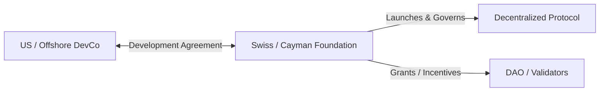

Welcome back, dev heroes. If you are launching a Web3 startup in 2023, let me first offer my sincere respect. You are building in a regulatory environment that is a chaotic cross between *Mad Max* and a Kafka novel. 

With the SEC suing exchanges left and right, and classification letters flying around like shrapnel, the old playbook of *"deploy a token first, ask questions later"* is officially dead. If you try to run that model today, your primary developer tool won't be VS Code—it will be a subpoena.

But despair is not a viable business strategy. The bear market is for builders, and history shows that the projects that design compliant, legally resilient structures during the regulatory winter are the ones that capture massive market share in the next expansion cycle.

Today, we are going to dive into the structural mechanics of Web3 corporate design. This is a pragmatic, battle-tested playbook for founders who want to build cutting-edge decentralized technology without ending up in federal court.

---

## 1. The Core Paradigm: Decentralization is Your Only Shield

To navigate securities law, you must understand the **Howey Test**. Under US law, an asset is an investment contract (a security) if it involves:
1.  An investment of money
2.  In a common enterprise
3.  With a reasonable expectation of profits
4.  Derived solely from the entrepreneurial or managerial efforts of others.

As a early-stage startup, your biggest legal risk lies in prong 4. If your core development team controls the protocol, directs the roadmap, manages the treasury, and promotes the token, then the token is almost certainly a security. 

Your goal must be **Sufficient Decentralization**. 

In the eyes of the law, once a network is sufficiently decentralized—meaning there is no central group of managers whose efforts dictate the value of the token—the "efforts of others" prong fails. The classic example is Ethereum. While ETH was originally sold in a crowdsale, regulators have largely agreed that the network has evolved to become so decentralized that ETH is now a commodity, not a security.

To build this shield, you must plan for ** progressive decentralization** from day one. You start as a centralized builder team, but you must have a clear, documented roadmap to hand over governance, state updates, and treasury management to a decentralized community of node operators and DAO participants.

---

## 2. The Dual-Entity Corporate Architecture

Sophisticated Web3 founders do not run their entire operation from a single Delaware C-Corp. If you do, you are creating a massive, centralized target for class-action lawsuits and regulatory enforcement.

Instead, the industry standard is a **dual-entity structure** that isolates liability and separates software development from the decentralized protocol itself.

### Entity A: The Software Development Lab (DevCo)
This is your standard operating company (e.g., a US LLC or a UK Ltd). The DevCo houses your developers, owns the intellectual property (IP) during the early stages, and signs contracts with Web2 providers (like AWS or GitHub). 
Importantly, **the DevCo does not issue the token**. It simply acts as a software contractor.

### Entity B: The Decentralized Foundation (Foundation)
This is an offshore, non-profit entity, typically established in Switzerland, Liechtenstein, the Cayman Islands, or the British Virgin Islands. 
The Foundation's sole purpose is to act as the steward of the decentralized protocol. 

The DevCo enters into a development agreement with the Foundation. The Foundation pays the DevCo in fiat or stablecoins to write open-source code for the protocol. When the protocol launches, the Foundation deploys the smart contracts and, if applicable, orchestrates the token distribution.

Because the Foundation has no shareholders and is offshore, it isolates the core developers at the DevCo from direct liability related to token sales or protocol activity.

---

## 3. Token Design: Utility Over Speculation

If you plan to launch a token, you must ensure that its primary architecture is rooted in **utility** rather than speculative capital.

If your token's main pitch is *"buy this token and its price will go up as we build more features,"* you are building an unregistered security.

Instead, your token must be a functional component of your decentralized network. Let's look at the standard utility mechanisms that legal teams love:
*   **Gas / Resource Payment**: Users must burn or spend your token to execute actions on your network (like ETH on Ethereum or SOL on Solana).
*   **Consensus & Security**: Node operators must stake your token to secure the network and earn validation rewards.
*   **Decentralized Governance**: Token holders use the asset to vote on protocol parameters, upgrades, and grant allocations. The token must represent voting weight, not equity or dividend rights.

To fund early development, you can use a **SAFT (Simple Agreement for Future Tokens)**. The SAFT is a security, and you sell it *only* to accredited, high-net-worth investors under regulatory exemptions (like SEC Regulation D). 

When the token is finally generated, it must only be distributed to the general public once the network is live and the token has immediate, practical utility on-chain.

---

## 4. The Nuclear Option: Strict Geofencing

Let's address the elephant in the room: the US regulatory market is highly hostile. Many top-tier Web3 projects are choosing to exclude the United States from their public token distributions and airdrops entirely.

If you decide to exclude the US, you must be extremely disciplined about your **geofencing**:
1.  **Strict IP Blocking**: Implement enterprise-grade IP geo-blocking on your frontend applications.
2.  **VPN Mitigation**: Use advanced detection scripts to block users who are attempting to bypass your geofencing via VPNs or Tor.
3.  **Terms of Service & KYC**: Require users to agree to legally binding terms that explicitly prohibit US residents from participating. For larger sales, implement automated KYC (Know Your Customer) verifications to filter out US passports.

While it is frustrating to cut off the largest capital market in the world, the peace of mind gained by removing your protocol from the SEC's direct jurisdiction is often worth the sacrifice.

---

## Conclusion: Build Like an Architect, Not an Outlaw

Regulatory pressure is not the death of Web3; it is the professionalization of it. The era of the "wild west" is coming to a close, and the era of sophisticated, resilient financial architecture is beginning.

By separating your development lab from your protocol foundation, designing tokens with genuine utility, and using offshore frameworks strategically, you can build applications that are legally secure and technically robust.

Don't let the regulatory noise stop you from building. Grab your legal templates, set up your dual entities, and write code that stands the test of time.

Stay compliant, stay sovereign, and keep building.
