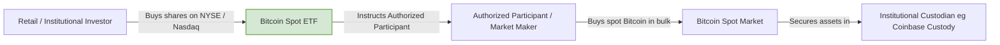

If you spent 2022 and early 2023 huddling in the crypto winter trenches, watching FTX burn, Celsius implode, and Do Kwon run from the law, congratulations: you survived. You are still here. Your reward? A front-row seat to one of the most fascinating market structural shifts in financial history.

Bitcoin has quietly crossed **$37,000**. 

Just think about that for a second. Less than a year ago, in November 2022, Bitcoin was limping around $15,500, and the mainstream media was drafting crypto's obituary for the twentieth time. Today, the asset is up over 130% year-to-date.

But this isn't the retail-driven, meme-fueled, laser-eye mania of 2021. There are no Super Bowl commercials, no dog coins dominating the evening news, and your uncle hasn't asked you how to buy Ethereum at Sunday dinner yet. 

Instead, this rally is quiet, deliberate, and deeply institutional. The market is aggressively front-running the SEC's inevitable approval of a **Spot Bitcoin ETF** (Exchange-Traded Fund). 

Let’s skip the hype, pop open the hood, and look at the actual on-chain and market structure metrics driving this rally.

---

## The Big Prize: Why a Spot ETF is a Game-Changer

To understand the price action, we first have to understand why Wall Street’s heavyweights—BlackRock, Fidelity, Franklin Templeton, VanEck—are fighting so hard for a Spot ETF.

Currently, if an institutional investor (like a pension fund or a registered investment advisor managing $5 billion) wants exposure to Bitcoin, they face massive regulatory and technical hurdles:
- They can’t hold raw BTC on a Ledger Nano in a desk drawer.
- They can’t open an account on a offshore crypto exchange.
- The existing futures-based ETFs suffer from "roll decay" (the cost of constantly selling expiring futures contracts and buying the next month’s, which eats into performance).

A Spot ETF solves all of this. It wraps physical Bitcoin in a highly regulated, SEC-approved wrapper that can be traded on the Nasdaq or NYSE. The fund manager actually has to buy and custody physical Bitcoin to back the shares. 



This unlocks an ocean of capital. Registered investment advisors (RIAs) in the US manage over **$100 trillion** in wealth. Under current rules, they literally cannot touch Bitcoin. If they allocate just **0.5% to 1%** of that capital to a spot ETF, it represents $500 billion to $1 trillion of buy pressure on an asset with an illiquid, capped supply.

The market knows this. And the smart money is moving first.

---

## Metric 1: The Grayscale GBTC Discount Collapse

The single best leading indicator of the ETF's probability of approval has been the **Grayscale Bitcoin Trust (GBTC) discount to Net Asset Value (NAV)**.

GBTC is a trust that holds physical Bitcoin, but because of its closed-end structure, investors could not redeem shares for the underlying Bitcoin. During the depths of the bear market, GBTC traded at a staggering **-49% discount**. That meant you could buy $100 worth of Bitcoin for $51 by buying GBTC shares. It was a sign of absolute capitulation and regulatory despair.

Then, Grayscale sued the SEC for rejecting its application to convert the trust into an ETF—and won.

Since that court victory and BlackRock's ETF filing, the discount has collapsed from -45% down to **less than 10%**.

```
GBTC Discount to Net Asset Value (NAV) 2023 Trend:
[Dec 2022]  -49%  =======================================
[Jun 2023]  -30%  =======================
[Sep 2023]  -20%  ===============
[Nov 2023]  -9%   =======
```

This rapid contraction is the sound of sophisticated arbitrageurs buying up millions of dollars of GBTC, betting that when it converts to a Spot ETF, the discount will snap to zero, netting them a massive risk-free profit.

---

## Metric 2: CME Flips Binance (The Institutional Migration)

For years, the undisputed king of Bitcoin derivatives was Binance. It was the epicenter of leverage, retail trading, and offshore speculation. 

Not anymore. 

This month, the **Chicago Mercantile Exchange (CME)**—the traditional home of institutional futures trading—officially flipped Binance to become the world’s largest Bitcoin futures exchange by Open Interest (OI).

This is a massive structural milestone. 
CME’s open interest represents cash-settled, highly regulated, institutional contracts. This flip proves that traditional financial institutions are driving the current volume, positioning themselves ahead of the ETF decision window. They aren't trading on unregulated offshore platforms; they are trading on US-regulated exchanges.

---

## Metric 3: The Exchange Liquidity Squeeze

While Wall Street prepares the pipes for the ETF, what is happening to the supply of Bitcoin itself? 

The short answer: it’s disappearing.

According to Glassnode on-chain data, **Bitcoin exchange balances have hit a 5-year low**. Investors are aggressively withdrawing their coins from centralized exchanges (Binance, Coinbase, Kraken) and moving them into illiquid, long-term custody or cold storage.

```
Bitcoin held on Exchanges:
2020: ~3.2M BTC
2021: ~2.8M BTC
2022: ~2.5M BTC
2023: ~2.0M BTC (5-Year Low)
```

This is creating a massive **supply-side liquidity squeeze**. 
Currently, over **76% of all circulating Bitcoin** is classified as "illiquid"—held by entities that historically rarely sell their coins. 

When the BlackRocks of the world finally get the green light to buy spot Bitcoin to back their ETFs, they aren't going to find a highly liquid market with sellers eager to exit. They are going to run into a supply wall. They will have to bid prices up aggressively to coax long-term holders into selling.

---

## Metric 4: Whale Wallet Accumulation

Are the retail minnows buying this rally? No.
The addresses holding small amounts of Bitcoin (the "shrimp" holding < 1 BTC) have actually slowed their accumulation. 

The buying is coming from the **Whales** (entities holding > 100 BTC or > 1,000 BTC). 
Over the past 60 days, wallets with balances between 1,000 and 10,000 BTC have added over 60,000 BTC to their stacks. These are not retail traders panic-buying because of a Twitter thread; these are institutional desks, family offices, and high-net-worth entities systematically accumulating spot Bitcoin over weeks, hiding their orders in the liquidity pools.

---

## The Technical Reality Check: The Funding Rate Warning

Lest we get too drunk on the bullish kool-aid, let's look at one potential warning sign: **funding rates**.

As Bitcoin broke through $35,000 and marched toward $37,000, funding rates on perpetual swap contracts across crypto-native exchanges began to tick up to their highest levels since the 2021 bull run. 

High funding rates mean that long traders are paying short traders to keep their positions open. It indicates that the retail leverage engine is starting to wake up, and traders are chasing the momentum with aggressive leverage. 

While the spot accumulation is real, high leverage makes the market susceptible to "flush-outs." A sudden 5% drop in price can trigger a cascade of liquidations, flushing out late long-traders and dropping the price briefly back to the low $30,000s before resuming the upward trend.

## The Wrap Up: Wall Street is Coming

Bitcoin at $37,000 in late 2023 is a different beast than Bitcoin at $37,000 in 2021. 

The last bull run was built on the backs of zero-interest rates, government stimulus checks, and unstable leverage structures. This rally is being built on the anticipation of the largest asset managers in the world entering the ecosystem.

The on-chain data doesn't lie. Whale accumulation, exchange outflows, and derivative volumes all point to a market that is preparing for a massive, structural supply shock. 

For those who sat through the cold, dark days of 2022: the halving is coming in early 2024, the ETFs are on the horizon, and the smart money has arrived. Grab a seat—it's about to get very interesting.
