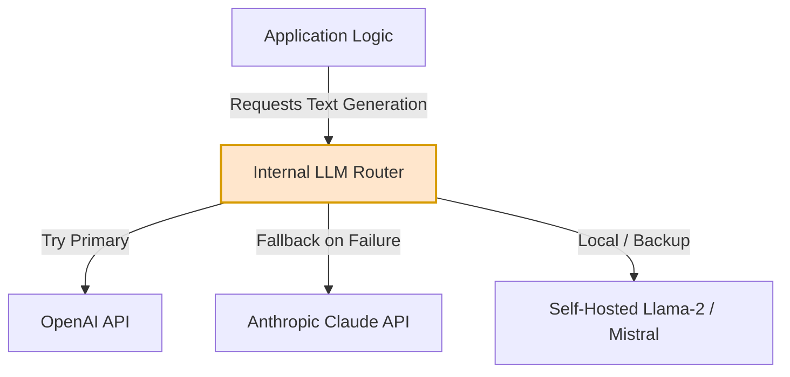

The five days of OpenAI drama in mid-November sent a massive shockwave through the venture capital and startup ecosystems. Overnight, hundreds of founders who had raised millions of dollars on the premise of "building on OpenAI" stared into an existential abyss. 

They realized that their entire business was built on a single, fragile point of failure: an API endpoint controlled by a non-profit board in San Francisco. 

If you are an AI founder, "platform risk" is no longer an abstract concept you discuss in pitch meetings to satisfy skeptical investors. It is an immediate, operational threat. If your company's core value proposition relies entirely on a single model from a single provider, you don't own a software company—you own a high-risk derivative.

We need to build organizational and technical resilience. Let's look at the practical, engineering-first strategies you can implement today to ensure your AI startup survives the next ecosystem tremor.

---

## 1. The Architectural Strategy: The Multi-LLM Router

The most critical mistake is hardcoding a specific provider's client directly into your application services. 

If your codebase is littered with `openai.ChatCompletion.create` calls, you are locked in. Swapping to a different provider in an emergency will require a major, panic-ridden code rewrite, QA testing, and redeployment.

Instead, you must build an abstraction layer—a **LLM Router** or gateway. Your application code should talk to your internal router, and the router should handle the details of which provider to use.



Here is a simple, production-ready Python abstraction showing how to implement a fallback client that catches OpenAI API errors (like rate limits, timeouts, or server outages) and gracefully fails over to Anthropic’s Claude:

```python
import os
import time
import logging
from openai import OpenAI, OpenAIError
from anthropic import Anthropic, AnthropicError

logging.basicConfig(level=logging.INFO)
logger = logging.getLogger("LLMRouter")

class ResilientLLMClient:
    def __init__(self):
        # Initialize clients using environment variables
        self.openai_client = OpenAI(api_key=os.getenv("OPENAI_API_KEY"))
        self.anthropic_client = Anthropic(api_key=os.getenv("ANTHROPIC_API_KEY"))

    def generate_text(self, system_prompt: str, user_prompt: str) -> str:
        # Step 1: Attempt to use OpenAI GPT-4
        try:
            logger.info("Attempting generation with OpenAI GPT-4...")
            response = self.openai_client.chat.completions.create(
                model="gpt-4-1106-preview",
                messages=[
                    {"role": "system", "content": system_prompt},
                    {"role": "user", "content": user_prompt}
                ],
                timeout=10.0 # Strict timeout to trigger fallback quickly
            )
            return response.choices[0].message.content
        except OpenAIError as e:
            logger.warning(f"OpenAI API failed: {str(e)}. Initiating fallback to Anthropic...")
            return self._fallback_to_anthropic(system_prompt, user_prompt)

    def _fallback_to_anthropic(self, system_prompt: str, user_prompt: str) -> str:
        # Step 2: Fallback to Anthropic Claude 2
        try:
            logger.info("Attempting generation with Anthropic Claude...")
            # Combine system and user prompts for Claude 2 legacy interface format if needed
            combined_prompt = f"{system_prompt}\n\nHuman: {user_prompt}\n\nAssistant:"
            response = self.anthropic_client.completions.create(
                model="claude-2",
                prompt=combined_prompt,
                max_tokens_to_sample=2000,
                timeout=10.0
            )
            return response.completion
        except AnthropicError as ae:
            logger.critical(f"Both primary and fallback LLMs failed: {str(ae)}")
            raise RuntimeError("All configured LLM providers are currently unavailable.")

# Example Usage:
# client = ResilientLLMClient()
# output = client.generate_text("You are a concise assistant.", "Explain recursion.")
```

By introducing this simple design pattern, you decouple your product from the underlying provider. If OpenAI experiences a global outage on a Monday morning, you can toggle a configuration flag in your database to route all traffic to Anthropic instantly without deploying new code.

---

## 2. Prompt Portability: The Hidden Challenge

Implementing a code abstraction is easy. The harder engineering challenge is **prompt portability**.

LLMs are highly sensitive to prompt structure. A detailed, multi-turn prompt that works perfectly with `gpt-4` to output structured JSON might fail completely when passed directly to `claude-2` or a fine-tuned open-source model.

To build true resilience:
- **Modularize your prompts**: Separate the core logic, constraints, and examples (few-shot learning) from the model-specific formatting.
- **Maintain a prompt registry**: Use tools or internal databases to manage different versions of prompts for different models.
- **Define standard interfaces**: Use schema-validation tools (like Pydantic in Python) to enforce structured outputs, regardless of which model produced the raw text. If a model fails to return valid JSON, route the output through a lightweight parser or a correction agent before feeding it to your application.

---

## 3. The Sovereign Cloud: Embracing Open-Source Models

Resilience means controlling your own destiny. And you cannot control your destiny if you are entirely dependent on proprietary APIs.

The release of open-source models like **Llama-2 (Meta)** and **Mistral-7B** has changed the calculus. These models can be self-hosted on your own infrastructure (AWS Bedrock, RunPod, Replicate, or dedicated Hugging Face TGI nodes).

While open-source models might not match `gpt-4` in complex multi-step reasoning, they are highly capable of handling 80% of standard tasks—such as text classification, entity extraction, summarization, and simple draft generation.

An optimal, resilient startup architecture uses a hybrid approach:

```
[Incoming Request]
       │
       ▼
 [Task Complexity Triage]
       ├── Low Complexity ──> [Self-Hosted Mistral-7B] (Cheap, 100% controlled)
       └── High Complexity ──> [LLM Router] 
                                  ├── Primary: GPT-4 Turbo
                                  └── Fallback: Claude 2
```

By offloading simple tasks to your own hosted open-source models, you cut your API bill, reduce external dependencies, and guarantee that a massive chunk of your product remains fully functional even if the proprietary API market collapses.

---

## 4. Where Does Your Moat Actually Live?

Beyond the technical architecture, the OpenAI crisis forced a deeper philosophical question for founders: **Where does your startup's moat actually live?**

If your business is simply a thin wrapper around another company's intelligence, you are highly vulnerable. Anyone can copy your prompt. Anyone can buy the same API. 

True organizational resilience comes from building value around the model:
- **Proprietary Data Pipelines**: Your ability to collect, clean, and utilize feedback data from your users. The logs of how users interact with your AI outputs are gold. This data is the foundation for fine-tuning your own proprietary models.
- **Workflow Integration**: Deeply integrating into your customer’s daily operations. It’s remarkably easy to switch an API; it is incredibly difficult to rip out a system that is integrated into a customer's databases, notification channels, and team workflows.
- **UX and Context Engineering**: How you manage context, retrieve relevant data (RAG), and present the output. 

## The Takeaway

The OpenAI boardroom coup was a terrifying wake-up call, but it was also a gift to the startup community. It exposed the danger of platform dependence early in the cycle, giving us the opportunity to correct course before we reached massive scale.

Don't wait for the next platform outage or boardroom crisis to build resilience. Decouple your code, invest in prompt portability, evaluate open-source alternatives, and focus on building a real moat. 

Your business is too valuable to be held hostage by someone else's board meeting.
