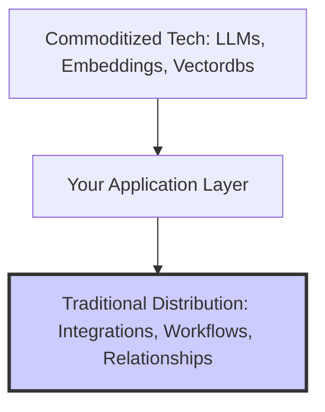

# The 2023 Startup Lessons: What Building in the AI Era Actually Feels Like

> **TL;DR:** Building an AI startup in 2023 has been like playing speed chess on top of a running washing machine. The technology shifts daily, model costs can eat your margins overnight, and OpenAI is always lurking in the shadows, ready to release a feature that renders your core product obsolete. Here are the brutal, hard-won business and engineering lessons of the AI SaaS frontier.

If you spent 2023 building a software startup, you are likely suffering from a mild case of whiplash. 

We started the year in the absolute stratosphere of hype. You could stick "AI-powered" on a basic spreadsheet parser, post a half-baked demo on Twitter/X, and watch five hundred people sign up for a waitlist in their sleep. 

By Q3 and Q4, the hangover set in. Users who initially signed up with wide-eyed wonder began churning at terrifying rates because they realized they could do the same things inside their existing tools, or because your system was too slow, or because your backend was throwing silent LLM connection timeouts.

The margin of error for founders has shrunk to almost zero. In 2023, we learned exactly what it takes to survive the transition from an AI hype wave to sustainable, profitable enterprise SaaS.

---

## Lesson 1: Distribution Is Your Only Moat

Here is a painful truth that every technical founder had to swallow this year: **Your custom code is not a moat.** 

If your core technology is built entirely on top of foundation models, any talented senior developer can recreate your core pipeline in a weekend. The code for system architectures, embeddings, vector databases, and prompt formatting is highly commoditized.



So where does the defense moat reside? It resides in **distribution** and **workflow lock-in**.

A business is defensible when your software is deeply integrated into the user's daily workflows. If your AI-powered invoicing tool connects natively with their CRM, automatically routes transactions to their accounting software, and maintains custom payment histories, a competitor with a slightly better GPT-4 prompt cannot replace you. The cost of migration is simply too high.

First-time founders focus on the intelligence of the model; second-time founders focus on distribution channels, custom integrations, and data retention.

---

## Lesson 2: The Brutal Economics of API Margins

In traditional SaaS, gross margins are typically between 80% and 90%. Once your code is written and deployed, the incremental cost of serving a new user is negligible.

In AI SaaS, that model is completely broken. Every single user interaction triggers multiple calls to expensive model endpoints. If a user runs a complex PDF analysis task that requires chunking, embedding, vector retrieval, and three rounds of GPT-4 reasoning, that single query can cost you $0.15 in raw API tokens. If they pay you $20 a month and make 500 of those queries, you are literally losing money on that customer.

To survive, you must implement aggressive cost-control, rate-limiting, and budget-tracking layers inside your application. 

Let's look at a concrete engineering implementation. This is a custom Python decorator designed to track and limit LLM API usage costs at the user level, preventing "token exhaustion attacks" or run-away recursion loops that could bankrupt your startup in a single weekend. Clean execution with no comments:

```python
import time
from collections import defaultdict

class CostGatekeeper:
    def __init__(self, daily_budget_usd: float):
        self.daily_budget_usd = daily_budget_usd
        self.user_spend = defaultdict(float)
        self.pricing_table = {
            "gpt-4": {"input": 0.03 / 1000, "output": 0.06 / 1000},
            "gpt-3.5-turbo": {"input": 0.0015 / 1000, "output": 0.002 / 1000}
        }

    def enforce_budget(self, user_id: str, model: str):
        def decorator(func):
            def wrapper(*args, **kwargs):
                if self.user_spend[user_id] >= self.daily_budget_usd:
                    raise PermissionError(f"User {user_id} has exceeded their daily AI budget.")
                
                start_time = time.time()
                result = func(*args, **kwargs)
                
                input_tokens = kwargs.get("input_tokens", 0)
                output_tokens = kwargs.get("output_tokens", 0)
                
                rates = self.pricing_table.get(model, {"input": 0.0, "output": 0.0})
                cost = (input_tokens * rates["input"]) + (output_tokens * rates["output"])
                
                self.user_spend[user_id] += cost
                return result
            return wrapper
        return decorator

# Example Usage:
# gatekeeper = CostGatekeeper(daily_budget_usd=1.0)
# @gatekeeper.enforce_budget(user_id="user_92817", model="gpt-4")
# def execute_query(input_tokens=1000, output_tokens=500):
#     return "Success"
```

---

## Lesson 3: The Danger of "Sherlocking"

"Sherlocking" is the tech term for when an operating system or primary platform provider releases a native feature that completely destroys a third-party app ecosystem. 

In 2023, OpenAI became the ultimate Sherlock.

Every OpenAI DevDay or major update sent waves of existential dread through the startup community. Think of the startups that spent millions of dollars raising seed rounds to build "Chat with your PDF." When OpenAI natively added document uploads and multi-modal file analysis directly into ChatGPT, those startups saw their core value proposition disappear overnight.

The lesson? **Never build in the direction of the foundation model's natural trajectory.**

If your product is a generic tool that can be easily added as an official platform update, it will be. Instead, build highly specialized, vertical-specific software. OpenAI is not going to build custom compliance automation for dental clinics in Ohio. They are not going to build custom logistics routing algorithms for dry-bulk shipping fleets. 

Vertical integration is your ultimate defense against the foundation platform’s native expansion.

---

## Lesson 4: Reliability Trumps Theoretical Intelligence

As developers, we love to chase the highest benchmarks. We want the biggest, smartest, most complex models. 

But users do not care about benchmarks; they care about **speed, stability, and reliability**.

A fast, highly consistent 7-billion parameter model (like Mistral-7B) fine-tuned for a specific task will almost always win a user over compared to a sluggish GPT-4 pipeline that takes 45 seconds to stream a response and occasionally throws a `502 Bad Gateway` error.

In 2023, the most successful startups spent less time on complex prompt chaining and more time on:

- **Aggressive Caching**: Storing common semantic queries in Redis so they can serve answers instantly without hitting model APIs.
- **Optimistic UI design**: Designing elegant streaming text displays, skeleton loading screens, and background task queues so the interface *feels* fast, even when the underlying API is crawling.
- **Graceful Degradation**: Falling back to cheaper, faster models or structured static responses if primary AI providers experience latency spikes.

---

## Survival of the Agile

Building a startup in the AI era is not for the faint of heart. It requires a level of agility, technical competence, and commercial ruthlessness that traditional SaaS developers rarely need to exercise. 

You must be willing to burn your own codebase to the ground when a new model rendering it obsolete is released. You must be obsessed with tracking every single tenth of a cent flowing through your API routing layer. And you must focus on acquiring customer relationships rather than celebrating beautiful code.

The gold rush is over. The real building has begun.
