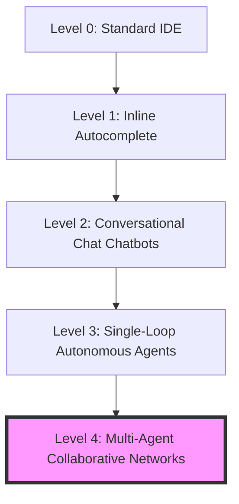

# 2023: The Year AI Agents Changed Software Development Forever

> **TL;DR:** We started the year thinking AI in software engineering meant inline tab-completes. We ended it realizing that autonomous, stateful, multi-agent networks are going to rewrite how codebases are architected, debugged, and maintained. Grab a coffee—let's look back at the wildest twelve months in software history.

It is December 2023. If you had told me in January that by the end of the year I would be routinely deploying multi-agent systems that autonomously research, write, test, and patch code without human intervention, I would have politely asked you to step away from the hopium pipe. 

Back in January, we were still marveling at the simple magic of inline code completion. "Look, it finished my ternary operator!" we squealed, feeling like absolute wizards. GitHub Copilot was a fantastic parlor trick that occasionally saved us from looking up syntax on Stack Overflow. 

But 2023 was not a year of linear progression. It was a year of exponential, phase-shifting acceleration. We did not just get better autocomplete; we witnessed the birth of the **Autonomous AI Agent**.

---

## The Evolution of the Developer Stack

To understand how far we have come, we need to trace the progression of AI developer tooling over the last twelve months. It is a journey from reactive assistants to proactive collaborators.



### Phase 1: Inline Autocomplete & Chat (Q1-Q2)
At the start of the year, our primary interface with LLMs was the chat sidebar or the tab-completion ghost text. It was a single-turn interaction model. You write a prompt, the model returns a block of code, and you copy-paste it into your editor, spend ten minutes fixing the broken imports, and repeat. The context window was narrow, and the model had no awareness of your overall system architecture.

### Phase 2: Single-Loop Autonomous Agents (Q2-Q3)
Then came the spring of AutoGPT and BabyAGI. The developer community collectively lost its mind. For the first time, we saw LLMs placed inside a execution loop where the model's output was parsed into "thoughts," "reasoning," and "actions." 

Suddenly, an AI could write a search query, read a web page, write a file, execute it, read the error log, and loop until the task was complete. While AutoGPT proved to be incredibly fragile—frequently falling into infinite loops of self-doubt and exhausting API limits on simple tasks—it proved a vital proof of concept. The loop was the secret.

### Phase 3: Multi-Agent Systems & Frameworks (Q3-Q4)
By late summer and fall, we realized that asking a single agent to be a product manager, developer, QA engineer, and devops specialist was a recipe for hallucination soup. 

Enter multi-agent framework architectures: CrewAI, Autogen, and ChatDev. Instead of one massive prompt, we broke the problem down. We created specialized agents with distinct system prompts, memories, and tools, and allowed them to collaborate. One agent drafts the plan, another writes the code, a third writes the tests, and a fourth runs the test suite and passes errors back to the developer agent.

---

## Architecting a Stateful Agent Loop

What does this look like in practice? Let's implement a simple, stateful Python agent loop. This agent is designed to autonomously write a function, run it, capture syntax errors, and fix itself until the code runs cleanly. No comments, clean execution:

```python
import sys
import io
import openai

class SelfHealingDeveloper:
    def __init__(self, api_key: str):
        self.client = openai.OpenAI(api_key=api_key)
        self.state = {
            "code": "",
            "error": "",
            "iterations": 0,
            "max_iterations": 5,
            "success": False
        }

    def heal_code(self, task: str) -> str:
        while self.state["iterations"] < self.state["max_iterations"]:
            self.state["iterations"] += 1
            prompt = self._build_prompt(task)
            
            response = self.client.chat.completions.create(
                model="gpt-4",
                messages=[{"role": "user", "content": prompt}],
                temperature=0.1
            )
            
            self.state["code"] = self._extract_code(response.choices[0].message.content)
            success, err_msg = self._test_execution()
            
            if success:
                self.state["success"] = True
                break
            else:
                self.state["error"] = err_msg

        return self.state["code"]

    def _build_prompt(self, task: str) -> str:
        if self.state["iterations"] == 1:
            return f"Write a Python function to solve: {task}. Return ONLY raw executable Python code inside a ```python block."
        return f"Your previous code failed with error:\n{self.state['error']}\n\nHere is the code:\n{self.state['code']}\n\nCorrect the code. Return ONLY raw executable Python inside a ```python block."

    def _extract_code(self, text: str) -> str:
        if "```python" in text:
            return text.split("```python")[1].split("```")[0].strip()
        return text.strip()

    def _test_execution(self) -> tuple[bool, str]:
        old_stdout = sys.stdout
        sys.stdout = io.StringIO()
        try:
            local_scope = {}
            exec(self.state["code"], local_scope)
            sys.stdout = old_stdout
            return True, ""
        except Exception as e:
            sys.stdout = old_stdout
            return False, str(e)
```

This simple loop demonstrates the core engine of 2023’s agentic paradigm: **continuous, self-directed feedback loops**. The agent is no longer a static oracle; it is an active, self-correcting runner.

---

## The Bear Market Crucible

We cannot talk about 2023 without acknowledging the macroeconomic backdrop. The tech sector spent the year in a brutal hangover. Interest rates hovered at multi-decade highs, VC funding dried up, and massive tech layoffs dominated the headlines. 

But this bear market was the perfect crucible for AI agents. In a zero-interest-rate environment, companies threw bodies at engineering problems. In the 2023 efficiency environment, teams had to scale horizontally without headcount. 

Agents allowed small, three-person engineering teams to move with the speed of thirty-person departments. We saw the rise of the "one-person unicorn" concept, where a single developer, orchestrating a fleet of specialized agentic systems, could build, test, and ship complete full-stack platforms.

---

## What We Learned (The Hard Truths)

As the initial hype around agents settled, we learned some brutal engineering realities:

1. **Context Windows are Not Unlimited Memory**: Throwing an entire 100k repository into a context window and hoping the agent understands your state management is a fantasy. Effective agents require meticulous retrieval architectures (RAG), intelligent code indexing, and AST (Abstract Syntax Tree) parsing.
2. **Evaluations are Everything**: How do you know your agent is getting better? We spent the last half of 2023 shifting away from pure prompt tweaks toward systematic evaluation frameworks. If you cannot measure your agent's success rate over 100 benchmark runs, you are flying blind.
3. **Determinism is Hard**: Building deterministic systems on top of non-deterministic models is the ultimate engineering challenge of our generation. We learned to wrap our LLMs with strict parsers, JSON schemas, and defensive code validation layers.

---

## Looking Ahead to 2024

We are entering 2024 with a completely redefined expectation of what a computer can do. The text area is no longer just a search bar; it is an execution engine.

Next year, the boundaries between writing code and instructing agents will blur entirely. We will see systems that don't just help us write software, but autonomously refactor entire legacy systems, maintain real-time documentation, and continuously patch security vulnerabilities while we sleep.

The developer who masters agent orchestration will be the most valuable engineer in the room. The era of the human typewriter is officially over. Welcome to the era of the human architect.
