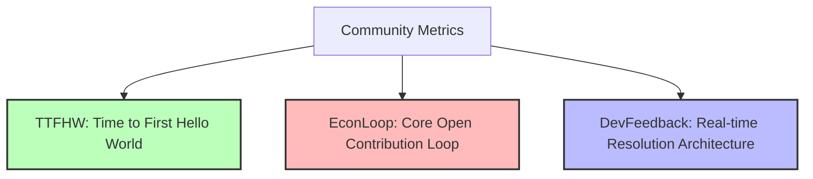

# Best Developer Communities of 2023: What We Can Learn

> **TL;DR:** Developer communities are not built by throwing a bunch of engineers into a Discord server and spamming them with marketing announcements. They are built through frictionless technical onboarding, open contribution loops, and mutual value creation. Let's study how Hugging Face, LangChain, and Polygon engineered the most sticky developer environments of 2023.

If you are a developer relations manager, a developer-tooling founder, or a community builder, 2023 was a year of intense reckoning. 

The era of lazy, marketing-led "community building" is officially over. Developers have developed a hyper-sensitive, built-in allergy to empty corporate buzzwords, generic dev-advocate hype, and transactional engagement metrics. They do not want to "join a movement" if your software is undocumented, your CLI is broken, or your Discord is a graveyard of unanswered support tickets.

In a year dominated by breakneck technological shifts, a few communities did not just survive—they exploded. They became the epicenter of technical culture. 

Let's dive into the structural mechanics of **Hugging Face**, **LangChain**, and **Polygon** to see how they engineered ecosystems that kept builders building.

---

## The Three Pillars of Developer Retention

If you analyze the most successful developer ecosystems of the year, you will find they all excel at three fundamental metrics:



1. **TTFHW (Time to First Hello World)**: How many seconds elapse between a developer landing on your homepage and executing their first successful integration? If this is more than 120 seconds, you are losing 50% of your funnel.
2. **The Open Contribution Loop**: How easy is it for a developer to submit a bug fix, build an integration, or share an application, and—critically—how quickly are they recognized and rewarded?
3. **The Real-Time Resolution Architecture**: How fast can an engineer get high-fidelity technical help when their production deployment is falling apart at 2:00 AM?

---

## 1. Hugging Face: The Collaborative Hub Model

Hugging Face has become the undisputed Github of Machine Learning. They did not achieve this dominance through massive marketing budgets; they achieved it by building a collaborative, hub-centric platform that turned model sharing into a social mechanics game.

### The Innovation of "Spaces"
Before Hugging Face, sharing a machine learning model meant exporting a `.pkl` file, writing a custom Flask API, hosting it on an AWS instance, and building a basic HTML interface to show it off. It was a massive friction barrier.

Hugging Face Spaces changed everything. By integrating natively with Gradio and Streamlit, they allowed developers to deploy a fully functional web-based model playground directly from a Git repository in under sixty seconds. Suddenly, ML researchers could show their models to the world with a single push. It created an incredibly viral sharing loop.

### Open-Source Tooling as a Trojan Horse
Hugging Face built the foundational libraries (`transformers`, `diffusers`, `datasets`) that became the standard API for interacting with models. By making the libraries open-source and easy to import, they made the Hugging Face Hub the natural default backend repository for all modern ML workflows.

---

## 2. LangChain: Hyper-Velocity Shipping and Community Integration

In January, LangChain was a tiny open-source project designed to make LLMs easier to chain together. By December, it had become the standard framework of the AI revolution, raising tens of millions of dollars and capturing a massive market share.

How did Harrison Chase and his team pull this off? **Hyper-velocity execution and continuous developer validation.**

### Shipping at the Speed of Twitter
Whenever OpenAI, Anthropic, or Cohere dropped a new model, API parameter, or capability, LangChain had a wrapper or integration merged and released within *hours*. They turned their Github repository into a living, real-time reflection of the entire AI space.

### Gamifying Contributions
LangChain made open-source contribution feel incredibly rewarding. They actively merged community PRs, called out contributors on Twitter/X, and integrated community-built wrappers into the core codebase. This created an army of volunteer developers who felt a strong sense of ownership over the framework's growth.

---

## 3. Polygon: On-the-Ground, Dev-First Execution

In the hyper-volatile world of Web3, developer retention can be incredibly fleeting. Communities often follow the path of short-term token incentives, disappearing as soon as a competitor offers a better yield.

Polygon defied this trend by executing a highly disciplined, dev-first, on-the-ground playbook throughout the 2023 bear market.

### The Power of Localized Hackathons
While other networks were focusing on high-level corporate partnerships, Polygon was running intense, highly technical global hackathons. They didn't just host events in San Francisco or London; they went deep into growing tech hubs across India, Southeast Asia, and Latin America. 

They focused on providing actual, concrete engineering support, high-fidelity developer tooling, and direct paths to venture capital or grant funding for winning builders.

### Simplifying the UX with Account Abstraction
Polygon spent 2023 championing account abstraction (ERC-4337), enabling developers to build Web3 applications that felt like traditional web apps. By removing the friction of gas fees and seed phrases, they empowered developers to focus on building great user experiences rather than fighting blockchain infrastructure limitations.

---

## Automating Community Recognition

To keep a developer community thriving, you need to automate the feedback loops. Let’s build a lightweight, clean Python FastAPI webhook server designed to listen to Github Pull Request events. When a developer gets a PR merged into an open-source project, this webhook automatically triggers a message to a Discord community channel to celebrate the builder. No comments, clean execution:

```python
import os
import hmac
import hashlib
from fastapi import FastAPI, Request, Header, HTTPException
import requests

app = FastAPI()

GITHUB_WEBHOOK_SECRET = os.getenv("GITHUB_WEBHOOK_SECRET", "super_secret_key")
DISCORD_WEBHOOK_URL = os.getenv("DISCORD_WEBHOOK_URL")

def verify_signature(payload: bytes, signature: str) -> bool:
    if not signature:
        return False
    sha_name, signature_val = signature.split("=")
    if sha_name != "sha256":
        return False
    mac = hmac.new(GITHUB_WEBHOOK_SECRET.encode(), payload, hashlib.sha256)
    return hmac.compare_digest(mac.hexdigest(), signature_val)

@app.post("/github-webhook")
async def github_webhook(request: Request, x_hub_signature_256: str = Header(None)):
    payload_bytes = await request.body()
    
    if not verify_signature(payload_bytes, x_hub_signature_256):
        raise HTTPException(status_code=401, detail="Invalid webhook signature")
    
    payload = await request.json()
    action = payload.get("action")
    pull_request = payload.get("pull_request", {})
    merged = pull_request.get("merged", False)
    
    if action == "closed" and merged:
        contributor = pull_request.get("user", {}).get("login", "Unknown")
        pr_title = pull_request.get("title", "No Title")
        pr_url = pull_request.get("html_url", "")
        repo_name = payload.get("repository", {}).get("full_name", "Our Repo")
        
        discord_message = {
            "content": f"🎉 **New Open Source Contribution Merged!**\n"
                       f"Kudos to **{contributor}** for merging: *{pr_title}* into `{repo_name}`!\n"
                       f"Check it out here: {pr_url}"
        }
        
        if DISCORD_WEBHOOK_URL:
            requests.post(DISCORD_WEBHOOK_URL, json=discord_message)
            
    return {"status": "processed"}
```

This simple backend script shows how easy it is to bridge git operations with social validation. It is exactly the kind of automation that turns static repositories into alive, engaging developer hubs.

---

## The Ultimate Takeaway

Developers are builders. They don’t want to be sold to; they want to build cool things with reliable tools. 

If you want to build an elite developer community in 2024, stop focusing on your marketing funnel. Focus on your API docs. Stop planning brand activations. Start writing better code examples. Stop tracking Twitter impressions. Track your Time to First Hello World.

Build a product that solves an actual, painful engineering problem, make it incredibly easy to start using, and treat every single open-source contributor like an equal engineering partner. The community will build itself.
