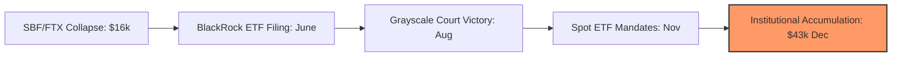

# Bitcoin $43k and the ETF: A Year-End Crypto Retrospective

> **TL;DR:** Twelve months ago, Bitcoin was flatlining at $16,000, Sam Bankman-Fried was in handcuffs, and the mainstream media was writing crypto's obituary. Today, Bitcoin sits at $43,000, BlackRock is leading a wall of institutional money toward a spot ETF approval, and the builders who stayed are shipping the most advanced decentralized scaling layers in history. Here is how we rebuilt from the ashes.

What a difference a year makes. 

In December 2022, the mood in the crypto industry was bleak. The collapse of FTX had ripped a multi-billion dollar hole in the market, taking down reputable lenders, custody providers, and hedge funds in its wake. Trading volume was practically non-existent. Mainstream commentators were smugly declaring that the "Web3 experiment" was officially over. "Crypto is dead," they said. Again. For about the eighth time.

Yet here we are in December 2023, and Bitcoin is trading at $43,000. 

This was not a rapid, retail-driven pump fueled by speculative TikTok hype. This was a slow, methodical, institutional-grade climb. It was a year of quiet, persistent on-chain accumulation, structural shifts in custody, and massive architectural breakthroughs. Let’s dissect the mechanics of this unbelievable comeback.

---

## The BlackRock Pivot and the Institutional Flood

The turning point of the year can be traced to a single date: June 15, 2023. That was the day BlackRock, the world’s largest asset manager with over $9 trillion in assets under management, officially filed an application with the SEC for a spot Bitcoin Exchange-Traded Fund (ETF).



This filing completely rewrote the narrative of the asset class. It changed Bitcoin from a "speculative retail token" into a "legitimate macroeconomic reserve asset" in the minds of traditional finance. BlackRock does not file ETFs for fun. They have an SEC approval record of 575-1. When Larry Fink goes on national television to call Bitcoin "digital gold" and a "flight to quality," the institutional game has officially changed.

Following BlackRock’s lead, every major financial giant—Fidelity, Invesco, Franklin Templeton, VanEck, and WisdomTree—filed their own spot ETF applications. The narrative shifted from *if* a spot ETF would be approved to *when*. 

The institutional rush was further accelerated by Grayscale’s landmark court victory against the SEC in August. The court ruled that the SEC’s rejection of Grayscale’s GBTC conversion to a spot ETF was "arbitrary and capricious," effectively boxing the regulatory agency into a corner.

---

## On-Chain Accumulation Dynamics

Behind the price action lay incredibly strong structural on-chain indicators. While short-term traders spent the first half of the year arguing about macroeconomic rate hikes, long-term holders (entities holding coins for more than 155 days) were quietly locking up supply.

By late November, the percentage of Bitcoin supply held by long-term holders reached an all-time high of over 76%. The liquid supply on exchanges plummeted to multi-year lows. We witnessed a classic supply shock: a massive surge in institutional demand colliding with a highly illiquid, tightly held asset.

To understand how developers and analysts track this dynamic programmatically, let’s look at a clean Python script using the Blockchain.info API to analyze basic network parameters and fee trends over time, providing direct metrics on Bitcoin network utility without any comments:

```python
import requests
import json

class BitcoinNetworkAnalyzer:
    def __init__(self):
        self.base_url = "https://api.blockchain.info"

    def get_market_statistics(self) -> dict:
        url = f"{self.base_url}/stats"
        response = requests.get(url)
        if response.status_code != 200:
            raise RuntimeError("Failed to fetch on-chain statistics")
        
        data = response.json()
        return {
            "price_usd": data.get("market_price_usd"),
            "hash_rate": data.get("hash_rate"),
            "total_fees_btc": data.get("total_fees_btc"),
            "n_transactions": data.get("n_tx"),
            "blocks_mined": data.get("n_blocks_mined")
        }

    def print_report(self):
        try:
            stats = self.get_market_statistics()
            print("--- BITCOIN ON-CHAIN REPORT ---")
            print(f"Market Price: ${stats['price_usd']:,.2f}")
            print(f"Network Hashrate: {stats['hash_rate']:,.2f} GH/s")
            print(f"Daily Transactions: {stats['n_transactions']:,}")
            print(f"Blocks Mined Today: {stats['blocks_mined']}")
            print(f"Total Fees: {stats['total_fees_btc']:.2f} BTC")
        except Exception as e:
            print(f"Error executing on-chain fetch: {e}")

if __name__ == "__main__":
    analyzer = BitcoinNetworkAnalyzer()
    analyzer.print_report()
```

---

## The Scaling Revolution: Ordinals and Layer 2s

While the institutional narrative was playing out in traditional media, a massive grassroots developer movement was transforming Bitcoin from a passive store of value into an active computation platform.

### Bitcoin Ordinals and BRC-20
In January, Casey Rodarmor introduced the **Ordinals** theory, a method of inscribing data directly onto individual satoshis (the smallest unit of Bitcoin) on-chain. This opened the floodgates for native Bitcoin digital art, PDFs, and token standards (BRC-20). 

For the first time in Bitcoin’s history, the network faced a massive fee-generation spike driven by transactional utility rather than simple money transfers. This was a critical test of Bitcoin's security budget, proving that miners could survive on transaction fees alone as block rewards continue to halve.

### The Rise of L2 Scaling Runtimes
We also saw a massive surge in developer interest in Bitcoin Layer 2 networks. While the Lightning Network continued to grow for instant retail payments, smart contract execution layers like Stacks (STX) experienced major upgrades. Builders realized that scaling Bitcoin meant building decentralized, programmable environments on top of the most secure, battle-tested settlement layer in the world.

On the Ethereum side, the scaling wars shifted definitively to Rollups. Zero-knowledge rollups (zkSync, Starknet, Scroll) and Optimistic rollups (Arbitrum, Optimism) became the default execution environments. Ethereum's mainnet became an expensive global settlement ledger, while user activity moved permanently to high-throughput, low-fee Layer 2 environments.

---

## The Bear Market Lessons: Clean Code, Real Yield

The return of the bull market in late 2023 feels incredibly different from the manic cycle of 2021. There is a quiet maturity in the air. 

The collapse of the highly leveraged centralized lenders (Celsius, BlockFi, Voyager) and algorithmic stablecoins (Terra/Luna) in 2022 purged the ecosystem of toxic, unsustainable yield models. The projects that survived and thrived in 2023 were those built on:

1. **Self-Custody**: The phrase "Not your keys, not your coins" became a mandatory technical standard. Cold-storage, multi-sig hardware setups, and smart-contract account abstraction wallets saw massive user adoption.
2. **Real Protocol Revenue**: Venture capital no longer backed projects based on vague, high-FDV token economic theories. Builders had to demonstrate real fee generation, actual active users, and concrete network utility.
3. **Decentralized Infrastructure**: The industry realized that relying on centralized intermediaries (like FTX or Celsius) for yields defeats the entire purpose of the technology. Real decentralized finance (DeFi) protocols like Uniswap, MakerDAO, and Aave ran flawlessly throughout the entire crisis without a single second of downtime.

---

## The 2024 Halving and Beyond

As we exit 2023, the stage is set for an absolutely spectacular 2024. In April 2024, the fourth Bitcoin halving will take place, slashing the daily supply of newly mined Bitcoins from 900 BTC to 450 BTC. 

Historically, the halving has been the catalyst for explosive structural bull runs. But this time is different. We have never entered a halving cycle with a spot ETF already approved, structural supply on exchanges at historic lows, and a mature Layer 2 ecosystem ready to absorb transactional demand.

The bear market of 2022-2023 was brutal, exhausting, and incredibly painful for those who lost capital. But it was also the ultimate cleaning of the slate. The charlatans, grifters, and highly leveraged operators have been cleared out. What remains is a clean, hyper-efficient, institutional-grade engine of financial sovereignty. 

We are officially back.
