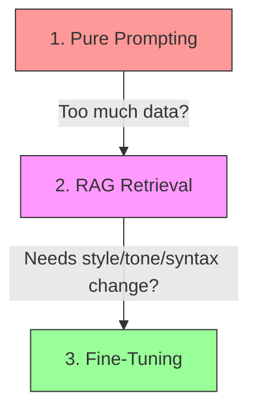

# Building with AI APIs: A Founder's Practical Guide

> **TL;DR:** Moving an LLM product from a local Python prototype to a scalable, cost-efficient, low-latency production system in early 2024 is incredibly hard. To win, founders must stop treating AI as a magical black box and start managing it like high-risk infrastructure. That means building evaluation suites before writing features, utilizing structured validation tools (like Pydantic or Instructor), optimizing token consumption with aggressive caching, and streaming outputs to hide latency.

If you read tech Twitter in April 2024, you’d think building an AI startup is a three-step process:
1.  Write a clever system prompt.
2.  Hook up OpenAI’s API.
3.  Raise a seed round at a $20M valuation.

But if you’ve actually tried to deploy an LLM-backed feature to thousands of paying customers, you know that the distance between a "cool demo on my laptop" and "reliable production software" is a vast, scar-filled chasm. 

In production, models hallucinate. Latency spikes. Token bills skyrocket. API connections time out. And users find bizarre, creative ways to break your prompts in the first five minutes.

We have spent the last year in the AI trenches, deploying real features on top of OpenAI and Anthropic APIs. Here is the unvarnished, practical truth about building products on LLM APIs in 2024—what works, what is a waste of money, and how to keep your systems fast and profitable.

---

## 1. Choosing Your Engine: OpenAI, Anthropic, or Open Source?

In early 2024, the LLM landscape is highly competitive. You are no longer locked into OpenAI. The core choices break down as follows:

```text
MODEL CATEGORY          LATENCY     COST        BEST USE CASE
---------------------------------------------------------------------------------
Frontier (GPT-4 / Opus)  High        High        Complex reasoning, code, agent planning
Medium (3.5 / Sonnet)    Medium      Medium      Data translation, RAG summarization
Utility (Haiku / Groq)   Ultra-Low   Very Low    High-volume categorization, extraction
Open Source (Llama 3)    Self-Run    Variable    High-privacy, highly specialized tasks
```

*   **OpenAI (GPT-4/GPT-3.5)** remains the default for most builders. They have the most mature API developer tooling, the lowest initial friction, and robust "JSON mode" capabilities.
*   **Anthropic (Claude 3: Haiku, Sonnet, Opus)** has made massive leaps. In particular, **Claude 3 Haiku** is an absolute game-changer for utility tasks—it is lightning fast, incredibly cheap, and handles large context windows beautifully. **Claude 3 Opus** is currently the best model for complex reasoning and software engineering tasks, though it is expensive and slow.
*   **Open Source (Llama 3, Mixtral)** is no longer a toy. If you have strict data privacy requirements, or if you are running millions of low-complexity extraction tasks where you can host your own fine-tuned model on an infrastructure provider like Groq or Anyscale, open-source is highly viable and protects you from API vendor lock-in.

**Our rule of thumb for 2024:** Start with a frontier model (GPT-4 or Claude Opus) to prove the feature works. Once it’s working, ruthlessly downgrade the task to the smallest, cheapest model (Claude Haiku or GPT-3.5-Turbo) that can achieve the target accuracy.

---

## 2. The Fine-Tuning vs. RAG vs. Prompting Hierarchy

A common mistake founders make is jumping straight to complex solutions. If a model doesn’t know your company's data, they assume they need to "fine-tune" a model. 

This is almost always wrong. In 2024, you should follow this hierarchy:



1.  **Pure Prompting (with context)**: Can you solve the problem by simply putting the context directly into a large model like Claude (which has a 200k context window)? This is the fastest, easiest approach.
2.  **RAG (Retrieval-Augmented Generation)**: If you have gigabytes of documentation or proprietary data, you cannot fit it all in the prompt. Use RAG. Convert your files into vector embeddings, store them in a database (like pgvector or Pinecone), query for the most relevant chunks based on user search, and inject only those chunks into the prompt context. RAG is 90% of what startups actually need.
3.  **Fine-Tuning**: Fine-tuning is **not** for teaching a model new facts. Fine-tuning is for teaching a model a specific **style, tone, syntax, or format**. For example, if you want a model to output custom code in a highly specific proprietary language, or if you need to run a high-volume, low-cost model (like Llama 3 8B) to perform a very narrow classification task with 99% consistency, that's when you fine-tune.

---

## 3. Cost Management at Scale

If your product is successful, your API bill will grow exponentially. To avoid bankruptcy, you need to manage token consumption aggressively.

*   **Implement Cache Headers and Semantic Caching**: If your users are asking identical or highly similar questions, do not call the LLM API every time. Use a semantic caching layer (like GPTCache or a custom Redis embedding search). If a new query is 98% semantically identical to a cached query, return the cached response.
*   **Ruthless Context Truncation**: When building chat logs or feeding documents to an LLM, do not just dump the raw text. Truncate histories, use recursive summarization, strip out HTML boilerplate, and compress your context. Every token you save is direct margin.
*   **Truncate Outputs**: Set strict `max_tokens` limits on your API requests. If a classification task only requires a single-word output, don't let the model write a three-paragraph explanation.

---

## 4. The Latency Wars: Hiding the Wait Time

LLMs are slow. A GPT-4 response can take 5 to 15 seconds. In a world where users expect sub-second web interactions, a 10-second loading spinner is a product killer.

You cannot make the model generate tokens faster, but you can alter the user's perception of time:

*   **Stream Everything**: If your UI does not stream outputs token-by-token, you are doing it wrong. Users are happy to watch text emerge in real-time. It feels interactive and fast, even if the total completion takes 10 seconds. Streaming reduces "perceived latency" to under 500ms.
*   **Asynchronous Background Processing**: If a task does not require an immediate UI update (e.g., generating a weekly report or processing bulk logs), do not make the user wait. Return a `202 Accepted` status, process the LLM task in a background worker (using BullMQ or Celery), and send a webhook or email when it’s complete.
*   **Optimistic UI and Loading Skeletons**: While waiting for the first chunk of streamed text, show a dynamic loading skeleton or a progress indicator that teaches the user what the AI is "thinking" about.

---

## 5. The #1 Production Mistake: Raw Output Validation

If you take only one lesson from this guide, let it be this: **Never trust raw LLM output.**

If you ask an LLM to output JSON:
```json
{
  "status": "success",
  "data": 123
}
```
At some point, the model will output:
```text
Sure! Here is the JSON you requested:
{
  "status": "success",
  "data": 123
}
```
Or it will miss a closing brace, or it will output trailing markdown backticks. If your backend tries to parse this with `JSON.parse()`, your app will crash.

You must introduce a strict **Output Validation Layer**. In 2024, the standard is to use tools like **Instructor** or **Pydantic** to enforce structured schema validation. 

```python
from pydantic import BaseModel, Field
from instructor import patch
import openai

# Define your strict target structure
class UserProfile(BaseModel):
    name: str = Field(description="The user's full name")
    age: int = Field(description="The user's age in years")
    languages: list[str] = Field(description="Languages they program in")

# Patch the OpenAI client to enforce this structure
client = patch(openai.OpenAI())

profile = client.chat.completions.create(
    model="gpt-3.5-turbo",
    response_model=UserProfile, # Guarantees this schema is returned
    messages=[{"role": "user", "content": "Extract: Dave, 32 years old, writes Go and Python"}]
)
```

Instructor handles the retry logic under the hood. If the model outputs bad JSON, Instructor catches the validation error, feeds the error trace back to the model, and asks it to correct its output automatically. This guarantees that your application logic only ever receives clean, validated, typed objects.

---

## Key Takeaways

- **Build Evals First**: Before writing your system prompts, write an evaluation script with 20 mock inputs and expected outputs. Run this script every time you change a prompt to ensure you haven't introduced regressions.
- **Enforce Structured Output**: Use validation frameworks like Instructor or Pydantic. Never feed raw, unvalidated LLM strings directly into your application databases or business logic.
- **Hide Latency with Streaming**: If your feature is user-facing, streaming is a non-negotiable requirement.
- **Scale Down Models**: Prove your concept on expensive models, then optimize and downscale to cheap, fast utility models for production.

---

## Frequently Asked Questions

**Q: Should we build our own proprietary LLM from scratch?**  
A: No. Unless you have $50M in venture capital, a team of world-class AI research scientists, and massive custom datasets, building a foundational model from scratch is a waste of resources. Focus on building value at the application, retrieval (RAG), and user experience layers. Leverage the billions of dollars cloud providers are investing in core models.

**Q: Our team is worried about data privacy when using OpenAI's API. What should we do?**  
A: OpenAI’s API terms explicitly state that they do not train models on data submitted through their API (unlike their free web playground). However, if your enterprise customers still object, you have two great options: use Azure's OpenAI instances (which guarantee enterprise data isolation and compliance) or self-host open-source models like Llama 3 on your own VPC infrastructure using platforms like AWS SageMaker or Hugging Face.

**Q: How do we prevent prompt injection attacks?**  
A: You must treat prompt injection like SQL injection. Never mix user-provided inputs directly into your system instructions without clear delimiters. Use dedicated parsers, separate system messages from user messages at the API level, and place an LLM firewall or input-validator script before your main execution prompt to flag adversarial requests.

---

*If this resonated, hit subscribe — I write about AI engineering and product architecture every week.*

*— [Shantanu Vishwanadha](https://substack.com/@thecoderpanda)*
