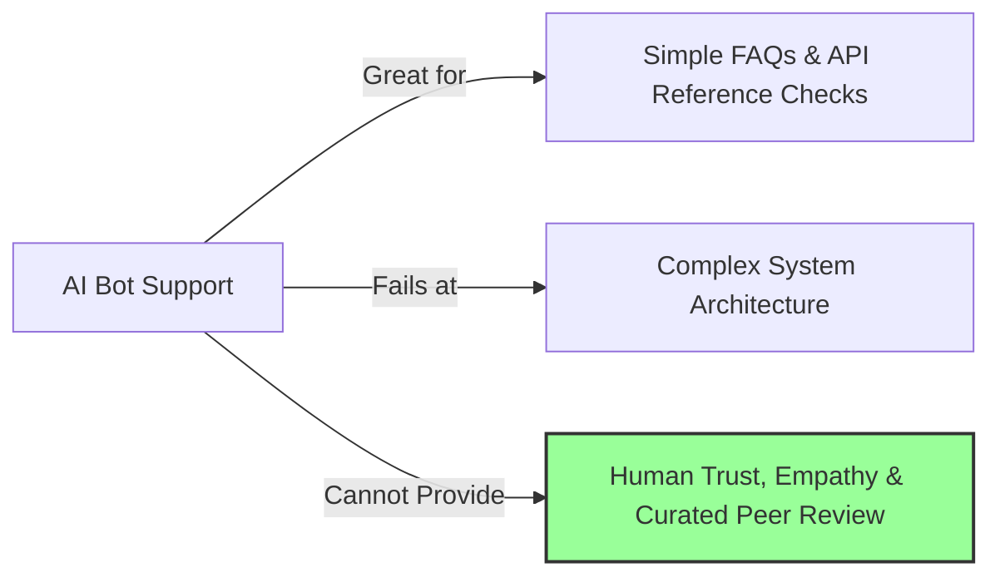

# Community Building in the AI Era

> **TL;DR:** In mid-2024, AI is flooding developer portals with autogenerated answers, synthetic documentation, and boilerplate tutorial spam. Because of this, traditional DevRel tactics are decaying. To thrive in the AI era, communities must stop measuring success by raw forum posts or member counts. Instead, they must double down on high-trust curation, human-to-human mentorship, real-world engineering problem solving, and building physical, un-bottable connections.

It is July 2024, and developer community forums are starting to look like a weird, digital hall of mirrors.

A developer asks a moderately complex question in a community Discord or on Slack. Within three seconds, an LLM-powered bot replies with a perfectly formatted, four-paragraph explanation complete with a beautifully color-coded markdown block of code. 

But there’s a catch: the code uses an API endpoint that doesn't exist, references an outdated library version, and completely misunderstands the user’s technical constraint. 

A minute later, the developer replies, having run the broken code, getting an exception, and pasting that exception back. The AI bot apologizes profusely: *"My apologies! You are entirely correct. Here is the corrected code..."* and outputs another slightly different, but still broken, snippet.

This is the state of many developer communities today. We are flooding our spaces with synthetic content, automated interactions, and autogenerated documentation. 

If an AI can answer any basic technical question instantly, and if bots are writing code for other bots, what is the actual point of a developer community? Is developer relations dead? Or has the bar for what makes a real community simply been raised to an entirely new level?

---

## How AI Has Transformed the Developer Landscape

Let's look at the massive shifts that have occurred in the developer community ecosystem over the past two years:

### 1. The Death of the "Getting Started" Search
Developers no longer go to search engines or read through endless pages of basic "getting started" guides. They ask their IDE coding assistant (like Cursor or Copilot) or prompt a chat model directly: *"Write a Next.js API route that connects to Postgres using Prisma."* 

This means that the massive search engine optimization (SEO) funnels that developer tools companies used to build their initial developer pipeline are rapidly decaying. Your "basic tutorial blog" is now irrelevant; an LLM can generate it custom-tailored to the developer's exact variables in real-time.

### 2. Discord and Slack Bot Spam
In an effort to "scale support," many DevRel teams have integrated AI agents into their chat channels. 

While this does help deflect simple, repetitive questions (like *"Where do I find my API key?"*), it has also turned community servers into sterile, robotic spaces. When every question is instantly intercepted by a verbose bot, human developers stop chatting. The social, conversational aspect of a community—the organic banter, the shared frustration, the "aha!" moments—is killed by immediate, automated correctness (or confident incorrectness).

### 3. The Avalanche of Synthetic Content
We are seeing an explosion of autogenerated content on platforms like DEV.to, Medium, and YouTube. AI can write a script, generate a synthetic voiceover, compile B-roll footage, and publish a technical video in 20 minutes. 

To developers, this feels like spam. Their defensive shields are up. They are developing an acute, highly sensitive radar for "AI-written text" and are aggressively filtering it out.

---

## What AI Cannot Replicate: The Human Premium

As the supply of synthetic content and automated answers approaches infinity, the value of that content drops to zero. 

Conversely, **the value of genuine, verified human connection, curation, and trust has skyrocketed.**

In 2024, we are entering the era of the **premium human community**. There are four core things that AI simply cannot replicate:

### 1. Trusted Curation
When there are 1,000 autogenerated packages on npm or 50 different AI libraries that do similar things, the developer's primary bottleneck is no longer "how to write the code." It is: **"Which tool should I actually use?"** 

An LLM can summarize features, but it cannot tell you: *"We ran this library in production at scale, and its connection-pooling model is broken under heavy concurrency. Go with this other one instead."* That curated, peer-validated knowledge only comes from real developers who have built real systems.

### 2. Emotional Empathy and Shared Experience
Being a developer is hard. It is a career of constant frustration, imposter syndrome, and midnight pager alerts. 

When a developer’s database blows up and they lose three days of work, an AI bot saying, *"I understand that this must be frustrating for you,"* feels insulting. A real developer saying, *"Man, I've been there. Last year I dropped a production database too. Here’s how we recovered, and here’s a coffee on me"* builds a lifelong relationship. Empathy is a human-only capability.

### 3. Mentorship and Career Guidance
AI can teach you syntax, but it cannot mentor you. It cannot help you navigate office politics, advise you on when to quit your job to start a company, or guide your growth from a senior engineer into a technical founder. Human developer communities are career engines; they succeed because of the professional bonds and mentorship networks they foster.

---

## The AI-Era DevRel Playbook

If you are running a developer community or managing a DevRel team in 2024, you must throw out the 2020 playbook. You cannot measure your success by "GitHub stars, Discord members, and SEO traffic." 

Here is the new playbook for building high-trust developer communities in the AI era:

### 1. Shift from Broad Support to High-Value Engineering
Stop trying to make your developer relations managers act like level-1 support agents answering basic syntax questions. Let the AI bots handle the repetitive FAQs. 

Instead, elevate your DevRel advocates into **high-cognitive-load systems engineers**. Their job should be writing deep, architectural case studies, performing complex load testing on your systems, and building advanced open-source reference implementations that showcase how your tool integrates into modern, AI-augmented production stacks.

### 2. Prioritize Micro-Communities and Curated Circles
Big, sprawling Discord servers with 50,000 members are becoming noisy, unmanageable swamps. 

Instead, focus on building **high-density, small-scale community spaces**. Create curated ambassador programs, run intimate roundtables for technical leaders, and establish private working groups where senior engineers can collaborate on hard technical challenges without having to filter through beginner noise or bot responses.

### 3. Bring Back Physical, In-Person Connection
You cannot bot a physical meet-up. In 2024, we are seeing a massive resurgence in local, grassroots developer meet-ups, hackathons, and intimate conferences. 

Getting 30 developers into a room with pizza, beers, and a whiteboard to talk about real system-design challenges builds more authentic product loyalty than 5,000 members joining a Slack workspace. Physical presence is the ultimate filter for authenticity.

---

## Key Takeaways

- **Synthetic abundance makes human premium**: The more autogenerated content there is, the more developers value authentic, peer-vouched human connection.
- **Automate the repetitive, elevate the human**: Use LLM agents to deflect simple FAQs, freeing up your DevRel team to write deep architectural guides and build real relationships.
- **De-prioritize generic SEO tutorials**: Focus instead on building advanced, opinionated reference architectures that show how your product solves systemic problems in production.
- **Focus on community density, not size**: A group of 100 highly active, deeply committed developers who write code and contribute back is infinitely more valuable than 10,000 passive Discord accounts.

---

## Frequently Asked Questions

**Q: We integrated an AI support bot in our Discord, and our community engagement metrics dropped. Why did this happen?**  
A: Because you turned a social community into a technical support queue. When a bot answers every post instantly, other developers feel their knowledge is no longer needed, so they stop checking the channel. To fix this, restrict your AI bot to a dedicated `#ask-ai` channel or configure it to wait 15 minutes before replying, giving other community members a chance to step in and build real human connections.

**Q: If SEO traffic is dropping due to AI search engines (like Perplexity or ChatGPT search), how do we drive initial developer awareness?**  
A: You must focus on **integrations, open-source ecosystems, and direct advocacy**. Ensure your product is the default choice inside popular scaffolding frameworks (like `create-next-app` or template libraries). Work on building integrations with the tooling developers are already using, and show up in the physical and digital spaces where senior engineers gather to share highly technical ideas.

**Q: How do we prevent AI-generated spam from polluting our open-source repositories via low-quality pull requests?**  
A: Implement a strict, automated contributor agreement and a clear PR checklist. Use automated linters and test suites to reject any PR that fails basic quality standards instantly. More importantly, establish a clear policy: if a pull request contains obviously autogenerated code that the contributor cannot explain or defend under code review, close the PR immediately and flag the account.

---

*If this resonated, hit subscribe — I write about the intersection of AI, developer communities, and technical growth every week.*

*— [Shantanu Vishwanadha](https://substack.com/@thecoderpanda)*
