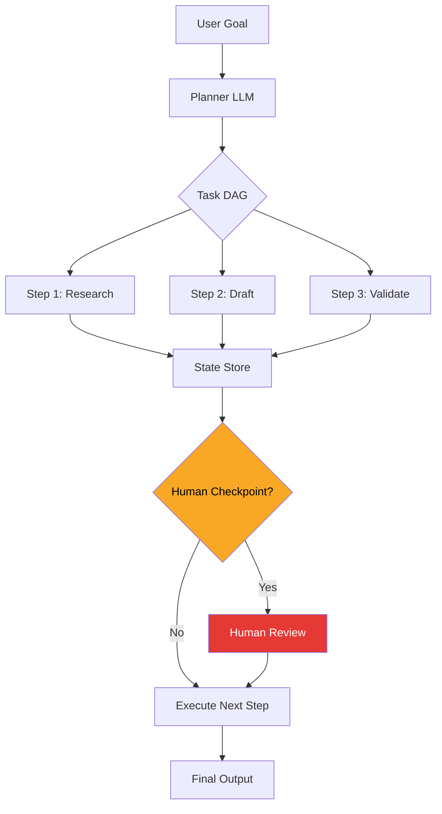

# AI Agents Went Mainstream in 2025 — Here's What Actually Changed

> **TL;DR:** In 2023, "AI agent" meant a demo that looped GPT-4 until it hit a rate limit or hallucinated itself into a corner. In 2025, it means something that runs in production, handles real workloads, and doesn't silently corrupt your data. The gap is enormous — and understanding it separates people building real products from people building impressive demos.

---

## What "Agent" Used to Mean vs. What It Means Now

Let's be honest about 2023. AutoGPT dropped in March of that year and Twitter lost its mind. The pitch was irresistible: give the LLM a goal, let it plan, execute, observe, and loop until done. Zero human in the loop. Fully autonomous. We all ran it. We all watched it spin up a browser, open Google, then fail to parse a CAPTCHA, then hallucinate that it had already completed the task, then try to delete something it shouldn't.

AutoGPT wasn't bad engineering — it was a premature product. The underlying concept of a reasoning loop was correct. The assumption that LLMs could handle unconstrained autonomy was not.

Fast forward to today. When a serious team says "we deployed an agent," they mean something specific:

- A system with a **defined scope of actions** — not "anything the LLM decides"
- **Structured tool calls** — not free-form text commands parsed by regex
- **Checkpoints** where a human or a second model validates before the agent proceeds
- **Observable state** — you can inspect exactly what the agent did, not just what it output

The word "agent" didn't change. The engineering discipline around it did.

---

## The Patterns That Survived Production

Not all agentic patterns are equal. Here's what's running in production at real companies right now:

**Tool use with structured schemas** is the backbone of every working agent I've seen. Instead of asking an LLM to "search the web," you define a `search_web(query: str) -> SearchResult` tool with strict input/output types. The model selects the tool, provides structured arguments, and your code executes it. The LLM is never touching the actual HTTP call — it's just the planner.

**Reflection loops with budgets** work when constrained. Ask a model to draft something, then ask a second call to critique it, then apply the critique. Two or three loops with a hard maximum. This pattern dramatically improves output quality on complex tasks. Without the loop budget, you get infinite refinement chains that never terminate and cost you $40 per request.

**Multi-step planning with state serialization** is where things got interesting in 2024-2025. Instead of one massive LLM call trying to hold everything, you break the task into a DAG — a directed acyclic graph of sub-tasks — and persist intermediate state to a store. Each step is a small, verifiable LLM call. You can inspect, retry, or branch any node.

**The patterns that didn't survive?** Unconstrained web browsing agents. Agents that write and execute arbitrary code without sandboxing. Agents that take irreversible actions — sending emails, making purchases, deleting records — without explicit confirmation. These aren't theoretical failure modes. They're patterns that shipped and got walked back.

---

## Why Most Agent Demos Still Fail in Production

You've seen the demo. Someone shows an agent completing a multi-step research task: it searches the web, reads three articles, synthesizes a summary, and outputs a clean report. Looks great on stage. Fails on Monday morning when the first real user tries it.

The gap between demo and production usually lives in one of three places:

**Error propagation.** In a demo, every tool call succeeds. In production, the third search result returns a 403, the PDF parser chokes on a scanned document, and the LLM confidently hallucinates the missing data rather than saying "I couldn't retrieve this." A production agent needs explicit error handling at every tool call boundary — not just Python `try/except`, but LLM-level error handling where the model knows it failed and has a recovery strategy.

**Context accumulation.** A simple task with 5 tool calls can balloon to 15,000 tokens of context if you naively append every tool result. The LLM starts losing track of its original goal. "Lost in the middle" is a real attention phenomenon — models are better at reasoning about things at the start and end of context, not buried in the middle. Production agents curate context aggressively: summarize completed steps, drop raw tool outputs once they've been processed, keep the goal prominent.

**Irreversibility blindness.** The LLM doesn't inherently know which actions are reversible. You do. Deleting a database record, sending a Slack message, submitting a form — these need explicit gating. The infra pattern here is a "reversibility annotation" on every tool. If `delete_user()` is annotated as irreversible, the orchestrator automatically inserts a confirmation step before calling it, regardless of what the agent decides.

---

## The Infra Stack That Makes Agents Reliable

This is the stuff people don't write about because it's boring. It's also the difference between a toy and a product.

**Eval frameworks are non-negotiable.** You cannot eyeball your way to a reliable agent. Before you ship anything, you need a set of test cases — realistic inputs with expected behaviors — and you need to run them every time you change the model, the prompt, or the tools. LangSmith, Braintrust, and Weights & Biases Weave are the main players here. Pick one. If your agent doesn't have evals, it's not production-ready. It's a demo.

**Structured outputs are a reliability primitive.** Using `response_format: { type: "json_schema", json_schema: { ... } }` in OpenAI's API, or Anthropic's tool-calling mechanism, forces the model output into a validated schema. This isn't just about parsing convenience — it's about eliminating an entire class of runtime errors. A model that must output `{ "action": "search", "query": "..." }` cannot accidentally output freeform text that breaks your parser. Structured outputs are table stakes for any agent handling real data.

**Observability isn't optional.** Every LLM call needs a trace: what went in, what came out, how long it took, what it cost. When your agent fails at step 4 of 7, you need to know exactly what the model saw and what it decided. OpenTelemetry-compatible tracing through something like Langfuse or Arize Phoenix means you're not debugging blind. You'd never ship a web service without request logging. Don't ship an agent without LLM tracing.

**Human-in-the-loop checkpoints** are not a sign that your agent isn't good enough. They're a design decision about where human judgment is genuinely valuable. An agent that drafts a response but asks a human to review before sending isn't a failed agent — it's a correctly scoped one. The myth that a "real" agent operates with zero human involvement is exactly the kind of thinking that gets you into AutoGPT territory.

---

## What This Means for Hiring and Building Teams

Here's the uncomfortable truth: most "AI engineer" job descriptions in 2023-2024 were looking for prompt engineers who could demo well. The role has matured significantly.

The engineers building reliable agents today have a specific combination of skills. They understand distributed systems — because an agent workflow is essentially a distributed system with LLMs as probabilistic compute nodes. They understand evaluation — because shipping without evals is flying blind. They understand product judgment — because knowing when NOT to use an LLM is as important as knowing when to use one.

When I'm evaluating an AI engineer candidate now, I'm less interested in whether they can build a cool demo and more interested in how they think about failure modes. Ask them: "What happens when step 3 of your agent fails?" If the answer is confident and specific — retry with exponential backoff, fall back to deterministic code, surface the error to the user with context — they've shipped an agent before. If the answer is vague, they've built demos.

Teams building seriously in this space tend to separate concerns: a small "AI platform" team owns the evals framework, the tracing infra, and the model abstraction layer. Feature teams build agents on top of that platform. Don't let every team reinvent prompt engineering best practices and evaluation tooling from scratch — that's the path to a dozen different agent implementations that are all slightly wrong in different ways.

---

## Key Takeaways

- **2023 agents were demos; 2025 agents have evals, structured outputs, and human checkpoints** — these three things are what "production-ready" actually means
- **Tool use, constrained reflection loops, and DAG-based planning survived** — unconstrained autonomy and arbitrary code execution largely did not
- **Error handling at the LLM boundary is different from exception handling** — models need to know when they failed and have explicit recovery paths
- **Structured outputs eliminate a whole class of production bugs** — stop parsing LLM freeform text in 2025
- **The right question to ask a candidate isn't "can you build an agent?" — it's "what happens when your agent fails at step 4 of 7?"**

---

## Frequently Asked Questions

**Q: Is LangChain still worth using in 2025?**

Complicated question. LangChain was invaluable for exploration but became infamous for abstracting away the parts you actually need to understand and control in production. Most serious teams I know either use it very lightly — just the LLM abstraction layer — or have moved to thinner frameworks like LlamaIndex for specific use cases, or just raw SDK calls with their own orchestration layer. The core lesson: use it to explore, but understand what it's doing before you ship it.

**Q: When should an agent NOT be used?**

When the task is well-defined enough to be solved deterministically. If you know the input structure, the logic, and the output format — write code. Use an LLM when the problem requires genuine language understanding, ambiguity resolution, or judgment that can't be expressed as rules. A common trap is using an LLM for data transformation tasks that a good `pandas` pipeline could handle 100x faster, cheaper, and more reliably.

**Q: How do I know if my agent is production-ready?**

Three questions: Do you have an eval suite that runs on every deployment? Do all irreversible actions have explicit confirmation gates? Can you inspect the complete trace of any agent run within 60 seconds of it completing? If yes to all three, you're at the baseline. If no to any of them, you're not there yet.

---

*If this resonated, subscribe — I write about building real AI systems weekly.*

*— [Shantanu Vishwanadha](https://substack.com/@thecoderpanda)*
