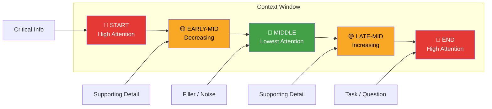

# The Context Window Wars — What 1M Token Windows Actually Change for Developers

> **TL;DR:** Gemini 1.5 Pro's 1M token window, GPT-4o's expanded context, and Claude's 200K are real capabilities, not marketing. But larger context doesn't mean better results by default — you still need to think hard about what you put in it, where you put it, and what it actually costs you. RAG isn't dead. It's just being used more carefully.

---

## What You Can Actually Do Now That You Couldn't Before

Let me start with the things that are genuinely unlocked by massive context windows, because the skeptics who say "it doesn't change anything" are wrong.

**Entire codebase analysis in a single call.** A typical production codebase — say, 50,000 lines of Python — fits comfortably inside a 1M token window. A year ago, you had to chunk files, build embeddings, run retrieval, and hope you surfaced the right code. Now you can ask "find every place where we're not handling the case where `user.subscription` is None" and the model has full visibility into your codebase. The quality of cross-file analysis this enables is qualitatively different. You're not asking the model to infer from retrieved snippets — you're asking it to actually read the code.

**Full conversation history without summarization.** Most production chatbots used to compress conversation history because they couldn't fit it in context. This introduced a subtle degradation — every summarization step lost nuance, and users would reference something from 20 messages ago that the model no longer had access to. At 200K+ tokens, you can keep the full transcript of a multi-hour conversation. This matters enormously for support applications, coding assistants, and anything where the user expects the AI to remember exactly what they said.

**Entire legal or technical documents as context.** A 400-page contract is roughly 200K tokens. A 300-page technical specification is roughly 150K tokens. The old workflow was chunking, embedding, and hoping your retrieval caught the relevant clause. The new workflow is: put the whole document in context, ask your question, get an answer that has read everything. For contract review, compliance checking, and technical documentation QA, this is a step-function improvement.

**Multi-document synthesis.** Ten research papers, a year of meeting notes, a full Slack export from a product channel — you can now combine these into a single context and ask synthesis questions that would have been architecturally impossible before. This use case is underexplored and I think it's where the next wave of genuinely useful AI products will come from.

---

## The Costs You Can't Ignore

Here's where the "1M tokens is amazing" narrative gets complicated. None of this is free.

**Latency scales with context length.** Time-to-first-token on a 100K token input is meaningfully higher than on a 4K token input. For interactive applications — chatbots, coding assistants, anything where a user is waiting — this is a product problem, not just an engineering footnote. Gemini 1.5 Pro with a 1M token context can take 30-60 seconds to respond. That's fine for batch processing. It's unacceptable for real-time interaction. Know which mode you're building for before you commit to a context-first architecture.

**Cost is quadratic, not linear.** Most transformer-based models have attention complexity that scales with the square of the sequence length. Doubling your context doesn't double your cost — it more than doubles it. Running Gemini 1.5 Pro at 1M tokens costs significantly more per query than at 100K tokens. If your use case requires many queries against large context, your unit economics can become problematic fast. Do the math before you build the product.

**Not all tokens in the window are attended to equally.** This is the critical insight that gets overlooked in the hype. Studies consistently show that LLMs perform significantly worse on information buried in the middle of a long context compared to information at the beginning or end. This phenomenon — called "lost in the middle" — means that naively shoving everything into context doesn't give you uniform recall quality across all positions.

The practical implication: if you're putting a 300-page document in context and your question depends on a clause on page 150, the model may perform worse than if that clause were on page 1 or page 299. Positioning matters. Don't treat the context window like a flat array with uniform read quality.

---

## The "Lost in the Middle" Problem and What To Do About It

The lost-in-the-middle problem was documented rigorously by researchers at Stanford in 2023, and subsequent work has confirmed it holds across GPT-4, Claude, and Gemini. The pattern is clear: recall accuracy follows a U-shaped curve across context position — high at the start, low in the middle, high at the end.

There are a few practical patterns that help:

**Put your most important information at the boundaries.** If you have a system prompt, ground rules, or critical reference information — it goes at the very beginning or the very end of context. Never bury it in the middle just because that's where it naturally appears in your document structure.

**Repeat key constraints at the end.** For long-context tasks, restating the core instruction or constraint at the end of the prompt (right before where the model generates) dramatically improves adherence. This feels inelegant but it works, and it's backed by empirical data.

**Don't confuse "fits in context" with "will be used well from context."** A document that fits in the window doesn't mean every sentence will be equally retrievable. For complex QA over long documents, hybrid approaches — putting the document in context AND using an initial retrieval step to pull likely-relevant sections to the front — consistently outperform naive full-document context.

---

## RAG Is Not Dead. It Just Grew Up.

Every time context windows expand, someone tweets that RAG is dead. It's not. It's evolved. Here's the distinction:

**What RAG was originally solving:** The context window was small (4K tokens), so you couldn't fit your documents in. RAG was a workaround — retrieve relevant chunks, stuff them in the tiny window, hope for the best.

**What that version of RAG** can safely be retired: Small-chunk, BM25-only, dump-and-pray retrieval is genuinely less necessary now. If your entire knowledge base fits in 200K tokens, you probably don't need to retrieve from it — just include it all.

**What RAG is becoming:** For knowledge bases that exceed context limits — which is almost every production enterprise knowledge base — RAG remains necessary. But the retrieval part is getting smarter. Hybrid search (semantic + keyword), re-ranking models, query expansion, and multi-hop retrieval are all maturing rapidly. This isn't "RAG vs. long context" — it's a question of whether your data fits in a window and whether the cost/latency tradeoffs work.

The real competition isn't RAG vs. long context. It's this: for a given query, what's the most reliable, cheapest, fastest way to get the relevant information in front of the model? Sometimes that's full-document context. Sometimes it's precise retrieval. Often it's both — retrieve to narrow scope, then provide full context on the retrieved scope.

**The emerging pattern that works in production:**

1. Use retrieval to identify the 2-3 most relevant document sections (fast, cheap, reliable)
2. Expand those sections to include surrounding context — not just the matched chunks
3. Optionally include the full document if it's small enough and the task requires holistic understanding
4. Keep the task instruction at both the beginning and end of the prompt

This isn't a retreat from long context — it's using long context surgically rather than exhaustively.

---

## Practical Architecture Decisions for 2025

If you're building a new product today and deciding how to handle context, here's the decision framework I'd use:

**Is your data source bounded and small?** (Under 500K tokens per query) → Full context inclusion is viable. Profile the latency, calculate the cost, test quality. This is the simplest architecture.

**Is your data source large or frequently updated?** → RAG is still your friend. Invest in retrieval quality — hybrid search, re-ranking, metadata filtering. Then use long context to provide expanded context around retrieved results.

**Are you doing document QA on fixed documents?** → Long context wins on quality if you can absorb the latency. Experiment with section ordering to mitigate lost-in-the-middle effects.

**Are you doing multi-turn conversation?** → Keep full history in context until you hit a threshold, then summarize older turns while keeping recent ones verbatim. Don't compress recent context — that's where the active reference is.

**Are you doing batch processing / async tasks?** → Long context is nearly always worth it here. Latency is acceptable, the quality improvement is real, and you're not paying the interactive UX penalty.

---

## Key Takeaways

- **1M token windows unlock codebase analysis, full document QA, and complete conversation history** — these are real, qualitative improvements, not just "bigger is better" marketing
- **Cost and latency scale non-linearly with context length** — do the math on your unit economics before committing to a context-heavy architecture
- **Lost in the middle is a real phenomenon** — position critical information at the start and end of your context, not in the middle
- **RAG isn't dead, it's specializing** — for knowledge bases that exceed context limits, smart retrieval is still essential; for bounded data sources, full-context approaches are increasingly viable
- **The winning pattern is hybrid**: retrieve to identify scope, use long context to understand it deeply

---

## Frequently Asked Questions

**Q: At what context size should I start worrying about latency?**

For interactive applications (where a user is waiting synchronously), I'd set a practical ceiling around 50K-80K tokens unless you're using a model with very fast inference. Above that, consider async patterns — submit the request, process it in the background, notify the user when complete. For batch processing or async tasks, 1M tokens is fine — latency is your compute budget, not your UX constraint.

**Q: Does caching help with long-context costs?**

Yes, significantly. Both Anthropic and OpenAI offer prompt caching — if the beginning of your context is static (system prompt, document content), you only pay for processing it once, and subsequent requests that reuse that prefix hit the cache at a fraction of the cost. For document QA workflows where many questions are asked against the same document, prompt caching can reduce costs by 80-90%. This changes the economics substantially.

**Q: Should I use embeddings + vector search in 2025?**

Yes, but with clarity on what they're good for. Semantic search with embeddings is excellent at finding thematically related content when keyword matching fails. It's still an essential part of a mature retrieval stack. What's changed is that it's rarely sufficient on its own — combine it with BM25 keyword search (hybrid retrieval), use a re-ranker to score retrieved chunks, and then use long context to provide expanded context around your best results.

---

*If this resonated, subscribe — I write about AI engineering and building with LLMs weekly.*

*— [Shantanu Vishwanadha](https://substack.com/@thecoderpanda)*
