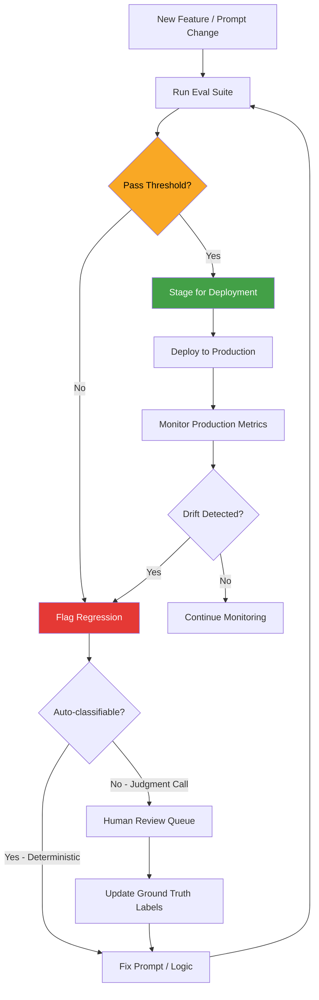

# Building AI Products That Don't Embarrass You in Production

> **TL;DR:** Most AI products fail not because the model is bad, but because the product was built around a demo, not a reliability standard. The difference between something people trust and something that ends up in a "AI fails compilation" tweet comes down to three things: evals, structured outputs, and honest uncertainty communication. None of these are optional if you're shipping to real users.

---

## Why Most AI Products Fail (And It's Not the Model)

I've consulted with or spoken to a lot of teams that shipped AI products in 2023-2024. The failure mode is almost always the same: they built around the best-case demo path.

Here's what that looks like. You prompt the model, it returns something impressive. You demo it. People are excited. You ship it. Then a user provides input that's slightly off the happy path — a weird character encoding, a question phrased differently than you tested, a domain-specific term the model doesn't handle well — and it returns something confidently wrong. Not "I don't know" wrong. Confidently, fluently, plausibly wrong. The user either trusts it (bad) or loses trust in your product entirely (also bad, but at least honest).

The difference between this and a product people trust is not the foundation model. GPT-4o and Claude Sonnet are genuinely good at a vast range of tasks. The difference is the **reliability envelope** you've built around them.

Three things define whether an AI product survives contact with real users:

1. **Do you know when it fails?** (Evals)
2. **Does it fail cleanly or messily?** (Structured outputs + error handling)
3. **Does the user know when to trust it?** (Uncertainty communication)

Most teams skip all three in the rush to ship. Let me break down what each actually looks like in practice.

---

## Build Your Eval Pipeline Before Your Features

This sounds backwards. It isn't.

If you ship a feature without evals, you're making a bet that your manual testing was comprehensive enough to catch the important failure modes. It wasn't. Manual testing for LLM behavior is the equivalent of manually reviewing every SQL query in production — you'll catch the obvious stuff and miss the systemic issues.

An eval pipeline is a set of test cases with inputs and expected behaviors, combined with a scoring mechanism, run automatically on every model or prompt change. Here's what that looks like concretely:

**Level 1: Deterministic assertions.** For tasks with known-correct outputs — classification, extraction, structured parsing — you can assert exact matches. "Given this support ticket text, extract the product name as a JSON field." Run 100 real examples with ground truth labels. Your accuracy on this benchmark tells you immediately when a model change or prompt change breaks something.

**Level 2: Model-graded evals.** For tasks where the output is open-ended — summaries, explanations, drafts — you use a second LLM call to score the output. "On a scale of 1-5, does this summary accurately capture the key points of the source document? Explain your reasoning." This is slower and adds cost, but it gives you scalable quality measurement on tasks that can't be reduced to string matching.

**Level 3: Human evals on regressions.** When your automated evals flag a regression — a drop in quality after a model update, a prompt change that hurt accuracy — you pull those cases for human review. You're not doing human evals on every output, you're using them surgically for calibration and for cases where the automated evals disagree.

The tooling here has gotten genuinely good. Braintrust, LangSmith, and Weights & Biases Weave all support eval pipelines out of the box. You don't need to build this infrastructure yourself — you need to build the test cases. The test cases are the hard part, and they come from real usage: edge cases you find in production, inputs that users actually send, examples that expose the model's specific weaknesses for your domain.

**Minimum viable eval cadence:** Run your eval suite before every deployment. If you're iterating fast (multiple deployments per day), run a smaller "smoke test" subset on every change and the full suite weekly.

---

## Structured Outputs Are a Reliability Primitive

Here's a thing I see constantly: teams using LLM outputs as raw text strings, then writing string parsers to extract structured data from them. This is fragile by design. The model is non-deterministic. Your parser will break.

Structured outputs — enforcing that the model returns valid JSON matching a specific schema — eliminate this entire class of failures. OpenAI's `response_format: { type: "json_schema" }`, Anthropic's tool-use mechanism, and Google's function calling all provide this. The model cannot return something that doesn't match your schema. If it tries, the API throws an error rather than giving you malformed output.

But structured outputs aren't just about parsing reliability. They're about **forcing the model to commit to explicit fields** rather than hedging in prose. When a model has to populate a field called `confidence_level: "high" | "medium" | "low"`, it makes a concrete commitment. When it has to populate `requires_human_review: boolean`, you can act on that programmatically. You can't do this with prose outputs.

**The pattern I'd recommend for any non-trivial AI feature:**

Define your output schema first. What fields do you actually need? What are the types? What fields represent uncertainty or confidence? Build your schema to expose these explicitly. Then write the LLM call to produce that schema. Then build the UI around the structured output.

When you do it in the opposite order — build the UI, then figure out what the LLM should return, then try to parse it — you end up with implicit contracts and fragile parsers.

---

## When to Use Deterministic Code vs. LLM

This is the judgment call that separates thoughtful AI product builders from people who hammer LLMs into every problem.

A simple heuristic: **use an LLM when the problem requires language understanding, judgment, or handling ambiguous input that can't be expressed as explicit rules. Use deterministic code when the problem is well-defined, the input structure is known, and the correct output can be specified unambiguously.**

Concrete examples of things that should NOT be LLM calls:

- Validating that an email address has the right format
- Calculating a subtotal from line items
- Extracting a date from an ISO 8601 string
- Routing a user to a specific page based on their account type
- Reformatting structured data (CSV → JSON when the schema is known)

All of these are things I've seen teams try to solve with LLM calls. Every one of them will occasionally fail, hallucinate, or return inconsistent results. And unlike a bug in deterministic code that's reproducible and fixable, an LLM producing wrong output for these tasks will fail unpredictably and silently.

LLMs are powerful and genuinely good at what they're good at. That doesn't mean they're the right tool for everything. Every LLM call in your codebase should have a clear answer to: "Why couldn't this be handled with regular code?" If the answer is "it could be," replace it.

---

## Communicating Uncertainty Without Killing the UX

This is the design problem that most AI teams get wrong in both directions.

One extreme: the AI presents everything with equal confidence, whether it's stating a well-established fact or hallucinating a citation that doesn't exist. Users can't calibrate trust. Eventually they hit something wrong, lose trust in everything the AI said, and churn.

Other extreme: the AI hedges everything with disclaimers. "This may not be accurate." "Please verify before acting on this." "I'm just an AI and could be wrong." Users learn to ignore the disclaimers entirely because they're on everything, and you've added friction without actually signaling when to be careful.

The right approach is **calibrated uncertainty** — signaling low confidence specifically when the model actually is uncertain, and only then.

How do you detect when the model is uncertain? A few practical patterns:

**Ask it explicitly.** Include a `confidence` field in your structured output schema — `high`, `medium`, `low`. Prompt the model: "If you are not confident in your answer, set confidence to low." Models are reasonably well-calibrated when asked to self-report confidence explicitly in structured form. They're much worse at communicating uncertainty organically in prose.

**Use consistency as a signal.** Sample the same query 3-5 times with temperature > 0. If the answers are consistent, confidence is high. If they diverge significantly, the model is uncertain. This is expensive but useful for high-stakes decisions where a second opinion is worth the cost.

**Set domain-specific rules.** For topics you know the model is weak on — highly recent events, deeply specialized domain knowledge, numerical calculations — trigger an uncertainty flag proactively, regardless of what the model says about its own confidence.

On the UX side: surface uncertainty through design, not disclaimers. A lower visual prominence for uncertain answers (lighter text weight, no bold, smaller type), a "check this" chip on uncertain medical or legal claims, or a "verify calculation" callout for numerical outputs — these communicate trust gradients without adding text clutter that users ignore.

---

## The Minimum Viable Safety Checklist

Before you ship an AI feature that interacts with real users, check these off. Not aspirationally — actually check them.

**Evals:** Do you have a suite of test cases that runs before every deployment? Does it cover your known edge cases and failure modes?

**Structured outputs:** Are you using schema-validated outputs, or are you parsing LLM prose with string parsing?

**Irreversible action gates:** If your feature takes any action that can't be undone — sending a message, deleting data, making a purchase, posting publicly — is there an explicit confirmation step that doesn't rely on the LLM to decide whether to confirm?

**Fallback behavior:** What happens when the LLM call fails, returns malformed output, or times out? Does your product degrade gracefully or does it throw a 500?

**PII and sensitive data:** Are you logging LLM inputs and outputs? If yes, are you scrubbing PII before storage? This is a compliance requirement in many jurisdictions, not a nice-to-have.

**Uncertainty surface:** Is there any user-facing output that communicates the AI's confidence level on claims where confidence matters? For factual questions, recommendations, or calculations — is uncertainty surfaced?

**Rate limiting and abuse prevention:** Can a user cause unexpected LLM costs by sending adversarial inputs? Do you have per-user limits?

This isn't a complete security or safety review — it's the baseline. The teams that skip this list are the ones whose products end up in the wrong kind of tweet.

---

## Key Takeaways

- **AI product failures are almost always infrastructure failures, not model failures** — evals, structured outputs, and uncertainty communication are what separate trustworthy products from demos
- **Build your eval suite before your features** — if you don't know when the model fails, you're flying blind
- **Structured outputs are a reliability primitive, not a convenience** — schema-validated outputs eliminate a whole class of production bugs
- **Not every problem should be an LLM call** — if it can be solved with deterministic code, it should be
- **Calibrated uncertainty beats blanket disclaimers** — surface confidence signals through UX design, not boilerplate text that users ignore

---

## Frequently Asked Questions

**Q: How many eval test cases do I actually need to start?**

More than zero, fewer than you think. Start with 20-50 handcrafted cases that cover your most common user paths plus your known edge cases. The goal isn't statistical coverage — it's catching the failure modes you already know about before deployment. You'll grow the suite organically as you find new failures in production. A 50-case eval suite that runs before every deployment is infinitely better than a 0-case eval suite with great intentions.

**Q: When is it okay to show AI-generated content without any uncertainty signal?**

When the claim type has high prior probability of being correct and the cost of a wrong answer is low. Suggesting a related article, autocompleting a phrase, or formatting code — the failure mode is minor and quickly correctable by the user. But anything medical, legal, financial, or factual where the user will make a decision based on the output needs some form of uncertainty signal or a strong recommendation to verify. Match the UX friction to the stakes of the decision.

**Q: How do I handle the case where my LLM feature works great for 95% of users but fails badly for 5%?**

Build a graceful fallback path for the 5% — human escalation, a simplified deterministic version of the feature, or a "we couldn't process this" state that doesn't silently produce wrong output. The 95% happy path is your feature. The 5% failure path is your product design problem. Most teams design the happy path and ignore the failure path — that's where trust gets destroyed.

---

*If this resonated, subscribe — I write about building real AI products weekly.*

*— [Shantanu Vishwanadha](https://substack.com/@thecoderpanda)*
