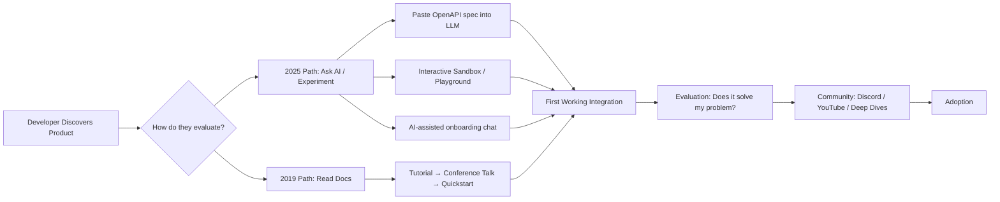

# DevRel in 2025: The Job Has Changed

> **TL;DR:** AI tools have fundamentally changed how developers discover, evaluate, and adopt APIs — and most DevRel teams haven't caught up. The conference-first playbook is dead. The winner is whoever makes their product easiest to understand and integrate in the first five minutes of experimentation, not the first five minutes of a talk.

I've been doing DevRel for a while. Long enough to remember when "write a blog post, speak at a conference, ship a quickstart tutorial" was the complete playbook. It worked. Developers found you through those channels, got value from the content, and converted to users.

That playbook is not dead. It's on life support, and the attending physician is an LLM.

Here's the specific thing that changed: developers used to read documentation to figure out how to use your API. Now they ask Claude. Or GPT. Or Copilot. The documentation still needs to exist — the AI needs something to read — but the journey looks completely different, and if your DevRel strategy isn't accounting for that, you're optimizing for a user behavior that's increasingly rare.

## How AI Tools Changed the Developer Journey

The old journey was linear: discovery → read docs → follow tutorial → build prototype → evaluate → adopt.

The new journey is: discovery → paste API docs into Claude → ask "how do I do X" → get generated code → try to run it → debug errors → adopt or abandon.

What changed? Steps two, three, and four are now largely AI-mediated. The developer isn't reading your quickstart tutorial; they're asking their AI assistant to interpret it for them and produce working code. Your beautiful prose documentation is becoming raw material for an AI to summarize.

This has three direct implications:

**Structured, machine-readable documentation wins.** OpenAPI specs, well-typed SDKs, clear schema definitions — these are no longer nice-to-haves. They're the actual product surface that AI tools consume and transform for developers. If your API isn't describable in an OpenAPI spec without ambiguity, you have a documentation problem and an AI-discoverability problem at the same time.

**Experimentation trumps explanation.** Developers reach for their API key before they finish reading your landing page. The question is: how fast can they get from "I want to try this" to "this is working"? If the answer is more than ten minutes, you're losing people. The DevRel investment that pays highest returns right now is ruthless attention to the first-run experience.

**Error messages are marketing copy.** When a developer's AI-generated code hits an error from your API, the error message is often the first human-readable thing they see from your product. A clear, actionable error message that explains what went wrong and how to fix it converts. A cryptic HTTP 400 with no body does not.

## What DevRel Teams Need to Do Differently

**Build interactive documentation, not static documentation.** The single highest-ROI DevRel investment right now is a live, runnable playground where developers can make real API calls without setting up an environment. ReadMe, Mintlify, and custom solutions built on Scalar all offer this. If a developer can get a successful response in 90 seconds without leaving your documentation page, your conversion rate will be higher. This is not a hypothesis; it's been measured repeatedly across developer products.

**Design your API for LLMs.** This sounds weird but it's real. Your API should be describable completely and correctly in an OpenAPI spec. Your error responses should be structured JSON with human-readable messages and ideally a link to the relevant docs. Your parameter names should be unambiguous without context. The test: paste your API reference into Claude and ask it to write code that does your core use case. If the output doesn't work, your API design or documentation has a gap.

**AI-assisted onboarding is now table stakes.** Not a chatbot that says "I didn't understand your question." A genuinely useful assistant that can take a developer's specific use case and walk them through the relevant parts of your product, generate working example code, and answer follow-up questions. Smaller products can get 80% of the way there with a well-prompted Claude integration over their documentation. Larger products need something more custom. Either way, the developer who feels hand-held through their first integration is far more likely to reach production.

## The Death of the Conference-First Playbook

Conferences are not dead. They're just not the primary channel anymore for developer acquisition, and they've never been great for conversion without follow-up.

Here's the hard truth: most conference talks reach fewer developers than a single good YouTube video that ranks for a specific search term. The talk is ephemeral. The video compounds over time. The economics are not even close.

What's risen instead:

**Discord as the primary community surface.** Real-time, searchable (in Notion or their own search now), and where developers are when they're actively building. The quality of your Discord community — whether questions get answered, whether your team is genuinely present, whether there's signal over noise — is a direct signal of your product's health to prospective users who join to evaluate.

**YouTube deep dives.** Long-form technical videos — 15 to 45 minutes — that walk through real implementation challenges. Not marketing content. Actual engineering content. Developers who find these while searching for "how to implement [specific thing] with [your product]" and learn something are extremely high-quality leads.

**Written deep dives.** Long-form written tutorials that solve specific, real problems. Not "Getting Started with Our API" — which every product has — but "How I built a production RAG pipeline on [your product] and what I learned." Specific, honest, experienced. These rank in search. They establish credibility. They convert skeptics.

Conferences are still worth attending for relationship-building, recruiting, and brand presence. They are not worth being the center of your DevRel strategy.

## How to Measure DevRel in the AI Era

The old metrics — event attendance, social impressions, newsletter opens — have always been directional at best and misleading at worst. The new measurement challenge is: how do you attribute developer acquisition and conversion when the path from "discovered your product" to "signed up" runs through an AI chat session that you don't have visibility into?

The honest answer is: you can't fully. But you can measure what matters:

**Time to first successful API call.** This is the most direct measure of developer experience quality. Instrument it. Track it by entry point (docs page, playground, SDK). Optimize it obsessively.

**Documentation quality score via LLM.** Literally: take your API reference, feed it to GPT-4 or Claude, ask it to generate code for your five most common use cases, run the generated code against your actual API, and measure pass rate. This sounds absurd. It works. It's a leading indicator for AI-mediated developer success.

**Activation rate.** What percentage of sign-ups make a second API call? A third? These are your real engagement metrics. A developer who makes one call and never comes back found your product and found it insufficient. Track the drop-off stages.

**Community health metrics.** Question response time in Discord. Percentage of questions answered. Number of developers helping other developers (not just your team answering). These correlate with retention and advocacy.

Revenue-attributable DevRel is real and achievable, but it requires instrumentation at the product level, not just the content level. Work with your product and growth teams to set it up.

## Why DevRel Is More Important Than Ever

The counterintuitive truth: as AI makes every step of the developer journey faster and more self-serve, the human layer of trust becomes more important, not less.

Developers can now build faster than ever. But they're also more overwhelmed by options than ever. There are dozens of reasonable choices for almost every infrastructure decision. In a world where any API can be described to an AI and integrated in an afternoon, the question isn't just "does your product work" — it's "do I trust these people to be around in a year, to help me when things break, to understand my specific problems."

That trust is built through community. Through genuine technical content. Through being consistently helpful on Discord at 11pm when someone's deploy is broken. Through blog posts that share real failure modes, not just success stories.

That's what DevRel does. It builds trust at scale with a technical audience. The channels and formats are changing. The underlying job is not.

## Key Takeaways

- **AI has made your documentation machine-readable input** — optimize for LLM consumption with structured specs, clear schemas, and unambiguous parameter names
- **First-run experience is now the primary conversion lever** — interactive playgrounds and AI-assisted onboarding outperform static quickstart tutorials
- **Conference-first is dead; Discord + YouTube + written deep dives** is the 2025 playbook for developer acquisition
- **Measure time to first successful call and activation rate** — not event attendance and social impressions
- **Trust compounds over time** — the DevRel function is more important than ever in a world of overwhelming developer choice

## Frequently Asked Questions

**Is it worth hiring a dedicated DevRel team at an early-stage startup?**
At seed, probably not full-time DevRel. Invest that headcount in making the product genuinely easier to use — better error messages, interactive docs, a fast onboarding flow. That's DevRel work even if it's done by engineers. At Series A with paying customers and meaningful API usage, a developer-focused hire makes sense — someone who's half engineer, half community person, who writes genuinely and builds in public.

**How do you build an AI-assisted onboarding experience without a large engineering investment?**
Start with a simple Claude or GPT integration that has your full API reference as context. Build a chat interface. It won't be perfect, but it will be dramatically better than nothing and you'll learn from it. The main investment is keeping the context window populated with accurate, up-to-date documentation — which you should be doing anyway.

---

*If this resonated, subscribe — I write about developer relations and community building weekly.*

*— [Shantanu Vishwanadha](https://substack.com/@thecoderpanda)*
