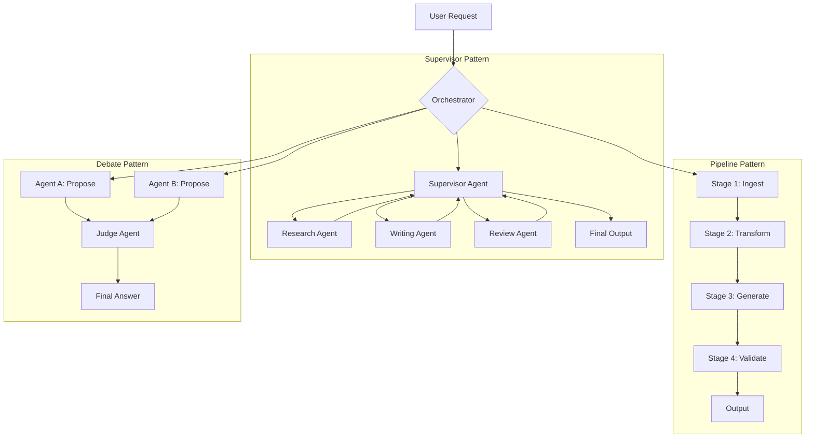

# Multi-Agent Systems: Lessons From Building Real Ones

> **TL;DR:** Multi-agent systems are genuinely powerful for parallelization, specialization, and long-horizon tasks — but they're also where AI complexity comes to die. This post covers the orchestration patterns that actually work, the failure modes nobody puts in their blog post, and why logging isn't optional — it's the entire foundation.

I've built a few multi-agent systems now. Some in demos. A couple in production. They are not the same experience.

The demo version is always clean. Agents cooperate. Tasks complete. The orchestrator hums along. You show it at a meetup and people are genuinely impressed. Then you try to build the real thing and you discover that you've basically signed up to write a distributed systems paper about a system that also sometimes just… forgets what it was doing.

Here's what I actually learned.

## When Multi-Agent Actually Helps

Let's start with the cases where multi-agent is the right call, because there are real ones.

**Parallelization** is the most obvious. If you're processing 100 documents and each document requires five LLM calls, you don't want one agent doing that sequentially — you want a fan-out architecture where tasks run concurrently. This isn't glamorous, but it's genuinely useful and it works.

**Specialization** is the second real case. An agent that only does code review, trained with specific system prompts and examples, performs measurably better at code review than a generalist agent asked to also answer customer questions and write SQL. Specialization in agents mirrors specialization in teams — when you reduce the task surface, you reduce the error surface.

**Long-horizon tasks** — research, multi-step analysis, building something iteratively — benefit from multi-agent because you can break the problem into phases where each phase has a clear owner, defined inputs and outputs, and can be re-run if it fails. Trying to do a 30-step workflow in a single LLM call is a recipe for context drift and hallucination compounding.

What you **don't** need multi-agent for: most CRUD applications, standard RAG pipelines, simple chatbots, any task that can be done in under three sequential LLM calls. Adding agents to those problems is like adding Kubernetes to a cron job. Technically possible. Deeply inadvisable.

## The Three Orchestration Patterns That Matter



**Supervisor pattern** — one orchestrating agent delegates tasks to specialized sub-agents and synthesizes results. Works well when tasks have variable dependencies. The supervisor needs to be your best model; don't cheap out here. The sub-agents can often use smaller, cheaper models.

**Pipeline pattern** — sequential stages where each agent's output is the next agent's input. Extremely debuggable. You can inspect state at every step. The tradeoff is latency; there's no parallelism unless you explicitly engineer it. I use pipelines for anything where correctness matters more than speed.

**Debate pattern** — two or more agents produce independent answers, and a judge synthesizes or selects the best one. Sounds clever. In practice, it's 3x more expensive and only meaningfully better when the task benefits from genuine diversity of approach, like adversarial evaluation or identifying flaws in a plan. Don't use this for standard tasks.

## How Agents Actually Communicate (Structured Outputs Are Non-Negotiable)

This is the part that burns people.

If you let agents pass freeform text to each other, you will get freeform chaos. Agent A produces a beautiful English-language summary. Agent B was expecting a JSON object. Agent B hallucinates the JSON object from the summary. Agent C receives hallucinated JSON and runs with it. By step five, you have output that is confidently, fluently, completely wrong.

Structured outputs — JSON schema, Pydantic models, whatever your framework provides — are not optional. They are the contract between agents. Every agent-to-agent communication should be typed, validated, and rejected loudly if it doesn't conform.

The pattern that works:

```python
class ResearchOutput(BaseModel):
    summary: str
    sources: list[str]
    confidence_score: float
    flags: list[str]
```

Every agent in your system should have an input schema and an output schema. Enforce them at the boundary. Fail fast and noisily when they're violated. Silent failures in agent pipelines are your worst nightmare.

## Failure Modes Nobody Talks About

**Cascading hallucinations** — this is the big one. When Agent A hallucinates slightly, Agent B takes that hallucination as ground truth and builds on it. By Agent D, you have a beautifully coherent story that is entirely fictional. The fix is validation checkpoints: after each major stage, run a lightweight verification step against ground truth or a schema before passing output downstream.

**Cost explosions** — it's genuinely easy to spend $50 accidentally when a single workflow triggers 200 LLM calls because an agent got stuck in a retry loop. Set hard limits on LLM calls per task. Set budget alerts. Log every call with its token count. If a workflow is supposed to cost $0.20 and you're seeing $12, something is wrong and you want to know immediately, not at the end of the month.

**Debugging nightmares** — when something goes wrong in a 10-step agent pipeline, where exactly did it go wrong? If you haven't instrumented everything, the answer is "somewhere in the middle, good luck." You need to be able to replay any step from its inputs, inspect intermediate state, and understand the chain of decisions that led to a bad output. This is not a nice-to-have; it's the difference between shipping a fix in two hours and spending three days in logs.

**Task drift in long-horizon agents** — agents with long context windows have a frustrating tendency to gradually lose sight of the original objective, especially if intermediate steps were challenging. The fix is periodic re-grounding: include the original objective in every agent's system prompt, not just the first one.

## The One Thing That Makes or Breaks Agent Systems: Observability

I've said this to every team I've worked with: you cannot run an agent system you cannot observe.

Logging in agent systems means something different than logging in a web app. You need to capture:

- The input to every LLM call (prompt, context, system prompt)
- The output from every LLM call (response, token usage, latency)
- The state of the agent at each decision point
- The tool calls made and their results
- The agent's "reasoning" when you're using chain-of-thought

This produces a lot of data. That's fine. Storage is cheap; debugging a production agent incident without this data is not.

The tools that actually work for this: LangSmith if you're on LangChain, Langfuse if you want something more open, or a custom setup with structured logs into whatever observability stack you already use. The important thing is that every workflow execution has a trace — a linear record of exactly what happened, in order, with full inputs and outputs.

When something goes wrong (and it will go wrong), you want to open the trace, read it top to bottom, and understand exactly where things fell apart. If you can't do that, you're guessing. Production systems cannot be run on guesses.

## Key Takeaways

- **Use multi-agent for parallelization, specialization, and long-horizon tasks** — not as a default for everything
- **Structured outputs are non-negotiable** — treat inter-agent communication as a typed API, not a conversation
- **Supervisor, pipeline, and debate are the three patterns worth knowing** — choose based on your task's dependency structure and correctness requirements
- **Cascading hallucinations and cost explosions are the real production risks** — validate at checkpoints and set hard budget limits
- **Observability is the foundation** — full distributed traces, not print statements

## Frequently Asked Questions

**When should I just use one agent instead of many?**
Whenever a single LLM call — or three sequential ones — can handle your task correctly and within acceptable latency. Multi-agent is a scaling solution for complexity, not a default architecture. Most tasks don't qualify, and adding agents to simple tasks just adds failure points and cost.

**What's the best framework for building multi-agent systems?**
LangGraph for stateful, graph-based workflows where you need precise control over state transitions. CrewAI if you want faster scaffolding for role-based agent teams. AutoGen if you're doing research or need flexible agent conversations. For production systems where you need control and observability over magic, I lean toward LangGraph or building lightly on top of raw SDK calls with your own orchestration layer.

**How do I handle an agent that gets stuck in a loop?**
Set a maximum iteration count at the framework level and enforce it hard — no exceptions. Also add a "progress check" mechanism: if the agent's state hasn't meaningfully changed after N iterations, interrupt it, log the stuck state, and surface it as an error rather than letting it spin indefinitely and run up your API bill.

---

*If this resonated, subscribe — I write about AI engineering and building real systems weekly.*

*— [Shantanu Vishwanadha](https://substack.com/@thecoderpanda)*
