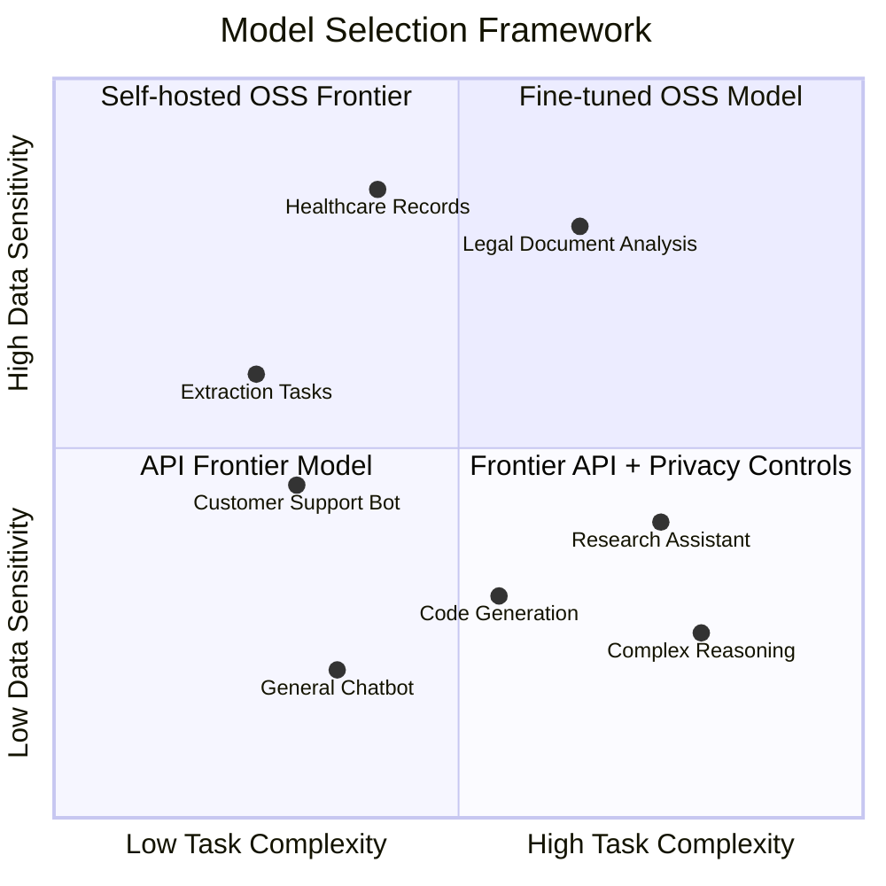

# Open Source AI and the New Developer Power Dynamics

> **TL;DR:** Open source models like Llama 3, Mistral, and Qwen aren't just "good enough" anymore — for a large class of production use cases, they're the better technical choice. Understanding when to use them, how to run them, and what the open source AI ecosystem means for your business model is now a core competency for anyone building on AI.

There's a moment in every technological shift when the open source alternative stops being a curiosity and starts being the serious option. Linux did it to Windows Server. PostgreSQL did it to Oracle (mostly). Now Llama 3, Mistral Large, and Qwen 2.5 are doing it to the frontier model APIs.

Not across the board. Not yet for every task. But for a large and growing class of production workloads, running an open source model is not just viable — it's the correct engineering decision.

Here's the honest case, with the tradeoffs included.

## Why Open Source Models Are a Legitimate Production Choice

The headline reasons you've heard are real: cost, privacy, customization, no rate limits. Let me be specific about each.

**Cost** is the most immediately compelling. Running Llama 3 70B on your own infrastructure — or through inference providers like Together AI, Fireworks AI, or Groq — costs roughly 10-20x less per million tokens than frontier models for comparable quality on most standard tasks. For products with high call volume, that's not a footnote in your spreadsheet; it's your entire unit economics story.

**Privacy and data control** is the one that I see underweighted in most public discussions. If you're processing healthcare data, financial records, or anything where your customer agreement says "we don't train on your data, ever, full stop" — self-hosted open source models are not just cheaper, they're the only defensible choice. No API call leaves your infrastructure. No question about what the model provider does with your prompts.

**Customization via fine-tuning** is where things get genuinely interesting. You can take Llama 3 8B, fine-tune it on 5,000 examples of your specific task, and produce a model that consistently outperforms GPT-4o on that narrow task at a fraction of the cost. This isn't theoretical — it's happening in production at companies building coding assistants, customer support tools, and domain-specific extraction pipelines. The frontier models are trained to be good at everything; fine-tuned OSS models can be exceptionally good at your thing.

**No rate limits** matters more than it sounds. Building a product on an API with rate limits means you're building on borrowed capacity. Your ability to serve users at peak load depends on someone else's provisioning decisions. Self-hosted inference is engineering complexity in exchange for full control — which is often the right trade for production systems.

## The Tradeoffs vs. Frontier Models (Real Talk)

The tradeoffs are real and you should know them before you commit.

**Reasoning and complex tasks** — the gap between Llama 3 70B and GPT-4o on multi-step reasoning, complex coding, and tasks requiring broad world knowledge is real. It's narrowing fast, but it hasn't closed. For tasks that require genuine reasoning depth or broad knowledge synthesis, frontier models still have the edge.

**Inference infrastructure complexity** — running your own inference is not a weekend project. You need GPU capacity, a serving layer (vLLM, TGI, Ollama for local), load balancing, and monitoring. If you're using a managed inference provider like Together or Fireworks, this gets significantly easier, but you're trading some cost savings for their operational overhead.

**Multimodal capabilities** — vision, audio, multi-modal reasoning — the open source ecosystem is behind. GPT-4o and Claude 3 Opus still lead here by a meaningful margin. If multimodal is core to your product, the OSS tradeoff is harder to justify today.

**Latency** — highly optimized inference providers like Groq are genuinely fast (sub-200ms for Llama 3 8B), but if you're running self-hosted inference on less-than-optimal hardware, you can end up slower than the frontier APIs with their massive distributed inference infrastructure.

## The Emerging Open Source AI Stack

The tooling around open source models has matured quickly and is worth understanding as a real alternative to "just call the OpenAI API."

For **model serving locally**: Ollama is now the default for getting models running on a developer's machine. It handles downloading, quantization, and serving with a one-line command. If you've been telling developers "you can run this locally," Ollama is the answer.

For **production inference**: vLLM is the serious choice for high-throughput serving. It handles continuous batching, paged attention, and multi-GPU support. TGI (Text Generation Inference) from Hugging Face is the alternative. Both are production-ready.

For **managed inference**: Groq (ridiculous speed via their LPU hardware), Together AI (excellent selection and competitive pricing), Fireworks AI (good developer experience), and Anyscale Endpoints (if you're already in the Ray ecosystem) are all real options that remove the infrastructure complexity.

For **fine-tuning**: Unsloth for efficient LoRA fine-tuning on consumer hardware, Axolotl for a more configurable training setup, or cloud-managed fine-tuning on Together or Fireworks. The barrier to fine-tuning a usable model on a custom dataset is now measured in hours and hundreds of dollars, not weeks and six figures.

For **model discovery**: Hugging Face is the hub. The Open LLM Leaderboard is your benchmark reference. LMSys Chatbot Arena gives you vibes-based human preference rankings that correlate surprisingly well with real-world usefulness.

## How OSS AI Is Changing Contribution Patterns

Open source AI projects aren't getting contributions the way traditional software does. Nobody is submitting PRs to Llama — that's Meta's internal work. What the community is doing instead is fascinating and different.

**Fine-tune sharing** — Hugging Face is filling up with community fine-tunes. People train models on specific domains and publish them. This is open source collaboration on the model layer rather than the code layer. The "code" is the weights; the "PR" is a fine-tune upload with eval results.

**Evaluation infrastructure** — the community has built evaluation frameworks (EleutherAI's lm-evaluation-harness, OpenAI's evals) and standardized benchmarks that function as shared quality infrastructure. Contributing a new benchmark is contributing to how the whole ecosystem measures progress.

**Tooling and integrations** — the real contributor surface is everything around the model: inference optimizers, quantization methods (GGUF, GPTQ, AWQ), serving frameworks, fine-tuning utilities. This is where developers with traditional software skills can genuinely contribute.

**Curated datasets** — model quality is data quality. Building and publishing high-quality, well-documented training datasets is one of the highest-leverage contributions you can make to the open source AI ecosystem.

## Business Models That Work When the Model Is Free

This is the part that matters if you're building a company.

If the underlying model is free and anyone can download it, your moat cannot be "we have access to this model." That's a 2022 business model and it's already under pressure. The businesses that work in the open source AI era are built on:

**Data and customization** — proprietary training data, domain-specific fine-tunes, and the operational expertise to maintain and improve models over time. The model is free; the expertise and data flywheel are not.

**Infrastructure and reliability** — running inference reliably at scale, with SLAs, monitoring, and enterprise support, is genuinely hard. Companies like Replicate, Together, and Fireworks are building real businesses here. The model weights are free; the operational excellence is not.

**Vertical integration** — building a complete product for a specific domain (legal, healthcare, finance, code) where the model is one component among many specialized pieces. The model is free; the data pipelines, integrations, UI, compliance posture, and domain knowledge are not.

**Workflow and application layer** — LLMs are a commodity input; the application that orchestrates them into a valuable workflow is the product. The model is free; the product is not.

The open source AI movement is, at its core, a commoditization of the model layer. The smart money is moving to everything that sits above and around it.

## Key Takeaways

- **Open source models are production-ready for cost-sensitive, privacy-sensitive, and customization-heavy use cases** — the frontier model API is no longer the default right answer
- **The OSS AI stack is mature**: Ollama for local, vLLM for production serving, Groq/Together/Fireworks for managed inference, Unsloth/Axolotl for fine-tuning
- **Contribution patterns in AI open source are different** — fine-tune sharing, benchmark infrastructure, and tooling are where developers make impact, not model code
- **The model being free changes what "moat" means** — defensibility now lives in data, domain expertise, operational reliability, and application layer, not model access
- **The gap between OSS and frontier models is real but narrowing fast** — re-evaluate your model choice every quarter

## Frequently Asked Questions

**Is it better to start with an open source model or a frontier model API for a new product?**
Start with the frontier model API. The development speed and quality ceiling get you to a real product faster. Once you have validated use cases and meaningful volume, evaluate whether fine-tuning an open source model improves quality or reduces costs enough to justify the operational complexity. The order matters — validate product-market fit first, then optimize the model layer.

**What's the realistic fine-tuning cost for an open source model?**
For a LoRA fine-tune of Llama 3 8B on a dataset of 5,000-10,000 examples: roughly 2-4 hours of training on a single A100 80GB (about $15-30 on cloud GPU). For a full fine-tune of a 7B model on 100k examples: budget a few hundred dollars and a weekend. The tools (Unsloth especially) have dramatically reduced both the cost and the expertise required. The bigger investment is usually data curation, not compute.

**How do I decide between self-hosting and managed inference?**
If your team doesn't have GPU infrastructure experience and you're not processing data that can't leave your network, start with a managed inference provider. The cost difference vs. frontier APIs is still significant, and you avoid the operational burden. Graduate to self-hosted when you have the engineering capacity and your volume makes the economics compelling — typically above $5k/month in inference costs.

---

*If this resonated, subscribe — I write about open source, AI engineering, and developer communities weekly.*

*— [Shantanu Vishwanadha](https://substack.com/@thecoderpanda)*
