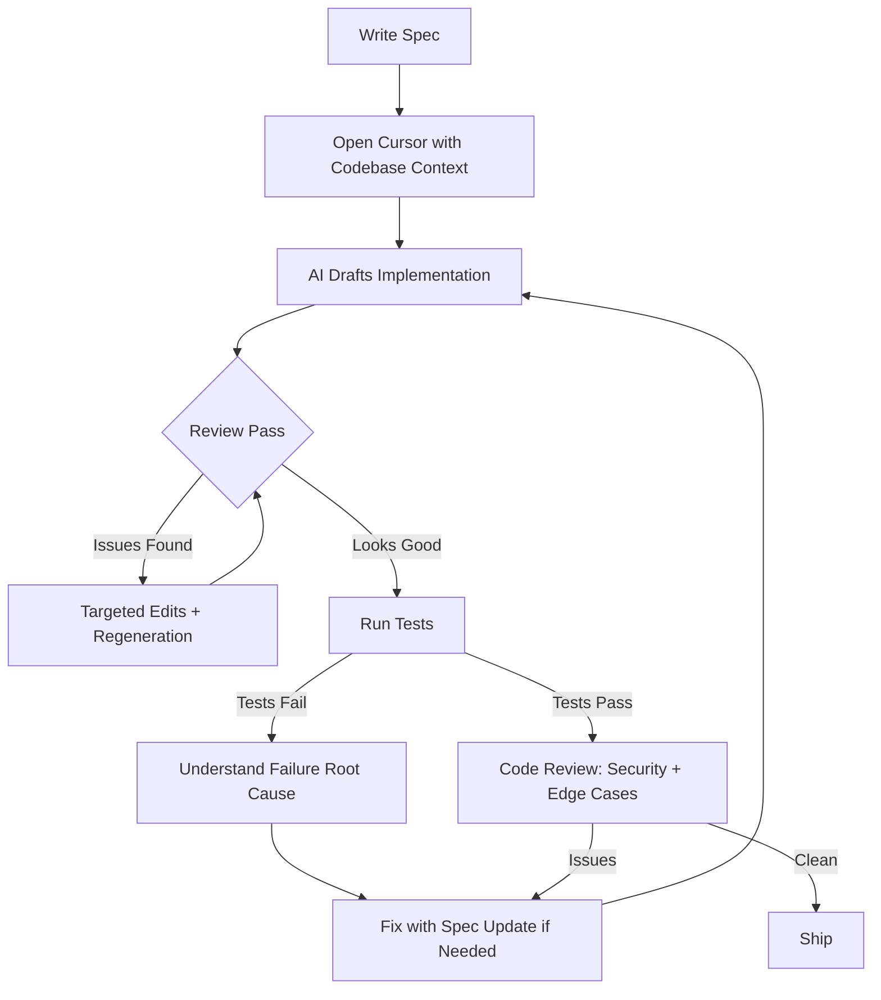

# Stop Writing Boilerplate: The AI Developer Workflow in 2025

> **TL;DR:** Senior engineers in 2025 write specs, review AI-generated code, and spend their keystrokes on the 20% that requires genuine expertise — not the boilerplate that consumes 60% of coding time. This is a practical walkthrough of what that actually looks like: the tools, the workflow, and the mindset shift that makes it work.

Let's establish something first: I'm not talking about "vibe coding" — the approach where you describe what you want, accept whatever the AI produces, and deploy it without reading it. That works great until it spectacularly doesn't, usually at the worst possible moment.

I'm talking about a disciplined, high-leverage approach where AI tools handle the predictable, mechanical parts of engineering — setup code, CRUD logic, boilerplate, test scaffolding — while you focus your cognitive energy on system design, edge cases, security implications, and the parts that require actual judgment.

The mindset shift is from **author** to **editor**. And it changes everything.

## The Spec-First Approach

The biggest mistake I see developers make with AI coding tools is treating them like a search engine with code generation. "Write me a function that does X" is a weak prompt. It produces code that technically does X and often misses the actual requirements, error handling, edge cases, and integration constraints that make X useful.

The spec-first approach fixes this.

Before any code is generated — AI-assisted or otherwise — write the spec. Not a formal document. A tight, precise description that answers:

- What is this doing and why?
- What are the inputs, outputs, and types?
- What are the failure modes and how should each be handled?
- What are the performance and scalability constraints?
- What does this integrate with and what are the contracts?

This sounds like overhead. It's the opposite. A spec forces you to think through the problem before you write a single line. It catches design mistakes before they're embedded in code. And when you give a well-written spec to an AI coding tool, the output quality improves dramatically — because the model has enough context to make the right decisions.

Here's the practical form I use:

```
Feature: Webhook event processor

Purpose: Consume webhook events from third-party payment provider, validate signature, 
parse event type, and route to appropriate handler. Must be idempotent.

Input: HTTP POST with headers (X-Signature-256, Content-Type) and JSON body
Output: 200 OK on success, 400 on invalid signature, 422 on unrecognized event type

Error handling:
- Invalid signature → 400, log attempt with IP, do not process
- Unknown event type → 422, log for monitoring, do not error
- Handler failure → 500, retry via queue, log full context

Constraints:
- Must handle duplicate delivery (idempotency key = event_id)
- Timeout: 30 seconds max before queue hand-off
- Events must be processed in order per customer_id

Integrations: PostgreSQL for idempotency store, SQS for async processing
```

That spec, pasted into Cursor with the right codebase context, generates code that actually works the first time — or close enough that the review pass is straightforward.

## The Toolchain: Cursor + Claude + Context Management



**Cursor** is the editor. The reason Cursor specifically matters is the codebase-aware context window. When you reference files with `@` mentions, ask it to look at a specific module, or use the `@Codebase` indexing feature, it's generating code that fits into your actual system — not some hypothetical architecture it's inventing. This is the difference between code you can use and code you have to rewrite.

The practical habits that make Cursor work well:
- Always have the relevant existing code open in split view so the model can see the patterns
- Use `@file` references explicitly — don't assume the model knows what you mean by "the auth module"
- When a generation is wrong, don't just re-prompt vaguely. Fix the spec and regenerate, or make a surgical edit and explain what changed

**Claude** (via the API or claude.ai) is where I do the heavier lifting: architecture review, spec refinement, debugging complex logic, reviewing a large diff. Claude's context window and instruction-following make it excellent for "here's a 500-line file, find the bug in this specific function and explain why."

**Context management** is the skill nobody talks about enough. The model is only as good as the context you give it. Bad context = mediocre output. The discipline is:
- Keep relevant files in context, prune irrelevant ones
- Include type definitions and interfaces, not just implementation files
- For complex systems, include a brief architecture overview at the top of your prompt
- If a generation goes wrong, check what context the model actually had access to before blaming the model

## Review as a Primary Skill

This is the shift. In 2025, the valuable engineering skill isn't writing code from scratch — it's reading AI-generated code and knowing immediately what's wrong with it.

What I look for in every review pass, in this order:

**Correctness of business logic** — does this actually implement the spec? AI is very good at producing plausible code that subtly misses the requirement. Read the logic; don't skim it.

**Error handling** — is every failure mode handled? AI-generated code often handles the happy path beautifully and silently ignores error conditions. Check every external call, every parse operation, every database query.

**Security implications** — injection vectors, authentication assumptions, data exposure. AI tools are getting better at this but they're not reliable. I don't trust AI-generated code in security-critical paths without a careful manual review.

**Performance at scale** — the code works for one user; does it work for ten thousand? N+1 queries, missing indexes, unbounded loops. AI doesn't have good intuition for this; you do.

**Integration points** — are the types correct? Are the contracts with other services honored? Is this consistent with how the rest of the codebase handles similar operations?

The goal of a review pass isn't to find something to fix — it's to genuinely understand the code well enough that you could have written it yourself. If you can't get to that level of understanding, the code isn't ready to ship.

## Test-Driven AI Development

Test-first development pairs exceptionally well with AI coding tools. The workflow: write the tests first (or write the spec and generate the tests first), then use the tests as a contract that the implementation must satisfy.

When you give an AI model a set of failing tests and ask it to write code that makes them pass, you've constrained the problem dramatically. The model can't produce clever-but-wrong code if it has to satisfy concrete assertions. This is particularly powerful for:

- Algorithmic functions with clear input/output relationships
- API handlers with specific request/response contracts
- Data transformation pipelines with known test cases

The tests also give you a rapid feedback loop. Generate code → run tests → if tests fail, paste the failure output back into the prompt → regenerate. This loop is often faster than debugging manually, and it produces code you can actually trust because it's been verified against your intentions.

The discipline here: write tests that test behavior, not implementation. If your tests are tightly coupled to implementation details, AI refactoring will break them constantly. Test the what, not the how.

## When to Trust AI Output and When to Be Skeptical

The honest answer is: trust but verify, always. But there's a calibrated version.

**High trust situations** — generating standard CRUD operations, writing serialization/deserialization code, scaffolding test setup, generating SQL migrations from a schema, implementing well-defined interfaces that match a spec. These are mechanical tasks with clear correct answers. AI is excellent here and the review pass is fast.

**Medium trust situations** — implementing business logic from a spec, generating API client code, writing integration tests. The output is often good but requires careful review. The spec quality matters a lot here; a tight spec → high-quality output.

**Low trust situations** — security-sensitive code (authentication, authorization, cryptographic operations), performance-critical algorithms, complex state management, anything with subtle correctness requirements that aren't captured in the happy-path description. Generate a draft, review it carefully, and don't be surprised if you're substantially rewriting it.

**Never fully trust** — generated code that touches user data, financial calculations, anything where a silent bug has significant consequences. The model doesn't know what it doesn't know. It will produce confident code that is confidently wrong about edge cases it hasn't seen.

The meta-skill is calibrating skepticism to the stakes. Boilerplate CRUD? Accept the output, run the tests, ship. Payment processing logic? Read every line twice.

## The Mindset Shift: Author to Editor

The productivity gains from AI coding tools aren't automatic. Developers who approach AI tools as "fast autocomplete" get a 20% productivity boost. Developers who genuinely internalize the author-to-editor shift get 3-5x on the right tasks.

What the editor mindset means in practice:

**Your job is judgment, not typing.** The bottleneck in engineering has never been keystroke speed. It's the quality of decisions. AI handles the keystrokes. You handle the decisions.

**Boilerplate is now free.** The mental tax of writing boilerplate code — setup, serialization, standard CRUD, test scaffolding — was always high relative to its value. That tax is gone. Redirect that cognitive load toward the hard problems.

**Specification is the real craft.** The ability to write a tight, precise spec that produces high-quality AI output is now a core engineering skill. It's also, not coincidentally, the same skill that produces good system design documents, good code review comments, and good technical communication.

**Taste beats throughput.** A senior engineer with AI tools will still outproduce a junior engineer with AI tools, for the same reason a senior engineer without AI tools outproduces a junior one. The difference isn't speed — it's the judgment to know what to build, how to structure it, and what to be careful about.

The developers who will struggle with AI tooling are the ones whose value was primarily in the ability to produce code quickly. The ones who will thrive are the ones whose value is in understanding systems, making good technical decisions, and knowing what "correct" looks like.

That's always been the real job. The tools just made it more obvious.

## Key Takeaways

- **Spec-first development dramatically improves AI output quality** — write the spec before generating any code; treat it as the real design artifact
- **The toolchain is Cursor for codebase-aware generation, Claude for architecture and complex debugging** — context quality determines output quality
- **Review is now a primary engineering skill** — read AI-generated code for business logic correctness, error handling, security, and performance
- **Test-driven AI development constrains the problem** — write tests first, use them as a contract the AI must satisfy
- **Calibrate trust to stakes** — high trust for boilerplate, low trust for security-sensitive or financially critical code
- **The mindset shift from author to editor** is the difference between 20% and 5x productivity gain

## Frequently Asked Questions

**Does this workflow work for senior engineers only, or can junior developers adopt it too?**
The toolchain is accessible to anyone. The limiting factor is the judgment layer — knowing what "correct" looks like in a review pass requires experience with the failure modes of real systems. Junior developers can get significant productivity gains but may miss subtle issues in reviews. I'd recommend pairing AI-assisted development with more frequent code review by senior engineers while that experience accumulates.

**What's the biggest mistake people make when adopting AI coding tools?**
Accepting generated code without fully understanding it. The worst outcome isn't wasted time — it's shipping code that works in the happy path and silently fails under specific conditions, months later, in production. Read every line. If you can't explain why a line exists, ask the model to explain it, or delete it and see what breaks.

**Is Cursor worth the subscription cost vs. GitHub Copilot?**
For most engineers doing serious work, yes. The codebase indexing and the ability to have multi-file context conversations makes a meaningful quality difference on anything beyond trivial tasks. Copilot is better-integrated if you're living in VS Code and not willing to switch editors. If you're willing to switch, Cursor's context management is currently the better engineering experience.

---

*If this resonated, subscribe — I write about developer productivity and AI-assisted engineering weekly.*

*— [Shantanu Vishwanadha](https://substack.com/@thecoderpanda)*
