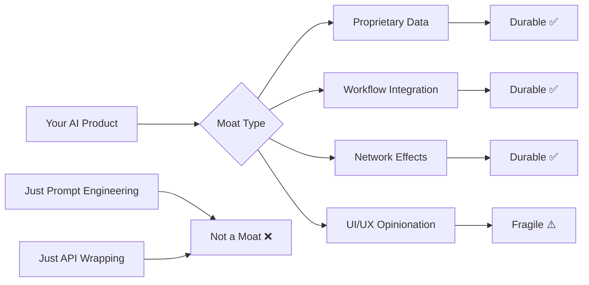

# Product-Market Fit in the AI Era Is Different

> **TL;DR:** AI has collapsed the time to ship a prototype from months to days — which sounds like founder paradise, but it's actually raised the competitive bar in ways most people haven't internalized. Old PMF signals don't map cleanly anymore. Retention on AI features, the "I'll just build this with ChatGPT" threat model, and the speed at which incumbents can now pivot are all rewriting the rules. Here's what PMF actually looks like in 2025.

---

## The MVP Is Dead. Long Live the MDP.

The Minimum Viable Product served us well. Build the smallest thing that tests your riskiest assumption. Ship. Learn. Iterate. Paul Graham wrote the essay, YC turned it into gospel, and the 2010s were built on it.

Here's the problem: the MVP concept assumed that *building* was the constraint. Time, engineering bandwidth, technical complexity — these were the reasons you couldn't ship a polished product on day one. The MVP was a workaround for scarcity.

AI just eliminated the scarcity.

A solo founder with Claude or GPT-4 can now ship a functional, production-adjacent prototype in 48 hours. Not a mockup — actual working software. The implementation ceiling has dropped so dramatically that the MVP is no longer the minimum thing you can build; it's often the first thing you build in an afternoon.

What you actually need now is a **Minimum Differentiable Product** — the smallest thing that's *distinct enough from what the LLM alone can do* to justify someone paying for or repeatedly returning to it. The bar isn't "does this work?" The bar is "why would someone use this instead of just prompting Claude?"

That's a much harder question, and most AI startups aren't asking it honestly enough.

---

## Why "I Can Build That With ChatGPT" Is the New Enterprise Threat

In the 2010s, startups feared the enterprise. "Microsoft/Google/Salesforce will just build this into their platform and you're dead." Some of those fears were rational; most weren't, because enterprises move slowly. The window was usually large enough.

The new threat is horizontal. It's not from a company — it's from an increasingly capable base model. Every week, the things users can do directly in ChatGPT, Claude, or Gemini expand. Your wrapper, your workflow tool, your AI-powered feature — it's not competing against a competitor's roadmap. It's competing against the base model getting smarter.

The startups that will survive this are the ones whose value compounds *independently of the base model*. Proprietary data flywheels. Deep workflow integrations that would take months to recreate. Network effects where the product gets better because more users are using it. These are durable. "We wrote a really good system prompt" is not.

The blunt version: if your entire product is a nicer UI over a model API with a clever prompt, you have 12 months before either the model API ships a product tier that eats you, or a competitor with better distribution does the same thing cheaper.

---

## New PMF Signals for AI Products (Retention Is Everything)

The classic PMF indicators — NPS, activation rate, daily active users — still matter, but they're insufficient for AI products. You can activate users with a demo that feels like magic. You can get high NPS from early adopters who are excited about AI in general. Neither of those signals tells you whether you've actually found PMF.

The signal that matters most for AI products is **retained AI feature usage** — specifically, whether users are returning to use your AI feature in their *normal workflow*, not just when they're exploring it.

Think about it this way. If you ship an AI feature and 60% of users try it in week one, but only 15% use it in week four without being prompted, you don't have PMF on that feature. You have novelty retention. The novelty will decay; the question is what's left underneath.

Concrete signals that actually indicate AI PMF:

- **Week-4 AI feature retention above 30%** — users who are still regularly using your AI features a month after activation
- **Organic session starts on AI features** — users navigating directly to your AI feature rather than being prompted by onboarding flows or notifications
- **AI-assisted outputs being shared externally** — users using your AI feature's outputs in their actual work (sending the email it drafted, shipping the code it generated, presenting the analysis it produced)
- **Support requests for "why didn't the AI do X?"** — counterintuitively, complaints about AI behavior are a strong PMF signal. Users who complain are users who've incorporated the feature into their workflow. Silent users churn.

The retention curve for AI features flattens differently than traditional features. Expect a steeper initial drop — the novelty cliff — followed by a *longer tail* for users who've genuinely integrated it. If your curve just drops and doesn't flatten, you haven't hit PMF. You've built a demo.

---

## How AI Incumbents Can Now Pivot Faster Than Startups

Here's the moat analysis that most founders get wrong: they assume incumbents are slow because of organizational inertia. Sometimes that's true. But AI has handed incumbents a powerful new weapon — the ability to prototype and validate new directions at startup speed.

A team at Notion, Linear, or Figma can now spin up a working AI feature in a weekend. They have the distribution (millions of existing users), the data (years of user behavior), and now the development speed. The moat equation has changed.

The startup advantage used to be speed. You could move in six weeks what took an incumbent six months. That gap has closed significantly. What's left?

**Founder insight**: domain-specific knowledge that incumbents don't have because they're generalists. The best AI startups in 2025 are built by founders who have spent years in a specific domain — legal, healthcare, finance, construction, sales operations — and understand the workflows, the data structures, the compliance requirements, and the failure modes in ways that an AI product team at a horizontal platform cannot replicate quickly.

**Distribution without incumbents**: building in channels that big platforms don't own. Communities, newsletters, LinkedIn audiences, niche conferences. If your user acquisition is entirely dependent on the app store or a platform's marketplace, you're one policy change away from zero.

**Speed of iteration on feedback**: startups that genuinely talk to their users every week and ship changes within days still have an edge. Not because incumbents can't — they can — but because most large organizations don't have the culture to. Use the advantage while it exists.

---

## Distribution Is the Only Durable Moat for Most AI Startups

I want to be direct about something: for most AI startups — not the ones with massive proprietary datasets or deep enterprise integrations — the only durable moat is distribution.

If you've built an audience of 50,000 developers who read your newsletter, watch your YouTube channel, or follow your work on Twitter/X, you have an asymmetric advantage that a bigger competitor with more engineers can't buy quickly. Building that audience takes years, and it's a compounding asset.

The AI founders who are winning right now typically have one of two things: either proprietary data or distribution. The ones with both are in generational business territory. The ones with neither are building very expensive open-source projects.

Distribution doesn't mean "go viral." It means having a reliable, repeatable way to reach the people who would benefit from what you're building. A specific developer community. A podcast with 10,000 monthly listeners who trust you. A reputation in a specific industry where your name carries weight. These are worth more than a better model, a prettier UI, or a smarter system prompt.

The actionable version of this for founders: before you write a line of code for your next AI product, ask yourself what distribution channel you own or can realistically build. If the honest answer is "none," the product work will eventually be irrelevant.

---

## Key Takeaways

- **The MVP isn't enough anymore** — you need a Minimum Differentiable Product that answers "why would someone use this instead of just prompting an LLM directly?"
- **"I can build this with ChatGPT" is your real competition** — not other startups. Design your moat accordingly: proprietary data, deep workflow integration, or genuine network effects.
- **Retained AI feature usage (week 4+) is the PMF signal that actually matters** — novelty retention is real and it will fool you. Dig into whether users are still coming back after the honeymoon phase.
- **Incumbents can now move at startup speed on AI features** — your advantage is domain expertise, founder insight, and the distribution you've built, not raw development velocity.
- **Distribution compounds in ways that better models don't** — own your audience before you build your product, and you'll have options that purely product-focused founders won't.

---

## Frequently Asked Questions

**Q: Is product-market fit harder to achieve for AI products than traditional SaaS?**

It's not harder, but it's harder to *measure accurately*. AI products have a novelty-driven activation spike that can trick founders into thinking they've hit PMF when they've actually just shipped an impressive demo. The discipline required is to look past the activation numbers to week-4 and week-8 retention on AI-specific features before drawing conclusions.

**Q: How do you build a proprietary data moat as an early-stage startup?**

You usually can't build it before you have users — which is the catch-22. The approach that works: design your product so that user interactions generate training signal or labeled data from day one. Every time a user edits your AI output, that's a preference signal. Every time they approve or reject a suggestion, that's labeled data. Build the infrastructure to capture this from the start, even if you don't have the scale to use it yet.

**Q: The distribution argument sounds like "build an audience before you build a product." Is that realistic?**

Partially. The most pragmatic version is: build in public. Document your building process, share your failures and learnings, engage with the communities where your target users are. This isn't about becoming a content creator — it's about building trust and visibility in parallel with the product. Six months of genuine engagement in the right community is worth more than a Product Hunt launch.

---

*If this resonated, subscribe — I write about AI startups and product strategy weekly.*

*— [Shantanu Vishwanadha](https://substack.com/@thecoderpanda)*
