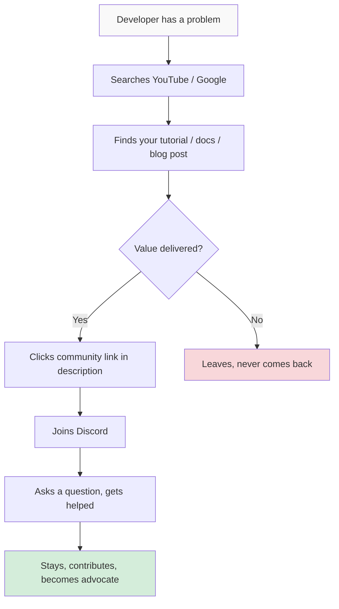

# Building Developer Communities in 2025: What Actually Works

> **TL;DR:** Discord won for real-time developer community. YouTube and long-form docs won for discovery. AI changed the ops layer — moderation, FAQ bots, and onboarding are all partially automated now. But community health metrics matter more than size, the 1000-true-fans model applies directly, and the thing that kills dev communities faster than anything else is losing the human element. Here's what I've seen work.

---

## The Platform Landscape in 2025: Discord Won, But It's Not Enough

Let's settle this: Discord is the default real-time hub for developer communities. Slack lost the race for open communities years ago — it's fine for private team workspaces, but the free plan's message limits and the culture of formality killed it for open developer spaces. Discourse still powers some excellent forum-style communities (Elixir Forum, Rust Users Forum), but it's best for communities where async, searchable threads matter more than live energy.

Discord won because of a few specific things: voice channels lowered the barrier to spontaneous office hours, the threads model let conversations get long without polluting the main feed, and stage channels gave community builders a way to host events without a separate Zoom setup. The bot ecosystem is mature enough to build sophisticated automations, and mobile notifications are actually good.

But here's the critical nuance that a lot of community builders miss: **Discord is where your community lives, not where it gets discovered**. The discovery layer is entirely different.

YouTube is where developers find communities in 2025. A well-titled tutorial video that shows up in search will drive more new members to your Discord than any growth hack. Long-form technical content — blog posts, documentation, GitHub repos with real examples — is the discovery surface. Discord is where people go *after* they find you, not how they find you.

This has concrete implications for how you allocate effort:

Most community teams underinvest in the discovery layer and overinvest in the community layer. They spend hours building elaborate Discord structures, custom bots, onboarding flows — and then wonder why the community isn't growing. Flip the ratio: content creation for discovery, community infrastructure for retention.

---

## AI Changed the Operations Layer (Not the Culture Layer)

Here's where I need to be precise, because the discourse around "AI community management" is sloppy and often sets wrong expectations.

AI is very good at **operations**: spam detection, auto-answering FAQ questions, routing people to the right channels, summarizing long threads for newcomers, and flagging potentially toxic messages for human review. It is genuinely useful here and has changed the ops workload for community managers significantly.

AI is not good at **culture**: knowing when someone is having a hard time and needs empathy rather than a solution, reading the room in a live office hours session, recognizing when a conversation is drifting into territory that will alienate a segment of your community, or making the judgment calls that define your community's values over time.

The practical breakdown:

**Automate with AI (and it works well):**
- FAQ bots that answer the top 20 questions with structured, accurate answers sourced from your documentation
- Welcome messages that personalize based on what channel a new member entered from
- Thread summarization for long discussions ("catch up" feature)
- Spam and hate speech detection with human escalation for edge cases
- Daily/weekly digest generation for community highlights

**Keep human (AI helps but doesn't replace):**
- Community moderation judgment calls
- Relationship building with power users and contributors
- Live events, office hours, AMAs
- Handling community conflicts and policy violations
- Spotting and nurturing the members who are becoming community champions

The mistake I see is teams that automate the relationship layer because the ops wins are obvious and measurable, and then wonder why community engagement is dropping. Automation is leverage for humans, not a replacement for them.

---

## Community Health Metrics That Actually Matter

The vanity metric trap in community is strong. Discord member count is the most useless number in DevRel. I've seen communities of 50,000 members where no one talks, and communities of 800 members where every question gets answered within 20 minutes and new contributors are minted monthly.

Here are the metrics I actually track:

**Active Participation Rate (APR)**: the percentage of your members who sent at least one message in the last 30 days. A healthy developer community sits between 8-15% APR. Below 5% and you're running a ghost town. Above 20% is excellent, usually the sign of a community that's found a strong niche.

**Question Resolution Rate (QRR)**: what percentage of questions asked in your support channels get a meaningful answer within 24 hours. This is the heartbeat of a developer community. If developers can't get help, they leave. Target: above 80%.

**Contributor Growth Rate**: how many members have gone from "passive lurker" to "active participant" (at least 3 substantive messages in a month) in the last quarter. This is your pipeline for community champions and potential moderators.

**Content Amplification Rate**: how often community members share content created *by* the community — tutorials, code examples, projects — to external channels. This indicates community pride and the existence of a genuine identity.

**Event Attendance Retention**: not how many people attend your first event, but how many return for the third or fourth. First-event attendance is marketing. Third-event attendance is community.

Notice what's not on this list: total member count, total messages, daily message volume. These can all be gamed, accidentally inflated by bots, or reflect noisy/low-quality activity rather than genuine engagement.

---

## The 1000 True Fans Model Applied to Developer Communities

Kevin Kelly's 1000 True Fans essay is the best framework for developer community building that wasn't written about developer communities. The thesis: you don't need a massive audience; you need 1000 people who deeply care about what you're building and will evangelize it for you.

Applied to developer communities, the math is even more forgiving. 100 genuinely engaged, technically credible developers who love your community will:

- Answer questions before you can (reducing support burden)
- Create tutorials, blog posts, and videos that extend your reach (free content marketing)
- Recruit their colleagues and networks into the community (organic growth)
- Provide honest, specific product feedback that improves your roadmap (free user research)
- Defend your reputation in threads and discussions where you're not present (brand protection)

The question is how to cultivate these people. The short answer: **identify them early and invest in them disproportionately.**

Signs someone is becoming a true fan: they answer questions without being asked, they post their projects built with your tool, they push back constructively when you make a bad decision, they show up to office hours repeatedly. These are not people who love everything you do — they're people who care enough to engage critically.

What they want in return: recognition (a community title, a credit in your changelog), access (early feature previews, direct conversations with your team), and occasionally tangible benefits (conference tickets, swag, the occasional thank-you gift). The recognition and access almost always matter more than the tangibles.

Building a community of 100 true fans before you optimize for scale is not a compromise strategy — it's the correct strategy. The energy and quality of those 100 will define what your community becomes, and it's much harder to change the culture of a large community than to establish culture in a small one.

---

## The Content Loop That Feeds Community Growth

The sustainable growth pattern for developer communities is a specific content loop, and it's worth mapping explicitly:

1. **You create seed content** (tutorial, blog post, YouTube video, open-source project) that solves a real problem developers have
2. **Discovery drives community joins** — developers who found the content join your Discord or forum
3. **Community activity generates more content** — questions, answers, projects, discussions
4. **Community-generated content gets amplified** — you share the best of it in your newsletter, social, blog
5. **Amplification drives more discovery** — new developers find the community through the amplified content
6. **Repeat**

The key is that steps 3 and 4 are where most community teams drop the ball. They treat community content as something that happens *inside* the community and stays there. The communities that compound treat every great question-and-answer thread, every member project, every interesting discussion as potential external content.

This doesn't mean strip-mining your community for marketing material. It means having a system for surfacing the best internal content — a weekly "best of" newsletter, a YouTube channel where you do deep-dives on interesting community discussions, a GitHub org where community projects get featured. When members see their contributions amplified, they create more. When they don't, they eventually leave.

---

## The One Thing That Kills Communities Faster Than Anything

I've watched communities collapse from a lot of causes — poor moderation, tool changes, company pivots, founders who burned out. But the one that moves fastest, and is least discussed, is losing the human element from the top.

When a community stops hearing from the founders, the core team, the people who built the thing the community is around — it starts to feel like an abandoned storefront. It doesn't matter how automated your FAQ bot is or how many moderators you've trained. Developers are extremely sensitive to authenticity. They know when they're talking to a company versus talking to a person.

This is particularly acute in AI-powered developer tools right now. The competitive landscape is brutal, everyone's heads-down building, and community engagement is the first thing that gets dropped when the team is under pressure. It's also the thing that's hardest to restart once it's been absent for a while. Members who felt the disconnect don't come flooding back when the founder starts posting again — they've already found somewhere else to be.

The practical commitment: at least one person from the core team — ideally a founder or senior technical leader — needs to be genuinely active in your community at least three times a week. Not posting announcements. Answering questions. Commenting on member projects. Showing up to office hours and being human. This is a time commitment that pays compound interest.

---

## Key Takeaways

- **Discord is for retention; YouTube and long-form content is for discovery** — most community teams have this ratio backwards and wonder why growth stalls.
- **AI automates ops well, but culture is irreducibly human** — use AI for FAQ bots, moderation assistance, and thread summaries; never use it to replace genuine relationship-building.
- **Track APR, QRR, and contributor growth — not member count** — vanity metrics will actively mislead you about the health of your community.
- **100 true fans beats 10,000 lurkers** — identify your most engaged members early, invest in them disproportionately, and let them define the culture.
- **Losing the human element from leadership is the fastest path to community death** — no amount of automation compensates for founders and core team going dark.

---

## Frequently Asked Questions

**Q: How do you handle the Discord vs. Slack decision for an enterprise-focused developer tool?**

Default to Discord for open communities. Enterprise developers use Slack at work, but they actually prefer Discord for open-source and community-style participation — the barrier to join is lower, the culture is less formal, and the features (threads, voice, stages) are better suited. The exception is if your users are predominantly in enterprise settings where Discord is blocked by IT policy, in which case a hosted Discourse forum is a better alternative than Slack.

**Q: What's the right cadence for community events (office hours, AMAs, workshops)?**

Start with monthly events and run them consistently before you increase frequency. Consistency matters more than frequency — a monthly event that always happens on the first Tuesday at a predictable time will outperform biweekly events that shift schedules. Once you have 30+ consistent attendees per event, you have enough demand to go biweekly or add a second event type. Don't launch with weekly events — you'll burn out the organizers and train members to expect volume you can't sustain.

**Q: When should a community team hire its first dedicated community manager?**

When the founder or DevRel lead is spending more than 15 hours per week on community and it's actively pulling them away from product or go-to-market work — and you have at least 500 active members. Before that threshold, the founder should own community directly. There's no substitute for the credibility and authenticity of the builder being present in the community in the early stages.

---

*If this resonated, subscribe — I write about developer relations and community building weekly.*

*— [Shantanu Vishwanadha](https://substack.com/@thecoderpanda)*
