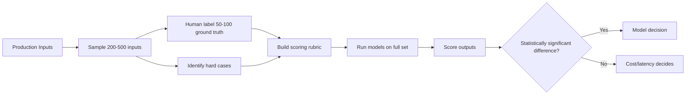
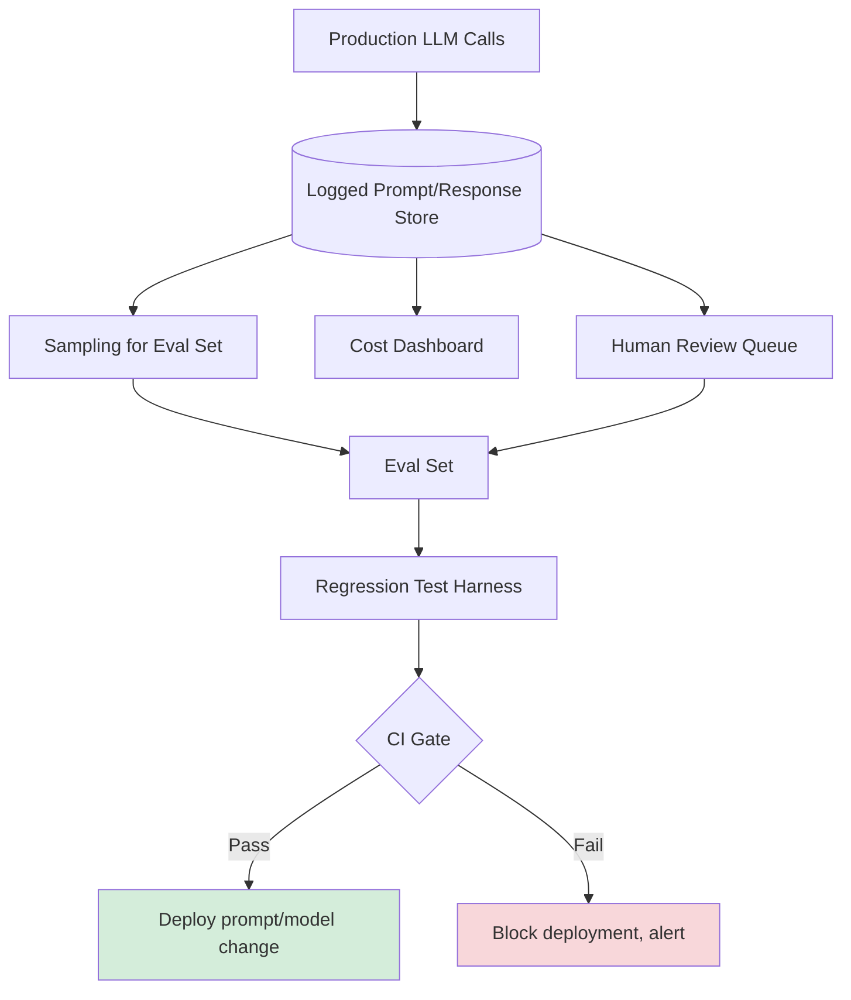

# Evaluating LLMs for Production: A Practical Guide

> **TL;DR:** "Which LLM is best?" is the wrong question. The right question is "which model gives me acceptable quality on my specific tasks, at a cost I can sustain, within the latency my users will tolerate?" This guide covers how to build task-specific eval sets, run automated evaluations at scale, analyze the cost-quality-latency tradeoff triangle, and the minimum eval infrastructure every AI team should have before shipping to production.

---

## The Wrong Question Everyone Starts With

Every AI team eventually has the "which model should we use?" meeting. Someone brings up the Chatbot Arena leaderboard. Someone else insists GPT-4o is the best at everything. A third person advocates for Gemini because Google's pricing is more competitive. The meeting lasts an hour and ends with a decision that's basically vibes-based.

The problem is that general benchmarks — MMLU, HumanEval, HellaSwag — tell you almost nothing about how a model will perform on your specific workload. They're measuring academic knowledge retrieval and reasoning on tasks designed to be comparable across models. Your task is extracting structured data from messy customer support tickets, or generating SQL from natural language queries against a specific schema, or summarizing legal documents while flagging missing clauses.

These tasks have very different difficulty profiles than the benchmark tasks. A model that ranks 3rd on Chatbot Arena might be the best choice for your structured extraction pipeline. A model that's the best at code generation might be surprisingly weak at your specific domain's terminology.

The foundation of good LLM evaluation is this principle: **your eval set is the ground truth, not someone else's benchmark.** Everything else follows from that.

---

## Building a Task-Specific Eval Set That Actually Discriminates

An eval set is only useful if it can tell the difference between a good output and a bad one. If your eval set is too easy (every model gets it right), or too ambiguous (there's no clear correct answer), it's not giving you signal — it's wasting compute and time.

Here's the process for building a discriminating eval set:

**Step 1: Collect 200-500 real production inputs.** Not synthetic inputs you made up — actual inputs from users or close approximations. The closer these are to real production traffic, the more predictive your evals will be. If you're pre-launch, run a closed beta specifically to collect this data before you commit to a model.

**Step 2: Label 50-100 of them with ground truth.** Human-labeled ground truth is expensive but non-negotiable for the core of your eval set. For structured outputs (JSON extraction, classification), label the exact correct output. For open-ended generation tasks (summaries, explanations), label the minimum quality bar — what you'd consider acceptable at a P50 and P90 level.

**Step 3: Include hard cases deliberately.** The inputs where models fail interestingly are more valuable than the easy ones. If you're building a SQL generation tool, include ambiguous queries, edge cases with multiple valid interpretations, and queries that require understanding implicit business logic. Your eval set should have a distribution of difficulty — roughly 20% easy, 60% medium, 20% hard. The hard cases are where models differentiate.

**Step 4: Build a scoring rubric before you run the eval.** Write down what "correct," "acceptable," and "wrong" mean for each output type before you look at model outputs. If you write the rubric after, you'll unconsciously bias it toward the model you like. Rubric-first is the discipline that separates rigorous evals from motivated reasoning.



---

## Automated Eval Techniques That Scale

Once your eval set is built, you need to run it efficiently — both for initial model selection and for ongoing regression testing as you update prompts and models.

**LLM-as-Judge** is the most practical technique for open-ended generation tasks where there's no single correct answer. You pass the model's output to a separate LLM (usually a capable model like GPT-4o or Claude Opus) along with the original input, your scoring rubric, and sometimes the reference answer, and ask it to rate the output on a 1-5 scale with reasoning.

```python
def llm_judge_score(input_text: str, model_output: str, reference: str, rubric: str) -> dict:
    judge_prompt = f"""You are evaluating the quality of an AI-generated output.

Input: {input_text}
Reference answer: {reference}
Model output: {model_output}

Scoring rubric:
{rubric}

Score the model output from 1-5 and explain your reasoning briefly.
Return JSON: {{"score": <int>, "reasoning": "<str>", "issues": [<str>]}}"""
    
    response = openai_client.chat.completions.create(
        model="gpt-4o",
        messages=[{"role": "user", "content": judge_prompt}],
        response_format={"type": "json_object"}
    )
    return json.loads(response.choices[0].message.content)
```

The reliability of LLM-as-judge depends heavily on your rubric quality and the judge model's capability. Validate your judge against human ratings on a random sample — if your judge disagrees with human ratings more than 20% of the time, the rubric needs work or the judge model is wrong for the task.

**Unit tests for structured outputs** are simpler and more reliable than LLM-as-judge when your outputs have structure. If you're extracting JSON, test that required fields are present, types are correct, values are within valid ranges, and edge case inputs produce the expected edge case outputs. These run in milliseconds and don't require another LLM call.

```python
def validate_extraction_output(output: dict, schema: dict) -> list[str]:
    errors = []
    
    for field, field_schema in schema["required_fields"].items():
        if field not in output:
            errors.append(f"Missing required field: {field}")
            continue
        
        if not isinstance(output[field], field_schema["type"]):
            errors.append(f"Wrong type for {field}: expected {field_schema['type'].__name__}")
        
        if "enum" in field_schema and output[field] not in field_schema["enum"]:
            errors.append(f"Invalid enum value for {field}: {output[field]}")
    
    return errors
```

**Regression testing** is where most teams fail. You run your eval set before and after a prompt change or model upgrade, and you need a statistically valid way to decide whether the change is an improvement. The minimum bar: if your change improves average score by less than 0.1 on a 5-point scale, it's within noise. Run on at least 100 samples before drawing conclusions. Track the score distribution, not just the mean — a change that improves the mean but increases variance is usually not worth it in production.

---

## The Cost-Quality-Latency Triangle

There is no model that wins on all three dimensions. This is not a temporary state — it's a structural property of the market. Understanding the tradeoffs honestly is how you make good model decisions.

A practical framework for the tradeoff analysis:

**Quality** is task-specific (per your eval set). Don't assume a more expensive model is higher quality for your task — verify it with your evals. GPT-4o is not always better than Claude Haiku for classification tasks. Gemini Flash is surprisingly strong on structured extraction. Measure first.

**Cost** compounds at scale. A model that's 5x more expensive but 20% better on quality might be worth it at 10,000 requests/month and not worth it at 10,000,000 requests/month. Always model your cost projection at 10x and 100x current volume before committing to a model for a latency-sensitive, high-volume use case.

**Latency** has user experience implications that vary by use case. Rough guidance:

| Use Case | Acceptable P95 Latency | Model Tier |
|---|---|---|
| Real-time chat / autocomplete | < 1s | Small/fast models |
| Agentic step in a user-facing flow | < 5s | Mid-tier |
| Background document processing | < 30s | Any |
| Overnight batch analysis | Minutes | Largest/best |

The most common mistake is using a large frontier model for real-time autocomplete and wondering why latency is terrible. The second most common mistake is using a small/fast model for a complex reasoning task and wondering why quality is terrible. Map your use case to a latency bucket first, then optimize within that bucket for quality and cost.

---

## The Minimum Eval Infrastructure Every AI Team Needs

You don't need a sophisticated ML platform to do production-quality evals. But you do need to build a few things before you ship, and retrofitting them after is painful.

**A logged prompt/response store.** Every LLM call in production should be logged: timestamp, model, prompt, response, latency, token counts, and a trace ID that connects the LLM call to the user request that triggered it. This is your source of truth for debugging, for sampling real inputs for your eval set, and for cost tracking. Build this before you ship anything else. SQLite or Postgres with a simple schema is fine to start.

**A regression test harness.** A script you can run in CI that takes your prompt files, runs them against your eval set, scores the outputs, and fails if the average score drops below a threshold. Even if this takes 10 minutes to run and costs $5 per run, the value of catching prompt regressions before they hit production is enormous.

**A cost dashboard.** Token costs are easy to ignore until they're not. Track your spend by model, by feature, and by user segment (if applicable). Set a budget alert at 80% of your monthly cap. Cost spikes are almost always caused by a specific feature or edge case input — the dashboard lets you find it before it becomes a crisis.

**A human review queue.** A simple interface where you can sample production outputs, rate them as good/acceptable/bad, and flag them for prompt improvement. This closes the feedback loop from production back to your eval set and is how your evals improve over time. Start with just a spreadsheet if you need to — the discipline of reviewing outputs regularly matters more than the tooling sophistication.



The tools in this space — Braintrust, LangSmith, Weights & Biases, Langfuse — are all legitimately useful and will save you build time. The open-source options (Langfuse especially) are production-capable. Pick one and instrument your application with it before launch, not after.

---

## Putting It Together: A Model Selection Decision

Here's the process as a repeatable playbook:

1. **Define your task precisely** — what are the inputs, what counts as a correct output, and what's the failure mode you care most about avoiding?
2. **Build your eval set** — 200+ real inputs, 50-100 human-labeled ground truth outputs, scoring rubric written before you look at model outputs
3. **Select 3-4 candidate models** — include at least one small/fast model, one mid-tier model, and one frontier model. Don't run 15 models — you'll drown in the data.
4. **Run the eval set on all candidates** — use automated scoring (unit tests for structured, LLM-as-judge for open-ended), validate a sample of scores by hand
5. **Build the cost-latency model** — calculate cost per 1000 requests and P95 latency for each candidate at your expected volume
6. **Make the decision** — the model that hits your quality bar at the lowest cost within your latency constraint wins. If two models are within 5% on quality, cost and latency decide.
7. **Set up regression testing** — before you ship, make sure you have a test that will catch quality regressions as you iterate on prompts

This process takes a few days for a new use case. It will save you weeks of debugging quality issues in production and months of technical debt from picking the wrong model.

---

## Key Takeaways

- **"Which model is best?" is the wrong question** — the right question is which model hits your quality threshold on your specific task at a sustainable cost within your latency SLA.
- **Your eval set is your ground truth** — 200+ real inputs, 50-100 human labels, rubric written before you look at outputs. Don't shortcut this.
- **LLM-as-judge scales for open-ended tasks; unit tests scale for structured outputs** — use both, validate your judge against human ratings on a sample.
- **Map your use case to a latency bucket before optimizing for quality** — real-time features need small/fast models; background processing can use frontier models.
- **The minimum eval infrastructure is non-negotiable before shipping** — logged outputs, a regression test harness, a cost dashboard, and a human review queue. Build these first.

---

## Frequently Asked Questions

**Q: How often should we re-evaluate our model selection?**

Every time a major new model releases (roughly quarterly now), run your eval set against the new entrant. Also re-evaluate whenever your task definition changes significantly — adding new input types, changing your output schema, expanding to a new domain. Don't re-evaluate just because there's a new model on the leaderboard; re-evaluate when there's a plausible reason to think the conclusion might change.

**Q: What sample size do I actually need for statistically valid eval results?**

For binary metrics (correct/incorrect), you need about 200 samples to detect a 10% quality difference with 80% power at p<0.05. For continuous metrics (1-5 scores), 100 samples is usually sufficient to detect a 0.3-point difference in means. Anything under 50 samples and you're in noise territory — the results are unreliable regardless of what they show.

**Q: Is it worth fine-tuning a smaller model vs. using a larger base model with prompting?**

Fine-tuning wins when: your task is narrow and well-defined (classification, structured extraction), you have 500+ high-quality training examples, latency matters (fine-tuned small models can beat large models on latency at equivalent quality for narrow tasks), and you're running enough volume for the fine-tuning cost to amortize. Prompting with a frontier model wins when: your task is complex or varied, you have less than 200 training examples, or you need to iterate quickly on task definition. The default in 2025 is to start with prompting and consider fine-tuning once you have both quality data and volume to justify it.

---

*If this resonated, subscribe — I write about AI engineering and production ML weekly.*

*— [Shantanu Vishwanadha](https://substack.com/@thecoderpanda)*
