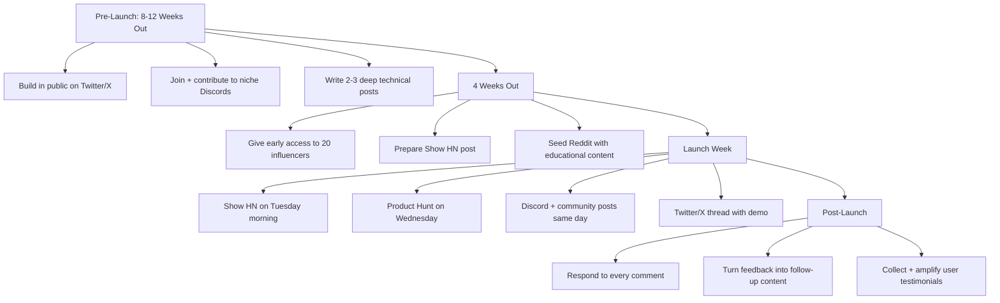

# Launching a Developer Tool in 2025: The Honest Playbook

> **TL;DR:** Launching a developer tool in 2025 is both easier and harder than it was five years ago. Easier because the build cost is lower and distribution channels exist. Harder because the noise level is deafening — 50 new developer tools ship every day, and most of them are fine. If you want to break through, you need a content-first strategy, a sequenced launch across the right channels, and actual word-of-mouth mechanics baked into the product. Here's the playbook that actually works.

I've launched tools, watched other people's launches closely, talked to founders about what worked and what was a waste of three weeks of runway. The pattern is real. Let me save you the tuition.

## What Actually Changed Since 2020

In 2020, if you built a useful dev tool, you launched on Product Hunt, posted on Hacker News, and waited for the sign-ups. The competition was thin enough that "build something useful and announce it" was a complete strategy.

In 2025, three things broke that:

**The discoverability problem got severe.** There are more developer tools than there are developers who need them. The signal-to-noise ratio on Product Hunt, Hacker News, and even Twitter/X has collapsed. Developers are actively filtered for new tool spam, and they should be. Their attention is finite.

**AI lowered the build cost to nearly zero.** Any competent developer can ship an MVP in a weekend. This is great for them, terrible for differentiation. If you can build it in a weekend, so can three other people who had the same idea last month. Shipping is no longer impressive. What you ship and *who knows about it* are the variables that matter.

**The trust bar moved.** Developers are more skeptical. They've been burned by tools that got acquired, deprecated, or enshittified. They want to see real usage, real documentation, and real opinions from people they already follow before they'll invest time integrating something.

What this means: a launch is no longer an event. It's the culmination of a content and community strategy that should start 8-12 weeks before you call anything a "launch."

## The Channels That Actually Move the Needle

Let's be specific. Not every channel works the same way for every tool. But here's the honest 2025 ranking:

**1. Niche Discord Servers and Slack Communities**

This is the highest-ROI channel that most people skip because it feels too small. It isn't. A single authentic, helpful post in the right Discord — not a "hey check out my tool" paste, but a genuine contribution that happens to mention what you built — can produce hundreds of high-intent sign-ups from the exact audience you want.

Find the communities where your target users already live. If you're building a developer tool for TypeScript developers, you want the TypeScript Discord. If you're building something for AI engineers, you want the Latent Space Discord, the AI Engineer community. These people talk to each other. Word-of-mouth in a tight community propagates fast.

The rules: be a member first, be helpful second, mention your tool third. Ratio matters. If the first message you ever post is about your product, you will be ignored.

**2. Hacker News: Show HN Is Still Underutilized**

Hacker News "Show HN" posts are chronically underestimated. A good Show HN can generate 10,000+ unique visitors, hundreds of GitHub stars, and genuine early feedback in 24 hours. A bad one disappears in 90 minutes.

The difference is almost entirely about *what you built and how you present it*. HN is allergic to marketing language. Write your Show HN post the way you'd explain it to a senior engineer who's mildly skeptical. Lead with what the tool does, show actual output, and be honest about what's not done yet. HN users will forgive incomplete tools. They will destroy you for perceived dishonesty or hype.

Timing matters: Tuesday-Thursday, 8-10 AM Eastern. Weekend posts get buried.

**3. Reddit: r/programming, r/webdev, the Subreddits That Fit**

Reddit is complicated. The moderators of large subreddits (r/programming, r/webdev) are aggressive about removing posts that read as self-promotion. But the content that makes it through gets enormous reach — millions of readers, substantial organic SEO value from external links.

The approach that works: ship something that's so genuinely useful or interesting that you can frame it as a "here's what I built and learned" post, not a product announcement. The "I spent 6 months building X, here's what I learned" format consistently outperforms "check out my new tool." The former is content. The latter is an ad.

**4. Twitter/X for Developer Audiences**

The developer Twitter/X audience is smaller than it was pre-Musk, but it's still real and it's still influential. The people who influence developer opinion — the prominent open-source maintainers, the DevRel leads, the technical bloggers — are still mostly there.

The play is getting these people to use your tool and talk about it organically. That means identifying 20-30 high-influence accounts in your niche, giving them early access, and helping them use it well. One tweet from the right person reaches more qualified leads than a Product Hunt launch.

Don't buy promotion. Don't ask for it. Build relationships early enough that sharing your tool is something they want to do.

## Why Product Hunt Still Matters — But Differently

People either oversell Product Hunt or dismiss it. The truth is more nuanced.

Product Hunt in 2025 is less about the traffic you get on launch day and more about three other things:

**Credibility signal.** Having a successful Product Hunt launch (top 5 of the day) gives you social proof that's real currency when you're talking to journalists, VCs, or potential design partners. It says "people liked this enough to vote."

**Backlinks and SEO.** Product Hunt links are indexed. A strong launch creates a crawlable footprint that accumulates over months.

**Discovery for specific audiences.** There are still founder, VC, and early adopter audiences that browse Product Hunt genuinely. You won't get mass developer adoption from it, but you might get a handful of power users who become advocates.

What doesn't work: treating Product Hunt as your primary channel. If you're launching on Product Hunt and nowhere else, you've already made a mistake.

## The Content-First Launch Strategy

The most durable launches I've seen follow this pattern: the tool was already somewhat known before it "launched."

This means building in public — not fake building in public where you tweet "excited to be building something 🔨" — but actually sharing technical decisions, early screenshots, implementation challenges, and what you're learning. This creates an audience that already understands what you're building before they're asked to sign up.

Three types of content that build pre-launch momentum:

**Technical deep-dives.** Write the blog post you wish existed when you were building the thing your tool solves. If your tool makes Postgres migrations safer, write a 2000-word post on why Postgres migrations go wrong and how to think about them. This post brings in organic search traffic, establishes your authority, and links naturally to what you built.

**Problem framing.** Write content that names the pain your tool addresses. Developers share content that describes their problems accurately. When they share it, they're primed to be interested in your solution.

**Build updates.** Weekly or bi-weekly posts (or tweets) showing real progress: "shipped the CLI interface today, here's how it works," "our eval showed we had a 12% error rate on X — here's how we fixed it." This is not marketing. It's transparency. Developers respect it.

## Manufacturing Word-of-Mouth

Word-of-mouth for developer tools doesn't happen by accident. You engineer it — ethically.

**Make sharing feel valuable.** If your tool produces an output that developers are proud of, they will share it. GitHub Actions generates badges. Tools that generate reports generate screenshots. Build the shareable artifact into the core output.

**Make the integration story compelling.** Developers talk about their stack. If your tool has a clean, well-documented integration with something popular (VS Code extension, GitHub Action, npm package), they'll mention it when they mention the tool they use it with.

**Nail the first 5 minutes.** Time-to-value is the biggest predictor of word-of-mouth. If a developer can get a real result in under 5 minutes, they'll tell someone about it. If setup takes 30 minutes and requires 4 environment variables and a config file, they'll abandon and forget. Be ruthless about this metric.

**Collect and amplify.** When someone tweets something positive about your tool, respond to it, quote-tweet it, add it to your website. Make the people who like you visible so that others trust you.

## The Launch Sequencing That Works

Stop thinking of "launch day" as singular. Think of it as a 2-week campaign:

**Week -4 to -1 (Pre-launch):** Give early access to 20-30 influential developers in your niche. Not random influencers — people who are actively working in the problem space. Help them use the tool. Collect their feedback. Ask if they'd be willing to share when you launch.

**Day 0 (Tuesday morning):** Post your Show HN. This is your highest-quality audience for immediate feedback. Engage in every comment thread.

**Day 1 (Wednesday):** Go live on Product Hunt. Coordinate with your early access users to have some on Product Hunt posting genuine reviews. This isn't manufactured — they've used it. They have opinions.

**Day 1-2:** Post in the relevant Discord servers and communities. One authentic post per community, tailored to that community. Not a copy-paste blast.

**Day 3-5:** Post the behind-the-scenes content — what you built, what you learned, what was hard. This performs well on Reddit, HN, and Twitter. It's interesting whether or not people cared about your launch.

**Week 2:** Turn the feedback from launch week into product updates and content. "You asked for X, we shipped it" posts have high engagement and reinforce that you're responsive.

## Key Takeaways

- **The launch is not an event — it's a culmination.** Your content and community strategy should start 8-12 weeks before launch day.
- **Niche Discord servers are the most underused high-ROI channel.** Small communities with high trust produce high-intent users. Start being helpful there months before you launch.
- **Product Hunt matters for credibility and SEO, not for primary discovery.** Don't treat it as your main channel.
- **Nail time-to-value ruthlessly.** If developers can't get a real result in 5 minutes, they won't tell anyone about you.
- **Word-of-mouth is engineered, not waited for.** Shareable outputs, clean integrations, and fast early adopter relationships are all deliberate design decisions.

## Frequently Asked Questions

**Should I wait until my tool is "polished" to launch?**

No, but you need to be honest about what's not done. "Early access" and "beta" are real categories that developers respect — if you label accurately, ship early, and use feedback to improve fast, you'll build a better product and a more loyal early community than if you wait 6 months for polish. The caveat: don't launch something that's so incomplete it creates a bad first impression. You get one first impression per person.

**How important is open-sourcing my developer tool for launch traction?**

Very important if your growth depends on trust and community adoption. Developers are more likely to use, contribute to, and advocate for tools they can inspect. Open-source also unlocks GitHub as a distribution channel — stars are social proof, and a trending repository drives sign-ups. The tradeoff is that open-sourcing makes monetization harder. Source-available licenses (BSL, SSPL) are a reasonable middle ground many dev tools companies have adopted.

**How do I find the right Discord servers and communities for my launch?**

Start by thinking about what your ideal user's day looks like. What tools do they use? What frameworks? What problems are they solving? Each of these often has a dedicated community. Google `[tool name] discord`, `[framework name] community slack`. Then spend 2-3 weeks genuinely participating before you ever mention your product. The quality of your presence before launch is the best predictor of how well your launch will land in those spaces.

---

*If this resonated, subscribe — I write about developer tools, product launches, and building in public weekly.*

*— [Shantanu Vishwanadha](https://substack.com/@thecoderpanda)*
