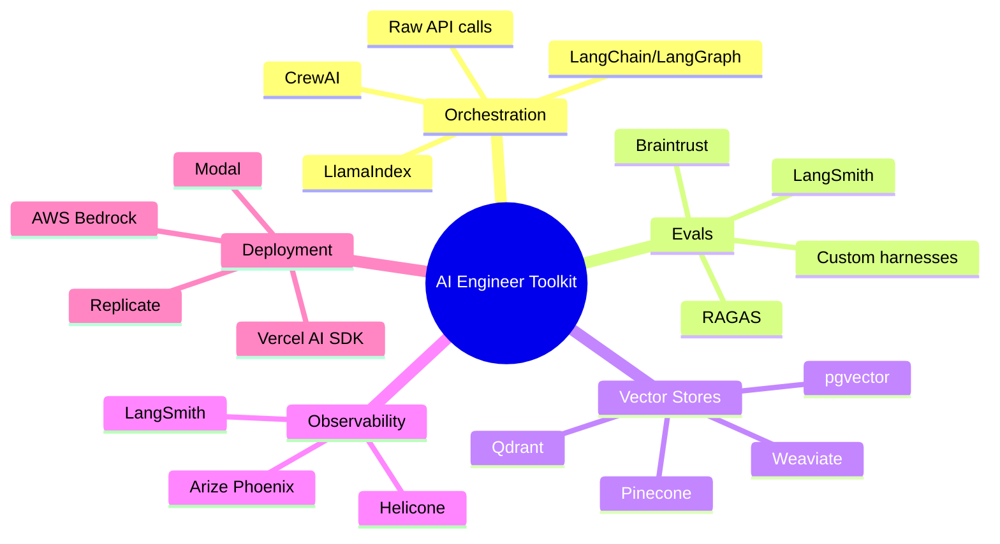

# The AI Engineer Role Is Real Now — Here's What It Actually Means

> **TL;DR:** AI Engineering is a distinct discipline that's crystallized in 2025. It's not ML research, it's not data science, and it's not just "using ChatGPT at work." It's software engineering with LLMs as a core primitive — and it's quickly becoming the default expectation for mid-to-senior engineers at any forward-looking org. Here's the map.

Two years ago, "AI Engineer" was a title you'd put on a LinkedIn profile when you weren't sure what you were. Today, it's a role that job descriptions are written for, that companies are building entire teams around, and that has a distinct skill set most senior engineers don't yet fully have.

The confusion is real. People hear "AI Engineer" and think: PhD, research lab, CUDA kernels. That's an ML researcher or an ML engineer. That's a different job. The AI engineer is a *software engineer* who has internalized LLMs as a first-class tool — not someone who trains models, but someone who deploys, orchestrates, and validates them at production scale.

Let's be specific about what this role actually is.

## AI Engineer vs. ML Engineer: Stop Conflating Them

This is the primary confusion and it costs orgs real money when they hire wrong.

An **ML engineer** trains, fine-tunes, and deploys machine learning models. They care about gradient descent, model architecture, dataset curation, training infrastructure. The job is fundamentally about getting models to learn from data. You need strong math, comfort with research papers, and familiarity with frameworks like PyTorch or JAX.

An **AI engineer** treats the model as a black box API. They don't train it. They *use* it. The job is about building reliable, useful systems on top of foundation models — and the core challenge is that LLMs are non-deterministic, expensive, and opinionated in ways that break standard software engineering assumptions.

The distinction isn't pedantic. The day-to-day is completely different. An ML engineer spends time in Jupyter notebooks and training runs. An AI engineer spends time designing retrieval pipelines, writing evals, debugging why GPT-4o returned a JSON object with a trailing comma that broke downstream parsing.

Both are valid. Neither is more prestigious. But they require different instincts, and orgs that hire an ML engineer when they need an AI engineer — or vice versa — end up with expensive mismatches.

## The Core Skill Stack of an AI Engineer in 2025

Here's what the role actually requires, in rough order of how often you'll use it:

**Prompt Engineering (and knowing its limits)**

Yes, prompt engineering is real. No, it's not just "add Please to your prompt." It's understanding how models behave under different temperatures, how to use system prompts vs. user prompts vs. few-shot examples, how chain-of-thought affects output quality, and when structured output modes (JSON mode, function calling) are appropriate versus when they'll hurt you.

The real skill is knowing when to stop prompting and start doing something else — fine-tuning, retrieval, or decomposing the task differently.

**Eval Design**

This is probably the most underrated skill in the entire field. If you can't measure whether your LLM feature is working, you can't improve it. Evals are the tests of AI engineering. Writing a good eval suite means defining what "correct" means for a non-deterministic system — which is harder than it sounds.

Good evals check things like: factual accuracy, format compliance, latency percentiles, hallucination rate, and output safety. Bad evals check things like "does it return a string" and then your team argues in Slack about whether the feature works.

**RAG Architecture and Retrieval**

Retrieval-Augmented Generation is now table stakes for any AI feature that touches private or time-sensitive data. But "RAG" hides enormous complexity. Chunking strategy, embedding model selection, vector database choices, hybrid search (dense + sparse), reranking — these are real engineering decisions with real performance tradeoffs.

A naive RAG implementation will work in a demo and fail in production when documents are 80 pages long and the query is ambiguous.

**Agent Orchestration**

Multi-step AI systems that make decisions, call tools, and loop until a goal is met — this is the frontier of AI engineering in 2025. Frameworks like LangGraph, CrewAI, and raw tool-calling in the OpenAI or Anthropic APIs are the primitives. The engineering challenge is controlling non-deterministic control flow: how do you test, debug, and recover from failures in a system where the model decides what happens next?

**Output Validation and Reliability**

LLMs hallucinate. They ignore instructions. They return malformed JSON. They confidently answer in the wrong language. Production AI engineering is substantially about building the guardrails: output parsers, retry logic, fallback chains, confidence scoring, and human-in-the-loop escalation paths.

This is deeply unsexy work. It's also what separates a working AI feature from a demo.

## The Tools of the Trade

You don't need all of these. But you need to know enough to pick the right one for a given problem. The trap is reaching for LangChain because it's popular when a direct API call with a for-loop would've been simpler and more debuggable. Abstraction layers are a tradeoff, not a free lunch.

## How to Transition from Traditional SWE to AI Engineering

This is the question I get most often, and the answer is more accessible than people expect.

If you're already a competent software engineer, you have 80% of what you need. The fundamentals — API design, data modeling, async programming, testing, observability — all transfer directly. What you need to add:

**Week 1-2:** Get genuinely fluent with the OpenAI and Anthropic APIs. Build something real with function calling. Understand token counts, context windows, and pricing. Feel the latency.

**Week 3-4:** Build a RAG system from scratch — no LangChain. Use a raw embedding API, a vector store, and write your own retrieval loop. When you understand it without the abstraction, the abstraction makes sense.

**Week 5-6:** Write your first eval suite. Pick a task — summarization, classification, extraction — define what correct means, write 20 test cases, and measure your system against them. Iterate.

**Month 2:** Build an agent that uses tools. Give it a real task with real tools (a search API, a database, a calculator). Watch it fail. Debug it. Fix it. Feel the terror of non-deterministic control flow and learn to manage it.

The engineers who make this transition fastest are the ones who already think in systems and who are comfortable with uncertainty. Debugging an LLM-powered system is less like debugging a function and more like debugging a product — you're asking "why did this user experience go wrong" as much as "why did this code return the wrong value."

## Is This a Niche Specialty or the New Default?

Here's my actual take: **within five years, "AI engineer" will be as redundant a term as "internet-era engineer."** Every software engineer will be expected to know how to wield LLMs as a primitive, the same way every software engineer today is expected to know how to make an HTTP request.

The specialty exists right now because the tools are new, the patterns aren't established, and most engineers haven't had to deal with non-deterministic systems before. Once the patterns crystallize — and they're crystallizing fast — this becomes baseline knowledge.

Which means if you're a senior engineer who hasn't invested any time in understanding how LLM-based systems work, you are accumulating a skills debt right now. The time to start is not when it becomes mandatory. The time to start is now, while the field is still new enough that effort converts to expertise quickly.

The AI engineering role isn't a bubble. It's not a title inflation. It's the beginning of a genuine shift in what software engineering means — and the engineers who get ahead of it won't be the ones who were afraid to look stupid asking basic questions about tokens and embeddings.

## Key Takeaways

- **AI engineering ≠ ML engineering.** One trains models, the other builds systems on top of them. Completely different jobs.
- **The core skills are:** prompt engineering, eval design, RAG architecture, agent orchestration, and output validation — in roughly that order of daily relevance.
- **The transition from traditional SWE is accessible.** You already have 80% of what you need. The remaining 20% is hands-on and learnable in weeks, not years.
- **Evals are the most underrated skill.** If you can't measure it, you can't improve it. This applies ten times over to LLM-based systems.
- **This becomes table stakes.** The "AI Engineer" title will disappear into the baseline expectation of what a software engineer is. Get ahead of it now.

## Frequently Asked Questions

**Do I need a math or statistics background to become an AI engineer?**

No — not for the role as it's defined here. You're building on top of models, not building models. A working understanding of embeddings (vectors, similarity, distance metrics) is useful, but you don't need to be able to derive backpropagation. If you can build a REST API, you can build an AI-powered feature. The math ceiling only matters if you want to go into ML engineering or research.

**What's the difference between an AI engineer and a "prompt engineer"?**

Prompt engineering is a *skill* that AI engineers have, not a complete job description. A prompt engineer who can't build a retrieval pipeline, write an eval suite, or deploy a service is missing most of what the role requires. The "prompt engineer" title that went viral in 2023 mostly described an early-stage role that has since either grown into AI engineering or evaporated. If someone's job is purely writing prompts, they're either very early in their career or working in a very specific vertical (copywriting, content, etc.).

**How does AI engineering fit into a startup vs. a big company?**

At a startup, the AI engineer is often doing everything — selecting models, building infrastructure, writing evals, and shipping the product. At a big company, there's usually more specialization — separate platform teams for the LLM infrastructure, product teams that consume it. The startup experience is faster learning; the enterprise experience is deeper scaling. Both are valuable. If you're early in your AI engineering career, startup experience is probably the faster path to fluency.

---

*If this resonated, subscribe — I write about AI engineering, developer tools, and building in public weekly.*

*— [Shantanu Vishwanadha](https://substack.com/@thecoderpanda)*
