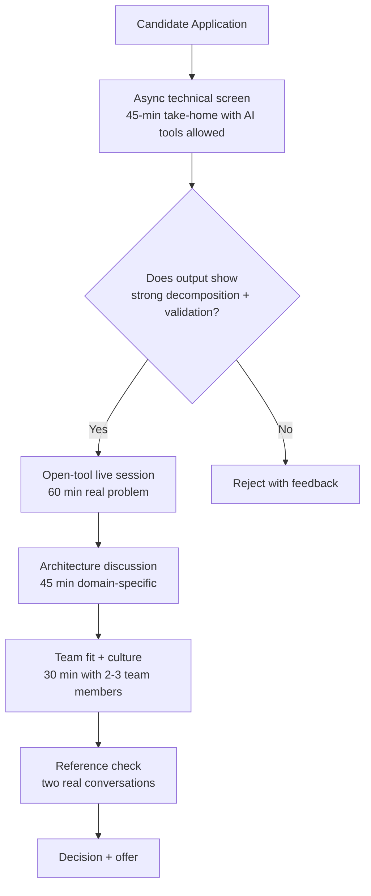

# Hiring Engineers in 2025: What the Playbook Looks Like Now

> **TL;DR:** The engineering hiring playbook needs a real update. AI changed what good looks like in a candidate — the ability to work effectively *with* AI tools is now more important than raw code output, and how you evaluate it in an interview matters. Leetcode marathons and whiteboard sessions are dying for good reason. Here's what top engineering teams are actually doing instead, and the traits that predict success in an AI-native org.

Hiring engineers has always been hard. It's now hard in new ways that most teams aren't accounting for.

The standard playbook — screen resumes, do a phone screen, two rounds of technical with algorithm questions, one behavioral, offer — was already mediocre before AI. Now it's actively filtering for the wrong things. A candidate who can ace a Leetcode hard but refuses to use Copilot is less useful to you than a candidate with average algorithm recall who ships twice as fast because they're fluent in AI-assisted development.

I've been watching hiring processes closely — as someone who's hired, been hired, and talked to a lot of founders about what broke in their processes. The pattern is clear. Here's what the updated playbook actually looks like.

## What AI Changed About What "Good" Looks Like

Let's be direct: AI fluency is now a baseline expectation, not a differentiator.

By 2025, an engineer who doesn't use AI coding tools — GitHub Copilot, Cursor, Claude for code review, LLM-assisted debugging — is making a conscious choice to be less productive. The productivity gap between "uses AI tools fluently" and "doesn't use AI tools" is large enough that it affects team output. This doesn't mean you should hire someone *only* because they use AI tools. It means not using them should raise a question mark in the same way that someone refusing to use version control would.

But beyond tool usage, AI changed what the underlying skills matter most:

**Problem decomposition over raw implementation speed.** The bottleneck for most engineers today isn't how fast they can type or how many algorithms they've memorized. It's how well they can break down a complex problem into pieces that they (and their AI tools) can tackle. An engineer who can clearly decompose a system into components, write precise specifications for each, and validate the results will consistently outperform an engineer who's marginally faster at implementing those components manually.

**Direction and validation over generation.** AI generates code. The engineer's job is increasingly to direct, review, and validate that code. This requires strong code comprehension (reading code is now more important than writing it), strong testing instincts (how do you know the AI-generated code actually works?), and strong architectural judgment (the AI will generate code that solves the immediate problem — the engineer decides whether it solves it the right way).

**Adaptability and learning speed.** The tools, models, and best practices are changing every few months. Engineers who learn quickly and update their mental models readily will compound their advantage over time. Engineers who resist new tools or approach AI with defensiveness will fall behind. Interviews should surface how candidates have learned and adapted in the past — recent examples, not abstract descriptions.

## What a Good Technical Interview Looks Like Today

The whiteboard algorithm interview is dying because it tests a narrow skill (memorized algorithmic patterns) that correlates weakly with the actual job in 2025. This isn't new criticism — it's been true for years — but AI accelerated the mismatch.

Here's what a better interview process looks like:

**Open-tool technical sessions.** Give the candidate access to their normal development environment, their preferred AI tools, and a real problem. Not a toy problem — a realistic representation of something they'd actually work on at your company. Then watch *how they work*, not just what they produce.

You're evaluating:
- How do they break the problem down before they start coding?
- How do they use AI tools? Do they blindly accept suggestions or evaluate them critically?
- How do they test their work? Do they just run it once and declare it done?
- How do they handle an unexpected constraint you introduce halfway through?

This tells you more in 60 minutes than four rounds of algorithm questions.

**Architecture and design discussions.** Give the candidate a real system design problem from your actual domain. Not "design Twitter" — that's a memorized answer at this point. Something specific: "We need to process 50,000 webhook events per hour with exactly-once delivery guarantees. Walk me through how you'd design this." The discussion reveals judgment, tradeoffs they've made before, and how they communicate complexity.

**Code review sessions.** Show the candidate a real piece of your code (ideally something you know has issues) and ask them to review it. This tests code comprehension, ability to identify non-obvious problems, and communication. The best candidates will find issues you didn't even intend to plant, and will explain them clearly without being condescending.

## The AI-Assisted Take-Home Debate

This comes up a lot: "If we allow AI tools in the take-home, aren't we just evaluating how well they use AI, not how well they can code?"

Yes. And that's partially the point.

But the concern is real: someone could produce a technically impressive take-home entirely with AI output that they don't actually understand. The solution isn't to ban AI tools — it's to build a follow-up into the process.

The structure that works: **async take-home with AI tools allowed, followed by a synchronous walkthrough.** In the walkthrough, the candidate walks you through their solution. They explain the decisions they made. You ask about specific pieces of their implementation. If they can't explain why they chose a particular approach, or they're confused by their own code, that's the signal you need.

This mirrors actual work. Engineers who use AI tools well can always explain the output they accepted and why. Engineers who are blindly copying AI output without understanding can't. The walkthrough is the discriminator.

## Assessing AI Literacy Without Making It a Gimmick

The wrong version of "test for AI literacy" is asking candidates trick questions about AI tools: "What's the maximum context window of GPT-4o?" or "Name three vector databases." This is trivia, not judgment.

The right version is understanding how the candidate thinks about AI as a collaborator:

**Ask how they've used AI in recent work.** Not "do you use AI tools" — everyone says yes. "Tell me about a time you used an AI tool to solve a problem that was harder than you expected. What did the AI get wrong? How did you catch it?" This separates people who genuinely work with AI from people who dabble with it.

**Ask how they validate AI-generated code.** "If you have Copilot suggest an implementation for a critical piece of code, what's your process for deciding whether to accept it?" Weak answers: "I run it and see if it works." Strong answers describe testing strategy, edge case consideration, whether the implementation matches the intended design, performance implications.

**Ask where they think AI tools fall short.** Good engineers have genuine opinions about this. They know the domains where AI tools are unreliable (subtle security vulnerabilities, complex stateful logic, domain-specific correctness requirements) and they compensate accordingly. If a candidate thinks AI tools are uniformly excellent at everything, that's a red flag.

## The Traits That Predict Success in AI-Native Orgs

Beyond technical skills, certain temperamental traits predict success at orgs where AI is a core part of how work happens:

**Comfortable with uncertainty.** AI-native orgs move fast, and the tools themselves are non-deterministic. Engineers who need complete specifications before they can start, or who are uncomfortable with "we don't fully know yet," struggle. Engineers who can make reasonable assumptions, start working, and adjust as they learn are invaluable.

**High standards for outcomes, not process.** Engineers who are attached to "how coding is supposed to be done" over what the code actually produces will be frustrated by AI-assisted development. Engineers who care about the outcome — is this code correct, maintainable, and performant? — adapt naturally to AI tools because the tools are just another path to that outcome.

**Self-directed learners with recent examples.** Ask what they've taught themselves in the last six months. Not what they want to learn or what looks good on a resume — what have they actually learned and shipped? In a field moving this fast, the ability to learn independently and apply new tools quickly compounds dramatically.

**Clear communicators.** AI tools change the composition of an engineer's output: less time typing code, more time explaining intent (writing prompts, writing tests, writing specs). Communication quality became a more important engineering skill, not less. Engineers who write clearly will work more effectively with AI tools and collaborate better with teammates.

## The Remote vs. In-Person Calculus in 2025

This debate didn't die. It adapted.

The honest answer in 2025: **for most engineering roles, remote works fine, and the candidate pool benefit is real.** The best engineers are not uniformly concentrated in SF or NYC. If you require in-person, you are competing for a subset of a subset of the talent market.

But nuance exists:

**Early-stage startups (pre-product-market-fit) benefit meaningfully from in-person density.** When you're still figuring out what you're building, the bandwidth of in-person collaboration — the whiteboard sessions, the hallway conversations, the ability to quickly align — has real value. At this stage, the founding team being co-located is worth the reduced pool.

**Established orgs with mature processes can go fully distributed.** Once you have established engineering culture, documentation standards, and async-first communication norms, the productivity loss of remote is marginal and the talent pool gain is substantial.

**The AI collaboration dimension:** AI tools actually *favor* remote-distributed work. Async communication with AI tools is natural — you write a clear spec, the AI helps implement it, you review. This mirrors how good remote engineering works. Teams that use AI well have already internalized the "write down what you want" discipline that makes remote work effective.

The mistake to avoid: requiring in-person to compensate for management practices that should be fixed instead. If you feel like you need people in-office to "know what they're working on," the problem is your project visibility and communication culture, not their location.

## Key Takeaways

- **AI fluency is now a baseline expectation**, not a differentiator. Not using AI tools should raise a question mark, the same way not using version control would.
- **Evaluate problem decomposition and AI collaboration**, not just raw code output. Open-tool interviews with a synchronous walkthrough are the most signal-dense format.
- **AI-assisted take-homes are fine — the walkthrough is what discriminates.** If candidates can't explain their own code, that's the signal.
- **The traits that predict success in AI-native orgs:** comfort with uncertainty, outcome focus over process attachment, self-directed recent learning, and clear communication.
- **Remote works for most engineering roles at established orgs.** The talent pool benefit is substantial. In-person is valuable for very early-stage founding teams still searching for PMF.

## Frequently Asked Questions

**Should we still test data structures and algorithms in interviews?**

Sparingly and contextually. If the role genuinely requires algorithm optimization — competitive systems, high-performance computing, search infrastructure — a focused algorithms question makes sense. For the majority of product engineering roles, it's a poor use of interview time relative to system design, code review, or open-tool problem solving. The key question: does this skill actually predict job performance for this specific role? If you can't answer yes confidently, cut it.

**How do we avoid hiring people who are just good at interviewing for AI fluency?**

The same way you avoid hiring people who are just good at whiteboard interviews: build multiple signals across different formats. Someone who sounds great talking about AI in a behavioral interview might struggle in an open-tool session. Someone who produces a polished take-home might not be able to explain their own code in a walkthrough. Use at least three independent evaluation points — async technical, live technical, and references — before trusting any one signal.

**How do we assess cultural fit without falling into similarity bias?**

Stop calling it "cultural fit." Start calling it "working style alignment" and make it concrete. Instead of "does this person feel like us," ask: "How do they handle disagreement on a technical decision?" "How do they communicate blockers?" "What does their code review style look like?" These questions reveal genuine alignment with how your team works without privileging candidates who look or sound like the existing team. Run cultural screens with diverse interviewers from different backgrounds and seniority levels. Pattern-match on working norms, not personality vibes.

---

*If this resonated, subscribe — I write about engineering hiring, team building, and operating in the AI era weekly.*

*— [Shantanu Vishwanadha](https://substack.com/@thecoderpanda)*
