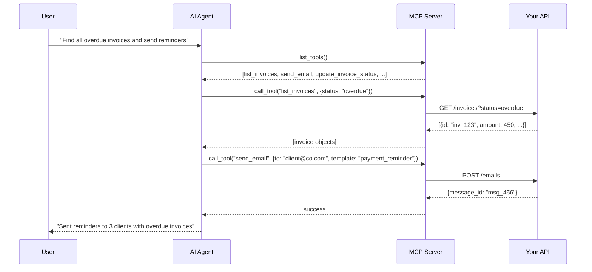
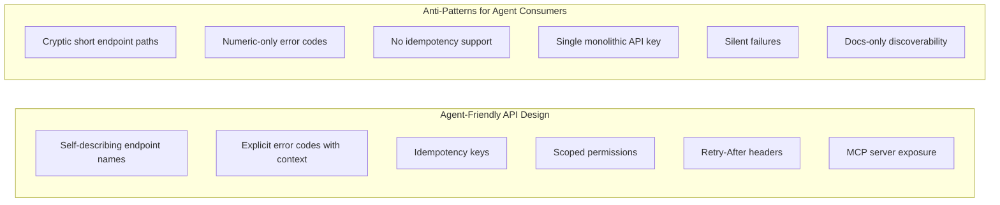

# The API Economy in 2025: What Developers Actually Need to Know

> **TL;DR:** The API economy didn't die — it transformed. AI changed who's calling your APIs (agents, not just developers), what they expect from documentation (semantic and queryable, not just readable), and how you should think about versioning, pricing, and design. MCP emerged as the paradigm for agent-friendly APIs. If you're building APIs in 2025 and ignoring the agent consumer, you're designing for 2021.

APIs have always been the connective tissue of software. But in 2025, the tissue is changing. The assumptions baked into how we design, document, and monetize APIs were built for a world where the consumer is a human developer reading docs in a browser. That world didn't disappear, but it got a new co-occupant: the AI agent.

This isn't a future thing. It's happening now. If you have a public API, agents are probably calling it already. If you're building a new API today, you'd be naive to design only for human consumers.

Let me walk through what actually changed and what it means for how you build.

## How AI Changed API Design Expectations

The traditional API design philosophy optimized for human ergonomics: consistent naming conventions, predictable response structures, clear error messages, and documentation that a developer could read on a lazy afternoon and understand.

Those things still matter. They now matter *more* — because the bar for "usable" got raised on two fronts simultaneously.

**LLM-friendly APIs are a real design consideration.** When an AI agent calls your API, it's working from a description of your API that was either in its training data, provided in a system prompt, or retrieved at runtime. If your endpoint names are cryptic (`POST /v2/ep/txn/proc`), your request schemas are deeply nested and optional-heavy, and your error codes are numeric without semantic meaning — an LLM is going to struggle to use your API correctly.

The principle: design for readability by someone who has never seen your docs before and is making inferences from the shape of the request/response alone. That means:

- Verbose, self-describing endpoint paths (`POST /invoices/{id}/approve` beats `POST /inv/mgmt/do`)
- Consistent and named error codes (not just HTTP status codes — return `{"error": "invoice_already_approved"}` alongside the 409)
- Required fields over optional fields where possible (fewer degrees of freedom = fewer ways for an agent to hallucinate a valid-looking but wrong request)
- Response fields that are self-labeling — if your API returns a timestamp, call it `created_at`, not `ts` or `t`

**Semantic search over documentation is now a real user path.** Developers used to navigate docs hierarchically — they'd click through sections. Now, a significant portion of API discovery happens through LLM-powered search: developers ask their coding assistant "how do I create a webhook with your API" and the LLM either knows from training data or retrieves from documentation. 

Your docs need to be structured in a way that LLMs can chunk and retrieve accurately. This means: clear headings, code examples that are copy-pasteable and self-contained, and conceptual explanations that map cleanly to the API surface. Long docs with high information density per sentence are *good* for human readers. For semantic retrieval, shorter focused sections with repetition of key terms perform better.

## The Rise of MCP as an API Paradigm

Model Context Protocol (MCP) is the most interesting thing that happened to the API economy in 2024-2025 and most developers are still catching up to its implications.

The short version: MCP is a standardized protocol for AI agents to discover and call tools at runtime. Instead of an API consumer needing to know your endpoint schema ahead of time, an MCP server exposes tools with descriptions and schemas that an agent can discover dynamically. The agent reads the description, decides if the tool is relevant to its current task, and calls it.

What MCP means practically for API builders: if you want agents to be able to use your service autonomously, you need an MCP server. Building one is not as hard as it sounds — the SDKs in Python, TypeScript, and Go are mature. The design challenge is thinking about what the *tool descriptions* should say to be useful for agent discovery. This is a different skill from writing API documentation — you're writing instructions for something that will decide autonomously whether to call your tool.

## Designing APIs for Agent Consumers

Agent consumers differ from human consumers in a few important ways that should inform your design:

**Agents don't tolerate ambiguity.** A human developer who gets a confusing error message will read the docs, post on Stack Overflow, maybe open a GitHub issue. An agent will either fail silently, retry incorrectly, or hallucinate a reasonable-looking request that does something unintended. Your error handling needs to be *explicit and machine-actionable*: tell the caller exactly what was wrong, what the valid options are, and what they should do instead.

**Agents call APIs at much higher rates and with less predictable patterns.** Rate limiting is more critical than ever, but so is the structure of your rate limit responses. Return standard `Retry-After` headers. Return remaining quota in response headers. Make it easy for an agent to manage its own consumption without human intervention.

**Agents are stateless between calls.** They don't remember context from previous calls unless you give it to them. This means idempotency keys matter enormously — if an agent gets a timeout and retries, you don't want a double charge or a duplicate record. Design every mutating endpoint to be safely retriable.

**Agents want narrow permissions.** The principle of least privilege matters more when the caller is autonomous. Support scoped API keys or OAuth scopes that let developers give agents only the permissions they need. An agent that only needs to read invoices should not have an API key that can delete them.

## The Economics of API Businesses in 2025

The API monetization landscape shifted in two directions simultaneously and they're in tension with each other.

**Consumption-based pricing won.** Token-based, request-based, and compute-unit pricing models are now the default expectation for developer-facing APIs. Developers are used to this from LLM providers and they prefer it for new tools — pay for what you use, no commitment required. If you're launching a new API in 2025 with seat-based pricing as the only option, you're fighting the current.

**The new consumption patterns are harder to predict.** When agents start calling your API, consumption goes from "predictable human-initiated requests" to "autonomous agent loops that may run 24/7." A single customer who integrates your API into an agentic workflow might consume 100x what a human-operated integration would. This is good for revenue but requires careful thinking about pricing tiers — customers need to be able to predict their costs, or they won't build on you.

The emerging answer is a hybrid model: consumption-based pricing with a cost cap or budget alerts, combined with committed spend tiers for customers who want predictability. Think "pay as you go + optional monthly commit for a discount."

**The new competitive pressure:** LLMs know about a lot of APIs from training data. If your API is well-documented and straightforward, it will be used by developers who are asking coding assistants for help. If it's poorly documented, you'll lose business to competitors that the LLM suggests instead. Documentation is now a sales channel.

## Versioning and Stability in a Fast-Moving World

The rate of change in the AI ecosystem is forcing a reckoning with API versioning. When your backend LLM provider changes its response format, you have to decide how that surfaces to your own API consumers. When you switch from one embedding model to another, vector similarity scores change and downstream systems break silently.

Some hard lessons the industry is learning:

**Behavioral versioning matters as much as structural versioning.** Traditional API versioning handles structural changes (fields added, removed, renamed). But LLM-backed APIs can have behavioral changes without structural changes — same response format, different quality, different behavior on edge cases. Document when you change underlying models. Log which model version produced each response. Let consumers pin to a specific model version if stability is critical.

**Deprecation is a commitment problem, not a technical problem.** It's easy to add a new API version. It's hard to maintain two versions for 18 months while customers migrate. Set and publicly commit to deprecation timelines before you version anything — and then honor them. Developers who've been burned by API deprecations without warning are ruthless about avoiding providers who have a history of it.

**The changelog is a product.** Teams that publish detailed, readable changelogs (not just commit messages) build significantly more trust. When an agent integration breaks, the developer needs to understand what changed. Make it easy for them. Link directly from error messages to the changelog entry that explains the breaking change.

## Key Takeaways

- **Design for the agent consumer, not just the human developer.** Self-describing endpoints, explicit error codes, idempotency, and scoped permissions are more important than ever.
- **MCP is the API layer for the agentic era.** If you want agents to use your service autonomously, you need to be thinking about an MCP server, not just REST documentation.
- **Consumption-based pricing is the default expectation now.** Build for it, and add predictability mechanisms (caps, budget alerts, committed tiers) for enterprise customers.
- **Documentation is a sales channel.** LLMs suggest APIs based on training data and semantic search. Bad docs means agents and developers will choose your competitor.
- **Behavioral versioning is new.** In AI-backed APIs, you can break consumers without changing your schema. Log model versions, communicate model changes, and give consumers the option to pin.

## Frequently Asked Questions

**Do I need to build an MCP server for my existing API?**

Not immediately, but it's worth planning for. MCP adoption is still early but growing fast, particularly in developer tools and enterprise automation. If your primary audience is technical users building AI-powered workflows, prioritizing MCP is worth it now. If you're primarily a data or business API with less AI-focused consumers, it's worth understanding but not urgent. The technical lift is lower than most people expect — an MCP wrapper over an existing REST API is typically a few hundred lines.

**How do I make my API documentation LLM-friendly without a full rewrite?**

Focus on structure first. Add a machine-readable OpenAPI spec if you don't have one — this is the highest-leverage single change you can make, because it's what coding assistants, LLM-powered API clients, and documentation tooling all consume. Then audit your endpoint descriptions: are they specific enough that an LLM could correctly infer what the endpoint does from the description alone? Finally, make code examples self-contained — every example should work as a standalone snippet with no implied context from surrounding text.

**What's the right mental model for pricing agents vs. human API consumers?**

Think about pricing in terms of *outcomes* rather than *calls*. A human developer makes one API call at a time, manually. An agent might make 50 calls to accomplish one task. If you price by call, the agent workflow is 50x more expensive than a human workflow for the same business outcome. That creates friction and sticker shock that kills adoption. Consider task-level pricing (this workflow costs X credits), output-based pricing (you pay for the records created, not the API calls to create them), or usage tiers with generous included volumes that make agentic usage economically predictable.

---

*If this resonated, subscribe — I write about API design, developer tools, and the evolving AI ecosystem weekly.*

*— [Shantanu Vishwanadha](https://substack.com/@thecoderpanda)*
