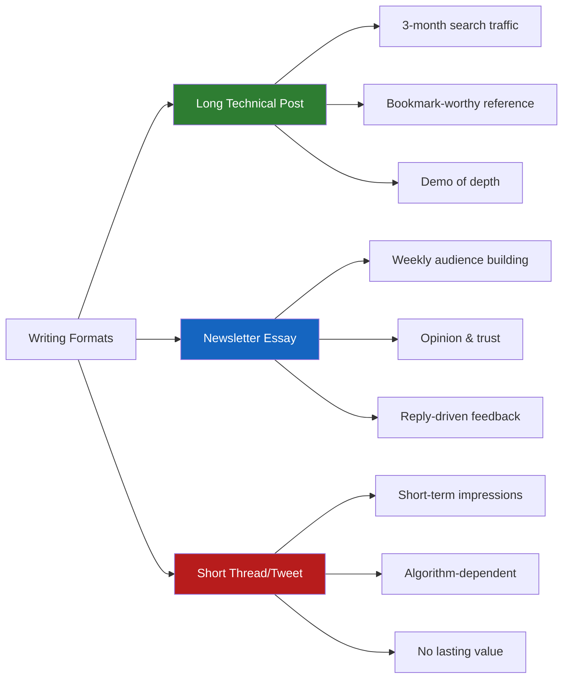

# Writing for Developers: The Complete Guide in 2025

> **TL;DR:** In 2025, AI can write boilerplate code faster than you can. It can scaffold a REST API, generate unit tests, and refactor your functions. What it cannot do is think through a problem in public, build trust with an audience over time, or explain *why* something matters in a way that only comes from having actually shipped it. Writing is now the skill that compounds when everything else commoditizes — and most developers are leaving it completely on the table.

---

## Why Writing Is the Highest-Leverage Skill You're Not Using

Here's something that happened in 2024 that most people underestimated. Developers who wrote consistently — newsletter essays, long technical blog posts, detailed GitHub READMEs — started getting inbound at a rate that no amount of LeetCode grinding or conference speaking could match. The mechanism is simple: written work is findable, indexable, and shareable forever. A 2,000-word post on how you debugged a gnarly distributed systems problem can bring in thousands of readers over two years. The 30-minute talk you gave at a meetup reached 40 people that Tuesday night.

But the deeper reason writing matters in the AI era is more interesting than SEO. AI can generate syntactically correct code. It cannot generate earned credibility. When you write through a problem — really write through it, not just describe it but argue with it — you're doing something that LLMs fundamentally cannot replicate: you're synthesizing your specific experience with a specific problem in a specific context and turning it into a transferable insight. The reader learns from your reasoning, not just your conclusion.

The developers I've watched build the most career leverage in 2025 have something in common. It's not their GitHub stars. It's that they have a body of work — a collection of opinions, explained in writing, that represent how they actually think. Hiring managers can read it. Potential co-founders can read it. Conference organizers can read it. Investors can read it. Code on GitHub doesn't tell anyone how you think. Writing does.

There's also a compounding effect that nobody talks about enough. The act of writing regularly makes you a better thinker. When you try to explain something you think you understand, you find the gaps. Writing is the best rubber duck you have access to. Engineers who write weekly about their work report understanding their own systems better as a result — not because writing taught them anything new, but because the discipline of explaining something precisely forces clarity that "I generally understand this" never achieves.

---

## The Formats That Actually Work (And Why Short Tweets Don't)

Let me be specific about format, because vague advice like "write more" is unhelpful.

**Long technical posts (1,500–3,000 words) are the highest-leverage format.** Not because length is inherently good — rambling 3,000-word posts that could be 800 words are a waste of everyone's time — but because technical depth requires space. A post that says "use indexes in your database" is useless. A post that says "here's exactly how we reduced our PostgreSQL query time by 87% by adding a composite index on (user_id, created_at DESC) and why the query planner makes this non-obvious" is a post people bookmark, share in Slack, and come back to six months later when they hit the same problem.

**The newsletter essay format (600–1,200 words, opinionated take, one central argument)** is the format for building an audience. Not a tutorial, not a documentation page — an essay. You have a specific claim. You argue for it. You concede the obvious counterargument. You land with a concrete recommendation. This format works because it respects the reader's time and has a point of view. Developers are allergic to hedging. If your post's conclusion is "it depends," you wasted their time.

**What doesn't work:** hot take threads. They get engagement but build no depth. The developer who has 50,000 Twitter followers from clever one-liners but no long-form work has an audience but no authority. When someone asks "what's your take on X?" and you can link them to a 2,000-word essay you wrote six months ago that addresses exactly that question — that's the credibility that converts to real opportunities.

---

## How to Structure a Technical Argument That Developers Will Actually Read

Most developer writing fails at structure, not content. The writer knows their material. They just don't know how to lead someone through it. Here's the structure that works:

**Lead with the problem, not the solution.** The most common mistake is starting with "Today I'm going to explain X." Nobody came to read your explanation — they came because they have a problem. Start with the problem. Be specific. "You've got a microservices architecture and you're seeing cascading failures that are nearly impossible to trace" is a lead that makes engineers lean in. "I'm going to talk about distributed tracing" is a lead that makes them open another tab.

**State your thesis in the first 150 words.** What is the specific claim you're making? "Circuit breakers solve this problem, and here's exactly how to implement them in Node.js with the `opossum` library" is a thesis. "We'll explore some approaches" is not. Developers are busy. Tell them what they're going to get before they've committed to reading.

**Use the "problem → failed approach → why it fails → better approach → result" structure for technical content.** This mirrors how engineers actually think through problems. A post that jumps straight to "here's the correct solution" loses credibility because it skips the reasoning. Show the wrong path. Explain why it's wrong. Then the right path lands with context.

**One concrete example beats three abstract explanations.** Show the actual code. Show the actual error message. Show the actual Grafana dashboard that showed you the problem. Abstract explanations are forgettable. The specific error trace from your actual production incident is something readers will screenshot and save.

**End with "so what."** What should the reader do differently as a result of reading this? If your post's ending is "hopefully this was helpful!" you've wasted the ending. The ending is where you convert a reader into someone who changes their behavior. Make it specific and actionable.

---

## The AI-Assisted Writing Workflow That Doesn't Feel Like AI

I use AI to help me write. I also have a specific workflow that ensures my writing doesn't sound like it was written by an AI. Here's the actual process:

**Step 1: Write the ugly first draft yourself.** No AI. Just you and a blank page. This draft will be bad — incomplete sentences, tangents, missing transitions. That's fine. The goal of the first draft is to extract what you actually think from your brain onto the page. This cannot be outsourced. If you ask an AI to write the first draft, you get an AI's summary of what other people think about this topic, cleaned up to sound authoritative. That's not your voice. That's nobody's voice.

**Step 2: Use AI to help you find gaps.** Paste your rough draft and ask: "What questions would a skeptical senior engineer ask after reading this that I haven't answered?" or "What's the most likely counterargument I haven't addressed?" This is AI as an editor, not a ghostwriter. It surfaces gaps in your reasoning that you're too close to the material to see.

**Step 3: Expand specific sections yourself, use AI for research.** If you need to add a section on a specific library or framework, use AI to pull the relevant API details or documentation references quickly. But write the explanation in your voice. The details can come from AI assistance; the reasoning is yours.

**Step 4: AI for polish, not substance.** "Fix grammar errors and awkward phrasing in this paragraph" is a legitimate use. "Make this section more engaging" is a trap — you get generic engagement patterns that strip your voice. The tell is usually an increase in phrases like "it's worth noting," "at the end of the day," and "let's dive in."

**Step 5: Read it aloud before publishing.** This is the test that finds every AI-contaminated sentence. If you're reading aloud and something sounds like a polished press release in a technical blog post, cut it. Your readers are engineers. They can smell corporate voice.

---

## Building a Consistent Writing Practice and Getting Your Work Read

Consistency is where most developers fail. They publish one post, get 200 views, feel underwhelmed, and stop. Here's what the actual compounding curve looks like: flat for months, then non-linear. The developer who publishes 30 posts over a year isn't just 30x more visible than the developer who published one — they're 30x more visible and each post is supporting the others through internal links, topic authority, and accumulated search presence.

**The practice question:** when do you write? This sounds tactical but it's the whole game. Writing at 6 AM before the Slack chaos starts works for some people. Writing on Friday afternoons when attention on engineering work has drifted works for others. What doesn't work is "when I have time" — developers never have time. Schedule it. 90 minutes, once a week, in the calendar, non-negotiable.

**The topic selection question:** write about what you actually solved last week. Not what you want to eventually understand. Not the theoretical ideal approach to a problem. The thing you actually fixed. The thing you actually built. The decision you actually made and why. This constraint is both a forcing function and a quality filter — you can only write authentically about what you've actually done.

**Distribution strategy that actually works:** The developer content distribution mistake is posting to Twitter/X and hoping for virality. The distribution that actually compounds:

- Post on your own domain (you own the audience, not a platform)
- Cross-post to DEV.to and Hashnode (massive built-in developer audiences)
- Submit to newsletters your audience reads — there are 40+ active developer newsletters that take external submissions
- Post to the relevant subreddits and Hacker News (Show HN works better than most people think)
- Share in relevant Discord and Slack communities where the problem you solved is actively being discussed

The last point is the most underrated. If you wrote a post about debugging Kubernetes networking issues, post it in the Kubernetes Slack when someone asks a question you've answered in the post. Not spammy — genuinely helpful. That kind of targeted distribution often outperforms mass posting.

---

## Key Takeaways

- **Writing is now a compounding asset in an era where code is increasingly commoditized** — it builds credibility and inbound that no amount of GitHub activity can replicate
- **Long technical posts (1,500–3,000 words) are the highest-leverage format** — deep content builds lasting authority; hot takes build short-term engagement
- **Structure your technical arguments with "problem → failed approach → why it fails → better approach → result"** — this is how engineers think and how they learn
- **AI should enhance your writing, not replace your drafting** — first draft always in your own voice; AI is most useful for gap-finding and polish, not generation
- **Consistency over quality in the early stages** — 30 decent posts compounds far better than 1 perfect post and 11 months of silence

---

## Frequently Asked Questions

**Q: Do I need my own blog, or can I just post on Medium/DEV?**

Own your domain. Medium's algorithm has changed multiple times in ways that hurt writers. DEV.to is a great amplifier but not a foundation. Host your writing at `yourname.com` or `yourhandle.dev`. Use a static site generator — Astro, Hugo, or Next.js are all fine. Cross-post everywhere, but the canonical version lives at your URL. When platforms change their rules, your readers should still be able to find you.

**Q: How do I know if a topic is worth writing about?**

Simple filter: did you search for this answer and have trouble finding a good one? Then write the answer you wish had existed. Technical content that fills a real gap in search results will find an audience even if you have zero followers when you publish. Some of my highest-traffic posts are on obscure-sounding topics with very specific search intent — exactly the posts where Google's first two pages were either outdated or wrong.

**Q: How long should I write before expecting results?**

Six months. I know that's not what you want to hear. But the traffic and inbound from developer writing typically follows a 3-6 month lag — posts need time to index, get linked to, get shared in the right communities. The developers I know who quit after two months of writing were three months away from the inflection point. Set a 6-month no-quit commitment, publish at least twice a month, and then evaluate.

---

*If this resonated, subscribe — I write about developer content, technical careers, and building in public weekly.*

*— [Shantanu Vishwanadha](https://substack.com/@thecoderpanda)*
